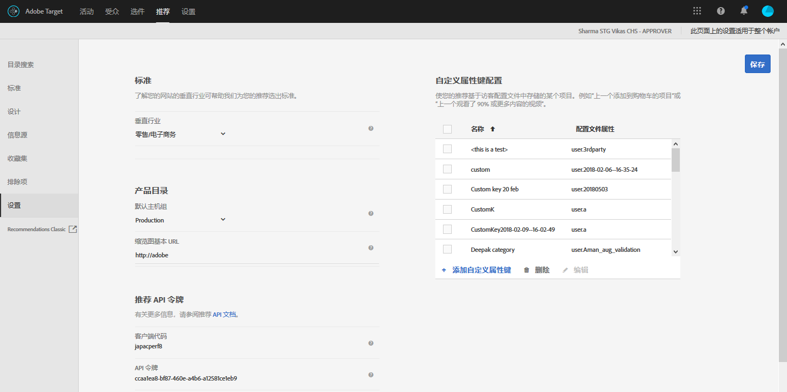

#  Plan and implementation Recommendations {#plan-and-implement-recommendations}

您在创建“推荐”活动之前需要了解的信息。

## 计划和实施推荐 {#concept_02AA644A4C7D4D5CB1D9CADA208CF8D1}

您在创建 [!DNL Recommendations] 活动之前需要了解的信息。

[!DNL Recommendations] 要求您按以下层次结构设置信息：

| 步骤 | 信息 | 详细信息 |
|--- |--- |--- |
|  | JavaScript 库 | 每个页面都需要引用 at.js 版本 0.9.1（或更高版本）或者 mbox.js 版本 55（或更高版本）。此实施步骤必须在将要使用 Target 活动的所有页面上执行，且可以包含诸如产品 ID 或类别 ID 之类的键。<BR>有关 at.js 的信息，请参阅 [at.js 实施](/help/c-implementing-target/c-implementing-target-for-client-side-web/t-mbox-download/c-target-atjs-implementation/target-atjs-implementation.md)。<br>有关 mbox.js 的更多信息，请参阅 [Mbox.js 实施](/help/c-implementing-target/c-implementing-target-for-client-side-web/t-mbox-download/mbox-download.md)。 |
|  | 键 | 键可决定要在推荐中显示的产品类型或内容类型。例如，键可以是产品类别。请参阅[使推荐基于推荐键](/help/c-recommendations/c-algorithms/create-new-algorithm.md#task_2B0ED54AFBF64C56916B6E1F4DC0DC3B)。 |
|  | 属性 | 属性可提供更多与要显示的产品有关的具体信息。例如，您可能想要显示处于特定价格范围内的产品，或达到库存阈值的项目。可以在 mbox 中或通过[信息源](/help/c-recommendations/c-products/feeds.md)提供属性。<br>请参阅[包含规则](/help/c-recommendations/c-algorithms/create-new-algorithm.md#task_28DB20F968B1451481D8E51BAF947079)和[实体属性](/help/c-recommendations/c-products/entity-attributes.md)。 |
|  | 排除项 | 排除项可决定不在您的推荐中显示哪些特定项目。<br>请参阅[排除项](/help/c-recommendations/c-products/exclusions.md)。 |
|  | 购买详细信息 | 完成购买后，购买详细信息可提供与已购项目和订单有关的信息。 |

## 基本实施 {#concept_D1154A3FB0FB4467A29AD2BDD21C82D5}

基本实施要求您将参数传递到页面，以确定在推荐中显示哪些产品或服务。

开始设置 [!DNL Recommendations] 活动之前，您应该了解将产品数据提供给 [!DNL Recommendations] 的方法，并确定最符合您的需要的方法。

可使用以下两种方法将产品和服务相关信息提供给 [!DNL Recommendations]：

| 方法 | 描述 |
|--- |--- |
| 直接将参数传递到页面 | 此方法适用于经常发生更改的项目。但是，由于此方法需要直接对页面进行更改，因此许多组织在使用此方法时需要 IT 部门和页面实施人员的帮助。 |
| 通过 Google 或 CSV 信息源传递参数 | 此方法适用于不会经常更改的收藏集。通常情况下，通过信息源提供产品信息时，不必更改 实施或其他页面代码。但是，由于产品列表保持静态，因此要实现快速更改会比较困难。有关更多信息，请参阅[信息源](/help/c-recommendations/c-products/feeds.md)。 |

如以下示例所示，这两种方法既可以单独使用也可以结合使用。

## 示例 1：将页面和信息源结合使用 {#section_DF6BAE4BF11548BD9C44D0A426BCF5A7}

同时使用页面参数和信息源是一种常用的 [!DNL Recommendations] 实施选项。

如果零售商具有相对固定的产品目录，但同时又希望突出特定的季节性项目或促销项目，则可以优先选择此方法。大多数客户可能还是主要通过信息源来提供其信息，只需偶尔对页面进行调整。

使用信息源提供不经常发生更改的信息。不论使用 CSV 文件还是 Google 信息源，均需使用以下参数：

* 必需的参数

   * `entity.id`

* 有用的参数

   * `entity.name`
   * `entity.categoryId`
   * `entity.brand`
   * `entity.pageUrl`
   * `entity.thumbnailUrl`
   * `entity.message`
   * 所有自定义属性

设置信息源并将其传递到 [!DNL Recommendations] 后，请在页面上为经常更改（即更改频率高于每日）的属性传递参数。

* 必需的参数

   * `entity.id`
   * `entity.categoryId`

* 有用的参数

   * `entity.inventory`
   * `entity.value`

最近运行的数据集将具有较高优先级。如果您先传递信息源，然后再更新页面参数，则会显示在页面参数中所做的更改，以替换在信息源中传递的项目信息。

## 示例 2：在产品（或内容）详细信息页面上传递所有参数 {#section_D5A4F69457604CA7AACFD7BFF79B58A9}

如果您在页面上传递所有参数，则可以通过更新页面快速实现更新。有些组织在使用此方法时需要 IT 部门或 Web 设计团队的帮助。

此示例可能会对媒体公司特别有用，因为媒体公司需要不断更改其内容。

* 必需的参数

   * `entity.id`
   * `entity.categoryId`
   * 所有其他属性

## 示例代码 {#section_6E8A73376F30468BB549F337C4C220B1}

例如，您可以在产品或内容页面的标头部分使用以下代码：

```
function targetPageParams() {
 return {
    "entity": {
       "id": "32323",
       "categoryId": "My Category",
       "value": 105.56,
       "inventory": 329
    }
 }
}
```

有关可能会在不同类型的页面上使用的代码的更多示例，请参阅[按照页面类型实施](../c-recommendations/plan-implement.md#reference_DE38BB07BD3C4511B176CDAB45E126FC)。

## 按照页面类型实施 {#reference_DE38BB07BD3C4511B176CDAB45E126FC}

页面类型将影响 [!DNL Recommendations] 实施。

例如，您可能想要在产品页面、类别页面或主页面上显示不同类型的推荐。对于每种页面，您可以在 mbox 调用之前运行特定的函数，以显示适当的推荐。

有关示例中的属性信息，请参阅[实体属性](../c-recommendations/c-products/entity-attributes.md#reference_3BCC1383FB3F44F4A2120BB36270387F)。

必须使用有效的 JSON 格式。

如果您要使用标签管理解决方案来实施页面，下面显示的 `targetPageParams` 函数会尤其有用。[!DNL Adobe Launch] 或 [!DNL Adobe Dynamic Tag Manager] (DTM) 会将 at.js/mbox.js 引用和 `targetPageParams` 函数放置在您的页面上，并允许您配置相应的值。您应当将该函数放置在 at.js/mbox.js 调用之前，或将其放到 at.js/mbox.js 中的“额外的 JavaScript”部分。

## 所有页面 {#section_A22061788BAB42BB82BA087DEC3AA4AD}

包含推荐的所有页面均需要在页面上引用 [!DNL at.js] 或 [!DNL mbox.js]。需将以下任一引用添加到包含推荐的所有页面：

```
<script src="../at.js /></script>
```

```
<script src="../mbox.js /></script>
```

此实施需要：

* [!DNL at.js] 版本 0.9.2（或更高版本）或者 [!DNL mbox.js] 版本 55（或更高版本）

* [!DNL mbox.js] 必须包含 [!DNL target.js] 引用（[!DNL at.js] 不需要包含 [!DNL target.js] 引用）

有关实施 [!DNL at.js] 的更多信息，请参阅[如何部署 at.js](../c-implementing-target/c-implementing-target-for-client-side-web/how-to-deployatjs/how-to-deployatjs.md#topic_ECF2D3D1F3384E2386593A582A978556)。

有关实施 [!DNL mbox.js] 的更多信息，请参阅 [Mbox.js 实施](../c-implementing-target/c-implementing-target-for-client-side-web/t-mbox-download/mbox-download.md#task_4EAE26BB84FD4E1D858F411AEDF4B420)。

要详细了解这两个 Target Javascript 库之间的差异，请参阅 [at.js 的好处](/help/c-implementing-target/c-implementing-target-for-client-side-web/t-mbox-download/c-target-atjs-implementation/target-atjs-implementation.md#benefits)。

## 类别页面 {#section_F51A1AAEAC0E4B788582BBE1FEC3ABDC}

在类别页面上，您可能只想要推荐该类别的产品或内容。要设置类别页面，您需要设置页面所使用的键。有关键的更多信息，请参阅[使推荐基于推荐键](../c-recommendations/c-algorithms/create-new-algorithm.md#task_2B0ED54AFBF64C56916B6E1F4DC0DC3B)。

```
function targetPageParams() { 
   return { 
      "entity": { 
         "categoryId": "My Category" 
      } 
   } 
}
```

## 产品页面 {#section_205B3953C9664125A17CA8574FA6B2A3}

在产品页面上，您可能想要推荐特定项目，或具有特定价格或库存水平的项目。对于产品页面，您可能需要设置经常发生变化的属性（例如值和库存），以及类别页面所需的键。

```
function targetPageParams() { 
   return { 
      "entity": { 
         "id": "32323", 
         "categoryId": "My Category", 
         "value": 105.56, 
         "inventory": 329 
      } 
   } 
}
```

## 购物车页面 {#section_D37E48700F074556B925D0CA0291405E}

在购物车页面上，您可能想要从推荐中排除某些项目，例如购物车中已有的项目。

```
<script type="text/javascript">
function targetPageParams() {
   return {
      "excludedIds": [352, 223, 23432, 432, 553]
      }
}
</script>
```

## 感谢页面 {#section_C6126A4517A1478693AB7EC2A1D4ACCA}

在感谢页面上，您可能想要显示订单总额、订单 ID 及已购产品，而不推荐任何其他项目。您可以再实施一个 mbox，以获取订单信息。

* 如果您使用的是 at.js，请参阅[跟踪转化](../c-implementing-target/c-implementing-target-for-client-side-web/how-to-deployatjs/implementing-target-without-a-tag-manager.md#task_E85D2F64FEB84201A594F2288FABF053)。
* 如果您使用的是 mbox.js，请参阅[创建订单确认 mbox - mbox.js](../c-implementing-target/c-implementing-target-for-client-side-web/t-mbox-download/orderconfirm-create.md#task_0036D5F6C062442788BB55E872816D82)。

## 设置 {#concept_C1E1E2351413468692D6C21145EF0B84}

可使用一些设置来管理 [!DNL Recommendations] 实施。

To access the [!UICONTROL Recommendations Settings] options, open [!DNL Target] in the [!DNL Adobe Experience Cloud], then click **[!UICONTROL Recommendations]** > **[!UICONTROL Settings]**.



以下选项可供选择：

| 设置 | 描述 |
|--- |--- |
| 自定义全局 Mbox | （可选）指定要用于提供 [!DNL Target] 活动的自定义全局 mbox。默认情况下，[!DNL Target} 使用的全局 mbox 会用于 [!DNL Recommendations]。<br>[!DNL Target]注意：此选项是在 [!UICONTROL “设置”]页面上设置的。打开 [!DNL Target]，然后单击[!UICONTROL 设置]。 |
| 垂直行业 | 垂直行业用来帮助对您的推荐标准进行分类。使用垂直行业，您的团队成员可以找到适用于特定页面的标准，例如适用于购物车页面的标准或适用于媒体页面的标准。 |
| 筛选不兼容的标准 | 启用此选项，可仅显示要求选定页面传递所需数据的标准。并非每个标准都能在每个页面上正常运行。页面或 mbox 需要传入 `entity.id` 或 `entity.categoryId`，才能兼容当前项目/当前类别推荐。一般来说，最好只显示兼容的标准。但是，如果您希望将不兼容的标准用于活动，请取消选中此选项。<br>如果使用标签管理解决方案，建议您禁用此选项。<br>有关此选项的更多信息，请参阅[推荐常见问题解答](/help/c-recommendations/c-recommendations-faq/recommendations-faq.md)。 |
| 默认主机组 | 选择您的默认主机组。<br>主机组可用于为不同用途而分隔目录中的可用项。例如，您可以将主机组用于“开发和生产”环境、不同的品牌或不同的地理位置。默认情况下，“目录搜索”、“收藏集”和“排除项”中的预览结果均基于默认的主机组。（也可以使用“环境”筛选器来选择要预览结果的不同主机组。）默认情况下，新添加的项目在所有主机组中都可用，除非在创建或更新项目时指定了环境 ID。交付的“推荐”取决于请求中指定的主机组。<br>如果您看不到产品，请确保您使用的是正确的主机组。例如，如果您将推荐设置为使用测试环境并将您的主机组设置为“测试”，则您可能需要在测试环境中重新创建收藏集，之后才会显示产品。要查看每个环境中提供了哪些产品，请在每个环境中使用“目录搜索”。您还可以预览选定环境（主机组）的“推荐”收藏集和排除项内容。<br>**注意：**更改选定的环境后，必须单击搜索以更新返回的结果。<br>[!UICONTROL 环境]筛选器可从[!DNL Target]UI 中的以下位置访问：<ul><li>目录搜索（[!UICONTROL 推荐 > 目录搜索）</li><li>“创建收藏集”对话框（[!UICONTROL 推荐 > 收藏集 > 新建]）</li><li>“更新收藏集”对话框（[!UICONTROL 推荐 > 收藏集 > 编辑]）</li><li>“创建排除项”对话框（[!UICONTROL 推荐 > 排除项 > 新建]）</li><li>“更新排除项”对话框（[!UICONTROL 推荐 > 排除项 > 编辑]）</li></ul>有关更多信息，请参阅[主机](/help/administrating-target/hosts.md)。 |
| 缩览图基本 URL | 为您的产品目录设置基本 URL 后，可以在指定产品缩览图以及传递缩览图 URL 时使用相对 URL。<br>例如：<br>`"entity.thumbnailURL=/Images/Homepage/product1.jpg"`<br>设置的便是相对于缩览图基本 URL 的 URL。 |
| 推荐 API 令牌 | 在推荐 API 调用（例如下载 API）中使用此令牌。 |
