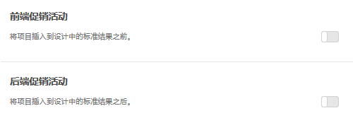

#  添加促销活动{#add-promotions}

可添加促销项目并控制它们在“推荐”设计中的放置位置。您可以添加静态和动态促销活动。

>[!IMPORTANT]
>
>静态和动态排除规则是可帮助您完成营销工作的强大功能。有关详细信息、示例和用例情景，请参阅[使用动态和静态包含规则](../../c-recommendations/c-algorithms/use-dynamic-and-static-inclusion-rules.md#concept_4CB5C0FA705D4E449BD0B37B3D987F9F)。

创建 [!DNL Recommendations] 活动时，您可以选择将促销项目包含在您的 [!DNL Recommendations] 设计中。促销活动使用设计中的可用版块，且优先于标准结果和备用推荐。例如，如果您的设计中有六个版块，而您将其中两个用于促销活动，则其余四个可用于基于标准推荐的项目。

促销活动会针对活动标准推荐的项目重复存在，因此给定项目不会在单个推荐托盘中出现两次。

您可以促销特定项目、动态促销项目、基于属性促销项目或促销收藏集。

>[!NOTE]
>
>使用促销活动会更改 CSV 结构和输出。这些更改可能会对任何涉及 CSV 的外部流程（如电子邮件）造成影响。

1. On the **[!UICONTROL Options]** page, click the **[!UICONTROL Front Promotion]** or **[!UICONTROL Back Promotion]** toggle.

   The following illustration shows the [!UICONTROL Front Promotion] toggle in the "On" position.

   

   您可以将促销活动插入到标准结果之前“及”之后。**
1. 设置要用于促销项目的设计版块数量。

   您最多可以使用 20 个版块，具体取决于您的 [!DNL Recommendations] 设计。对于基于您的标准返回的推荐，您所使用的各个版块会变得均不可用。

1. 为促销项目设置开始日期和结束日期。

   如果未设置开始日期，促销活动将立即开始。如果未设置结束日期，则不确定提升。

1. Select a **[!UICONTROL Promotion Type]**.

   * 选择&#x200B;**[!UICONTROL 项目列表]**，然后输入要促销的各个特定项目的 `entity.id` 值（值之间用逗号分隔）。

      如果列表中包含的项目数量多于您为促销活动设置的版块数量，则您可以选中“**[!UICONTROL 随机排列项目顺序]”复选框，以使您的设计中显示的促销项目发生变化。**&#x200B;选择此选项后，Target会随机选择为每次访问设置的整个促销活动集中启用的项目数量。

   * 选择&#x200B;**[!UICONTROL 按属性促销]，然后添加规则以定义要促销的项目的属性。**

      如果选择“按属性促销”，您可以创建动态匹配。有关更多信息，请参阅[使用动态和静态包含规则](../../c-recommendations/c-algorithms/use-dynamic-and-static-inclusion-rules.md#concept_4CB5C0FA705D4E449BD0B37B3D987F9F)。

   * 选择&#x200B;**[!UICONTROL 促销收藏集]，然后选择要促销的项目收藏集。**&#x200B;您可以创建新的收藏集，以将其用于促销活动。请参阅[创建收藏集](../../c-recommendations/c-products/collections.md#task_1256DFF6842141FCAADD9E1428EF7F08)，以了解更多信息。

1. 单击&#x200B;**[!UICONTROL 保存]**。

促销活动会应用到活动中的所有体验。
