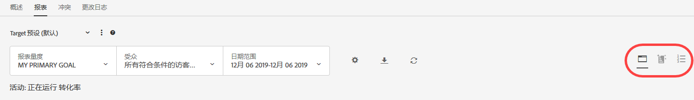
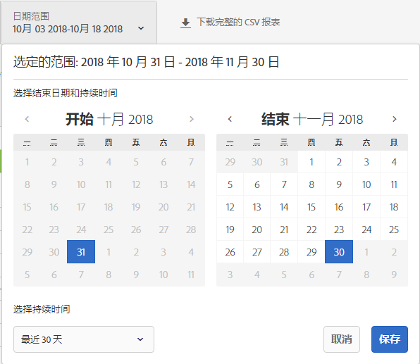
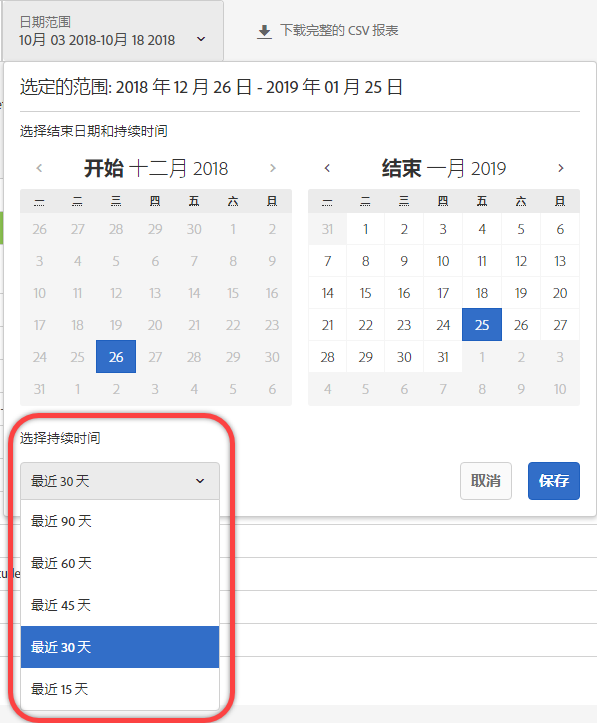
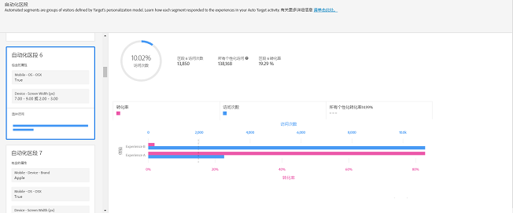
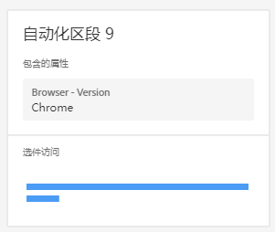
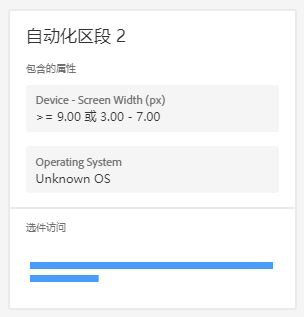

#  自动化区段报表{#automated-segments-report}

此信息介绍了自动化区段报表，该报表是自动个性化 (AP) 和自动定位 (AT) 活动用户可以使用的两个专门报表之一。

>[!NOTE]
>
>使用个性化洞察报告时，请考虑以下事项：
>
>* AP 和 AT 活动会作为 [!DNL Target Premium] 解决方案的一部分提供。在没有 [!DNL Target Premium] 许可证的情况下，它们将不会包含在 [!DNL Target Standard] 中。
   >
   >
* [!UICONTROL 个性化分析报表仅适用于使用转化优化目标的 AP 和 AT 活动。]活动上线后将优化目标从收入更改为转化的活动也不受支持。
   >
   >
* [!UICONTROL 只有从] “报告量度”下 [!UICONTROL 拉列表中选] 择了 [!UICONTROL “主要目标”，才] 能使用“个性化分析”报表。
   >
   >
* 仅[默认环境](../../administrating-target/hosts.md)支持个性化分析报表。
   >
   >
* [!UICONTROL 个性化] “分析”报表仅针对处于“实时  ”状态且已激活并接收至少15天流量的活动生成。

不同的访客对您的 AP/AT 活动中的选件/体验做出的响应会有所不同。此报表可显示 Target 的个性化模型定义的不同自动化区段如何响应活动中的选件/体验。

## 访问自动化区段报表 {#section_8E8F997AAAF44A1B9EE06EB6FB652801}

1. Click **[!UICONTROL Activities]**, then click the desired [Automated Personalization](../../c-activities/t-automated-personalization/automated-personalization.md#task_8AAF837796D74CF893CA2F88BA1491C9) or [Auto-Target](../../c-activities/auto-target-to-optimize.md#concept_67779E5B7F67427A97D7EA2A6FB919B3) activity from the list.

   If you have many activities, you can filter the list by selecting options from the [!UICONTROL Type], [!UICONTROL Status], [!UICONTROL Property], [!UICONTROL Reporting Source], [!UICONTROL Experience Composer], [!UICONTROL Metrics Type], and [!UICONTROL Activity Source] drop-down lists.

1. 单击&#x200B;**[!UICONTROL 报表]**。

   The [Automated Personalization Summary](/help/c-reports/reports-ap.md) or [Auto-Target Summary](/help/c-reports/auto-target-summary-report.md) report displays, which provides information about the performance of your activities, represented by the first screen icon. 其他两个图标表示两个个性化分析报表：自动化区段和重要属性。请注意，自动定位还有一个图形图标，表示“[!UICONTROL 摘要]”报表的图形视图。

   

   >[!IMPORTANT]
   >
   >[!UICONTROL 自动化区段]报表只有在激活活动至少 15 天后才能使用。在此初始阶段，您将无法访问此报表，也无法单击“[!UICONTROL 自动化区段]”图标。15 天过后，如果您的活动中有足够的个性化流量，将可以使用“[!UICONTROL 自动化区段]”报表。

1. 激活活动 15 天后，您可以单击&#x200B;**[!UICONTROL 自动化区段]**&#x200B;图标。

   

1. 选择所需的日期范围。

   与“[!UICONTROL 摘要]”报表（性能报表）不同，“[!UICONTROL 个性化分析]”（包括“[!UICONTROL 自动化区段]”）仅适用于固定日期范围：15 天、30 天、45 天、60 天和 90 天。通过这些固定日期范围，“[!UICONTROL 个性化分析]”可以使用足够多的数据来降低您从活动中的短生存期模式获取分析的可能性。您可以决定日期范围的“结束日期”和“持续时间”。您会注意到“开始”显示为灰色。开始日期会根据您选择的结束日期和持续时间自动进行更改。

   

   您可以从“[!UICONTROL 选择持续时间]”下拉列表中访问可用的固定日期范围。

   

1. 查看“[!UICONTROL 自动化区段]”报表数据。

   

1. （可选）[以 CSV 格式下载报表](../../c-reports/c-report-settings/report-settings.md#section_77E65C50BAAF4AB79242DB3A8778ADEF)，以便在 Excel 和其他工具中进行分析。

   >[!NOTE]
   >
   >个性化分析 UI 报表包含选择的信息。“自动化区段”报表的 CSV 下载包含其他详细信息。下载的自动化区段报表除了包含 UI 中所包含的排名靠前的区段之外，还包含其他自动化区段，以及这些区段对您的选件或体验的性能表现。

## 解释自动化区段报表

下表说明了如何解释报表并描述了其元素：

| 元素 | 详细信息 |
|--- |--- |
| 左侧面板 | 左侧面板列出了 Target 的个性化模型为此活动确定的 20 个最大“自动化区段”。“自动化区段”就像一个受众，但它是由 Target 的个性化模型定义的，而不是由营销人员定义。每个自动化区段由特定属性的特定值（或值范围）组成。 请注意，自动化区段可以重叠。自动化区段可以由一个、两个、三个或四个属性来定义。有关更多详细信息，请参阅下面的示例。 要了解有关 Target 个性化模型的更多信息，请参阅[随机林算法](/help/c-activities/t-automated-personalization/algo-random-forest.md)。要了解有关 Target 个性化模型用于创建自动化区段的属性的更多信息，请参阅[为 Target 个性化算法收集数据](/help/c-activities/t-automated-personalization/ap-data.md)。 |
| 中心图 | 中心图显示了您的活动内容对于高亮显示的自动化区段的性能表现。当您单击左侧面板上的不同区段时，中心图将会相应更新。 |
| 圆形分析图 | 中心面板顶部的圆形分析图显示了自动化区段的大小，以及活动中个性化访问的总次数（例如，个性化模型提供的此活动的流量。它不包括控制流量或整个入选者模型提供的流量）。请注意，区段的大小仅基于个性化访问。  |
| 双轴条形图 | 双轴条形图包含按该特定自动化区段的选件或体验划分的访问和转化信息。 |
| 粉色条 | 粉色条表示转化率，使用图形的底轴。您可以将鼠标悬停在该条上以获取更多信息。 |
| 蓝色条 | 蓝色条表示访问次数，使用图形的顶轴。您可以将鼠标悬停在该条上以获取更多信息。 |
| 灰色虚线 | 灰色虚线表示活动中所有个性化访问的转化率，涵盖所有选件/体验和自动化区段。 |

**自动化区段示例 1**

此自动化区段仅基于一个属性来定义。此自动化区段中包含的访客在平日正常工作时间之外或周末查看此 AP 活动。

**自动化区段示例 2**

此自动化区段基于两个属性来定义。此自动化区段中包含的查看此 AP 活动的访客在其当前访问中的页面查看次数少于三次，并且其地理位置位于纬度 42.57 和 47.29 之间（大约位于新罕布什尔州/俄勒冈州和华盛顿州/缅因州之间的一家美国公司）。

## 自动化区段常见问题解答 {#section_740910A52FA646B4AC9452F98C2F5719}

**我的活动还无法使用个性化分析报表。为什么？**

您的活动还不能使用“[!UICONTROL 个性化分析]”报表的原因包括以下几点：

* 激活活动后不满 15 天。在您启动活动至少 15 天后，自动化区段和重要属性报表才可用。在此初始阶段，您将无法访问这些报表，也无法单击“自动化区段”和“重要属性”图标。
* 您的活动在指定的时间范围内没有足够的流量。15 天过后，如果您的活动中有足够的个性化流量来构建个性化模型，将可以使用自动化区段和重要属性报表。
* 您的活动包含收入优化目标。目前，“[!UICONTROL 个性化分析]”仅适用于转化优化目标活动。我们将在未来的版本中添加对收入优化目标活动的支持。

**什么是属性？**

属性是关于个性化算法为了解如何个性化流量而使用的访客或其特定访问的信息。例如，属性可以是浏览器类型、位置、访问时间等。

有关 [!DNL Target] 在其个性化模型中使用的属性的更多信息，请参阅[为 Target 个性化算法收集数据](../../c-activities/t-automated-personalization/ap-data.md#reference_255BD3DE7AD04DC9B766E0BC78961058)。有关如何将新属性上传到 Target 以在 Target 的个性化模型中使用的更多信息，请参阅[将数据导入 Target 的方法](../../c-implementing-target/c-considerations-before-you-implement-target/c-methods-to-get-data-into-target/methods-to-get-data-into-target.md#concept_0069C0EFB56C4700BB33F2F35C2B9B17)。

**什么是自动化区段？**

“自动化区段”就像一个受众，但它是由 Target 的个性化模型定义的，而不是由营销人员定义。

一个自动化区段由特定属性的特定值（或值范围）组成。请参阅上面的步骤 5 以获取自动化区段示例。请注意，自动化区段可以重叠。

要了解有关随机林个性化算法（该算法是 Target 个性化模型的基础）的更多信息，请参阅[随机林算法](../../c-activities/t-automated-personalization/algo-random-forest.md#concept_48F3CDAA16A848D2A84CDCD19DAAE3AA)。

**什么决定了自动化区段的顺序？**

根据每个区段的大小以及它对您的活动内容的不同性能表现，会计算每个区段的得分。这些输入内容的组合决定了自动化区段的顺序，这样在响应不同内容方面具有较大差异的较大区段将显示在更靠近区段列表顶部的位置。

**为什么我的自动化区段报表中只显示了部分选件/体验？**

AP 和 AT 活动会为每个选件构建一个模型（对于 AP），以及为每个体验构建一个模型（对于 AT）。这些活动会开始提供个性化流量，并且只需构建两个模型即可创建您的“[!UICONTROL 个性化分析]”。如果您未在“[!UICONTROL 个性化分析]”中看到所有选件/体验，那么很可能您没有为某些特定的选件/体验构建模型。您可以检查活动“[!UICONTROL 摘要]”报表，并查看相应选件/体验旁边是否有时钟图标。此图标指示还没有为该选件/体验构建模型。

**为什么在特定自动化区段中一些转化率较低的选件/体验接收的流量比其他选件/体验多？**

在自动化区段中，您可能会看到转化率较低的选件或体验获得的访问次数更多，其潜在原因有多个，具体包括：

* 对特定自动化区段的部分或全部选件/体验的查看次数较少。
* 活动的容量较低，其中没有为某些选件/体验构建模型，或者为一些选件/体验构建模型的时间比其他选件/体验短。
* 针对特定选件的定位规则限制了哪些访客可以查看哪些选件/体验。

**[!UICONTROL 自动化区段]和[!UICONTROL 重要属性]报表中的信息与 CSV 下载中的信息相同吗？**

不相同，UI 报表包含选择的信息，而以 CSV 格式下载的报表则包含其他详细信息。下载的自动化区段分析报表除了包含 UI 中所包含的排名靠前的区段之外，还包含其他自动化区段，以及这些区段对您的选件或体验的性能表现。重要属性报表包含排名靠前的 100 个访客属性及其相对重要性，而 UI 则仅包含排名靠前的 10 个访客属性。

**我能否在自定义日期范围内查看个性化分析？**

个性化分析报表（“[!UICONTROL 自动化区段]”和“[!UICONTROL 重要属性]”）仅适用于固定日期范围：15 天、30 天、45 天、60 天和 90 天。通过这些固定日期范围，“[!UICONTROL 个性化分析]”可以使用足够多的数据来降低您从活动中的短生存期模式获取分析的可能性。您可以为任何结束日期（此时活动中有足够的数据来满足持续时间）选择这些持续时间。

**个性化分析是如何创建的？**

[!UICONTROL 个性化分析是采用名为 MAGIX（与模型无关的全局可理解解释）的 Adobe 技术创建的，该技术正在申请专利。]您可以在 [arXiv.org 网站](https://arxiv.org/abs/1706.07160)上 Adobe 研究团队发表的论文中了解有关 MAGIX 的更多信息。

**为什么[!UICONTROL 自动化区段]报表中的访客流量数据总数与我的 AP 或 AT 摘要/性能报表不相符？**

“[!UICONTROL 个性化分析]”报表仅包含查看 Target 的个性化模型所选内容的访客（即，它不考虑控制流量或整个入选者模型提供的流量）。此流量类型称为“个性化”流量。AP/AT 中的摘要性能报表包含控制流量与“目标”流量。目标流量包括个性化流量、使用整个入选者模型提供的流量以及随机提供的用于继续学习的一些流量。

**自动化区段是否会相互排斥？**

不会，自动化区段之间可以重叠。

**个性化分析是否可用于基于收入的建模目标/主要目标？**

目前，“[!UICONTROL 个性化分析]”仅适用于转化优化目标活动。我们将在未来的版本中添加对收入优化目标活动的支持。

**我可以通过哪些不同的方法来利用个性化分析中的信息？**

* 发现要定位的新受众：如果您发现某个特定自动化区段的性能表现极好，则可以考虑创建一个受众，以便您可以在其他报表中重复使用该区段。
* 测试您针对以下内容所做的假设：哪种类型的访客会对您的哪些体验做出响应。
* 深入了解哪些内容适用于哪类访客：哪些选件负责哪些访客的提升度。
* 确定性能不佳的内容。
* 了解哪些属性对模型的学习方式最为关键。
* 查看个性化模型中使用的属性，并了解它们的重要性。
* 确定您可以将其他数据点传递到 Target 的机会，以便为您的个性化提供更多信息。

**区段卡片中所显示属性的顺序是否存在任何逻辑？**

不存在，卡片的顺序只是基于上面描述的排名。卡片内属性的顺序并不基于任何逻辑。