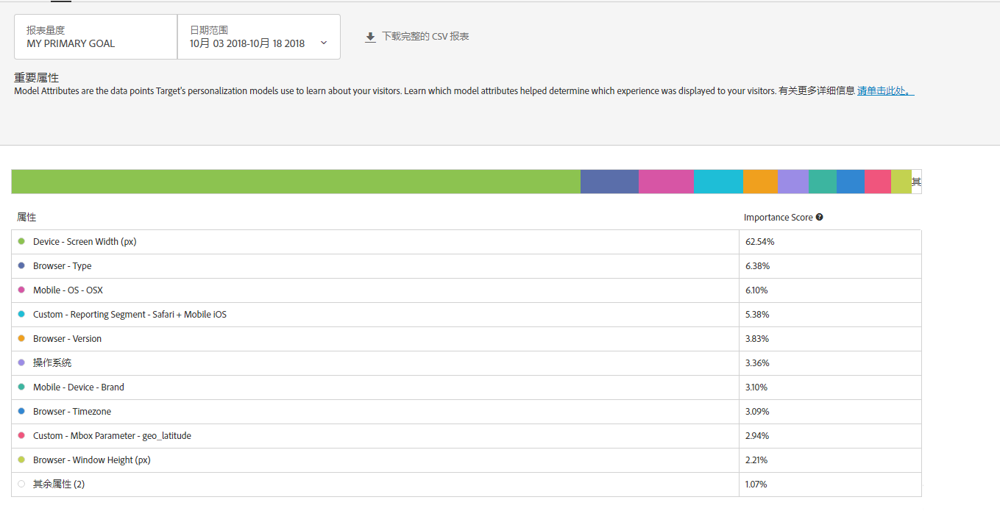

#  重要属性报表{#important-attributes-report}

此信息介绍了重要属性报表，该报表是自动个性化 (AP) 和自动定位 (AT) 活动用户可以使用的两个专门报表之一。

>[!NOTE]
>
>使用个性化洞察报告时，请考虑以下事项：
>
>* AP 和 AT 活动会作为 [!DNL Target Premium] 解决方案的一部分提供。在没有 [!DNL Target Premium] 许可证的情况下，它们将不会包含在 [!DNL Target Standard] 中。
   >
   >
* [!UICONTROL 个性化分析报表仅适用于使用转化优化目标的 AP 和 AT 活动。]活动上线后将优化目标从收入更改为转化的活动也不受支持。
   >
   >
* [!UICONTROL 只有从] “报告量度”下 [!UICONTROL 拉列表中选] 择了 [!UICONTROL “主要目标”，才] 能使用“个性化分析”报表。
   >
   >
* 仅[默认环境](../../administrating-target/hosts.md)支持个性化分析报表。
   >
   >
* [!UICONTROL 个性化] “分析”报表仅针对处于“实时  ”状态且已激活并接收至少15天流量的活动生成。

在不同的活动中，不同的属性对模型如何决定进行个性化的重要性也大小不一。此报表可显示影响模型的排名靠前的属性及其相对重要性。

## 访问重要属性报表 {#section_8E8F997AAAF44A1B9EE06EB6FB652801}

1. Click **[!UICONTROL Activities]**, then click the desired [Automated Personalization](../../c-activities/t-automated-personalization/automated-personalization.md#task_8AAF837796D74CF893CA2F88BA1491C9) or [Auto-Target](../../c-activities/auto-target-to-optimize.md#concept_67779E5B7F67427A97D7EA2A6FB919B3) activity from the list.

   如果您拥有多个活动，可以通过从[!UICONTROL 类型]、[!UICONTROL 状态]、[!UICONTROL 报表源]、[!UICONTROL 体验编辑器]、[!UICONTROL 量度类型]和[!UICONTROL 活动来源]下拉列表中选择相应选项来筛选列表。

1. 单击&#x200B;**[!UICONTROL 报表]**。

   The [Automated Personalization Summary](/help/c-reports/reports-ap.md) or [Auto-Target Summary](/help/c-reports/auto-target-summary-report.md) report displays, which provides information about the performance of your activities, represented by the first screen icon. 其他两个图标表示两个个性化分析报表：自动化区段和重要属性。请注意，自动定位还有一个图形图标，表示“[!UICONTROL 摘要]”报表的图形视图。

   

   >[!IMPORTANT]
   >
   >[!UICONTROL 重要属性]报表只有在您激活活动至少 15 天后才能使用。在此初始阶段，您将无法访问此报表，也无法单击“[!UICONTROL 重要属性]”图标。15 天过后，如果您的活动中有足够的个性化流量，将可以使用“[!UICONTROL 重要属性]”报表。

1. 激活活动 15 天后，您可以单击&#x200B;**[!UICONTROL 重要属性]**&#x200B;图标。

   

1. 选择所需的日期范围。

   与“[!UICONTROL 摘要]”报表（性能报表）不同，“[!UICONTROL 个性化分析]”（包括“[!UICONTROL 重要属性]”）仅适用于固定日期范围：15 天、30 天、45 天、60 天和 90 天。通过这些固定日期范围，“[!UICONTROL 个性化分析]”可以使用足够多的数据来降低您从活动中的短生存期模式获取分析的可能性。您可以决定日期范围的“结束日期”和“持续时间”。您会注意到“开始”显示为灰色。开始日期会根据您选择的结束日期和持续时间自动进行更改。

   

   您可以从“[!UICONTROL 选择持续时间]”下拉列表中访问可用的固定日期范围。

   

1. 查看“[!UICONTROL 重要属性]”报表数据。

   

1. （可选）[以 CSV 格式下载报表](../../c-reports/c-report-settings/report-settings.md#section_77E65C50BAAF4AB79242DB3A8778ADEF)，以便在 Excel 和其他工具中进行分析。

   >[!NOTE]
   >
   >个性化分析 UI 报表包含选择的信息。“重要属性”报表的 CSV 下载包含其他详细信息。下载的重要属性报表包含排名靠前的 100 个属性的完整列表，而 UI 报表则仅包含排名靠前的 10 个属性。如果您要在报表中查找某个特定属性，但未找到该属性，这并不意味着该属性不会影响活动，而只是该属性没有列在排名靠前的 100 个属性中。

## 解释重要属性报表

下表说明了如何解释报表并描述了其元素：

| 元素 | 详细信息 |
|--- |--- |
| 条形图 | 屏幕顶部的多色条形图允许您查看这些相对的重要性得分，该条形图映射到表格中每个相应属性旁边的圆点颜色。您还可以将鼠标悬停在条形图中的特定颜色上，以查看它所代表的属性。排名靠前的 100 个属性的重要性得分相加之和为 100%。要详细了解如何添加 Target 的个性化模型可以使用的更多属性，请参阅[为 Target 个性化算法上传数据](/help/c-activities/t-automated-personalization/uploading-data-for-the-target-personalization-algorithms.md)。 |
| 模型属性排名图 | 模型属性排名包括排名靠前的 10 个属性，这些属性对于 Target 的个性化模型如何决定向每个访客显示什么内容最为重要。重要性得分显示了相对于排名靠前的 100 个属性，特定属性在此活动中对 Target 的个性化模型的重要程度。 |

## 重要属性常见问题解答 {#section_740910A52FA646B4AC9452F98C2F5719}

**我的活动还无法使用个性化分析报表。为什么？**

您的活动可能还不能使用[!UICONTROL 个性化分析]报表的原因包括以下几点：

* 激活活动后不满 15 天。在您启动活动至少 15 天后，自动化区段和重要属性报表才可用。在此初始阶段，您将无法访问这些报表，也无法单击“自动化区段”和“重要属性”图标。
* 您的活动在指定的时间范围内没有足够的流量。15 天过后，如果您的活动中有[足够的个性化流量](/help/c-activities/auto-target-to-optimize.md#section_BA4D83BE40F14A96BE7CBC7C7CF2A8FB)来构建个性化模型，将可以使用自动化区段和重要属性报表。
* 您的活动包含收入优化目标。目前，“[!UICONTROL 个性化分析]”仅适用于转化优化目标活动。我们将在未来的版本中添加对收入优化目标活动的支持。

**什么是属性？**

属性是关于个性化算法为了解如何个性化流量而使用的访客或其特定访问的信息。例如，属性可以是浏览器类型、位置、访问时间等。

有关 [!DNL Target] 在其个性化模型中使用的属性的更多信息，请参阅[为 Target 个性化算法收集数据](../../c-activities/t-automated-personalization/ap-data.md#reference_255BD3DE7AD04DC9B766E0BC78961058)。有关如何将新属性上传到 Target 以在 Target 的个性化模型中使用的更多信息，请参阅[将数据导入 Target 的方法](../../c-implementing-target/c-considerations-before-you-implement-target/c-methods-to-get-data-into-target/methods-to-get-data-into-target.md#concept_0069C0EFB56C4700BB33F2F35C2B9B17)。

**[!UICONTROL 自动化区段]和[!UICONTROL 重要属性]报表中的信息与 CSV 下载中的信息相同吗？**

不相同，UI 报表包含选择的信息，而以 CSV 格式下载的报表则包含其他详细信息。下载的自动化区段分析报表除了包含 UI 中所包含的排名靠前的区段之外，还包含其他自动化区段，以及这些区段对您的选件或体验的性能表现。重要属性报表包含排名靠前的 100 个访客属性及其相对重要性，而 UI 则仅包含排名靠前的 10 个访客属性。

**我能否在自定义日期范围内查看个性化分析？**

个性化分析报表（“[!UICONTROL 自动化区段]”和“[!UICONTROL 重要属性]”）仅适用于固定日期范围：15 天、30 天、45 天、60 天和 90 天。通过这些固定日期范围，“[!UICONTROL 个性化分析]”可以使用足够多的数据来降低您从活动中的短生存期模式获取分析的可能性。您可以为任何结束日期（此时活动中有足够的数据来满足持续时间）选择这些持续时间。

**个性化分析是如何创建的？**

[!UICONTROL 个性化分析是采用名为 MAGIX（与模型无关的全局可理解解释）的 Adobe 技术创建的，该技术正在申请专利。]您可以在 [arXiv.org 网站](https://arxiv.org/abs/1706.07160)上 Adobe 研究团队发表的论文中了解有关 MAGIX 的更多信息。

**个性化分析是否可用于基于收入的建模目标/主要目标？**

目前，“[!UICONTROL 个性化分析]”仅适用于转化优化目标活动。我们将在未来的版本中添加对收入优化目标活动的支持。

**重要属性报表中的属性重要性得分是什么？**

该报表的“属性重要性排名”部分中的重要性得分为以下方面提供了依据：在算法确定如何将所有访客划分到其识别的区段时，算法用于学习的哪些变量最为重要。它为模型使用的排名靠前的 100 个属性分配了百分比得分。

**为什么在特定自动化区段中一些转化率较低的选件/体验接收的流量比其他选件/体验多？**

在自动化区段中，您可能会看到转化率较低的选件/体验获得的访问次数更多，其潜在原因有多个，具体包括：

* 对特定自动化区段的部分或全部选件/体验的查看次数较少。
* 存在容量较低的活动，在这些活动中某些选件或体验没有构建模型。
* 存在容量较低的活动，在这些活动中一些选件/体验的模型构建速度快于其他选件/体验。例如，假设附加模型是在第 22 天构建的，而您查看的是第 10 天至第 24 天的数据。
* 针对特定选件的定位规则限制了哪些访客可以查看哪些选件/体验。
* 分析报表中没有置信区间。但是，如果转化率足够接近，则模型可能会提供流量，以便提高点数，但这些数字并不具有“统计学差异”。

了解模型如何提供流量很有用。系统会根据每个人的总体配置文件为其提供流量。但是，分析报表对此行为进行了归纳，以便于人们理解。因此，区段间并不互相排斥。这会导致多个区段展示此类行为，因为同一个人可以出现在多个区段中。

**我可以通过哪些不同的方法来利用个性化分析中的信息？**

* 发现要定位的新受众：如果您发现某个特定自动化区段的性能表现极好，则可以考虑创建一个受众，以便您可以在其他报表中重复使用该区段。
* 测试您针对以下内容所做的假设：哪种类型的访客会对您的哪些体验做出响应。
* 深入了解哪些内容适用于哪类访客：哪些选件负责哪些访客的提升度。
* 确定性能不佳的内容。
* 了解哪些属性对模型的学习方式最为关键。
* 查看个性化模型中使用的属性，并了解它们的重要性。
* 确定您可以将其他数据点传递到 Target 的机会，以便为您的个性化提供更多信息。