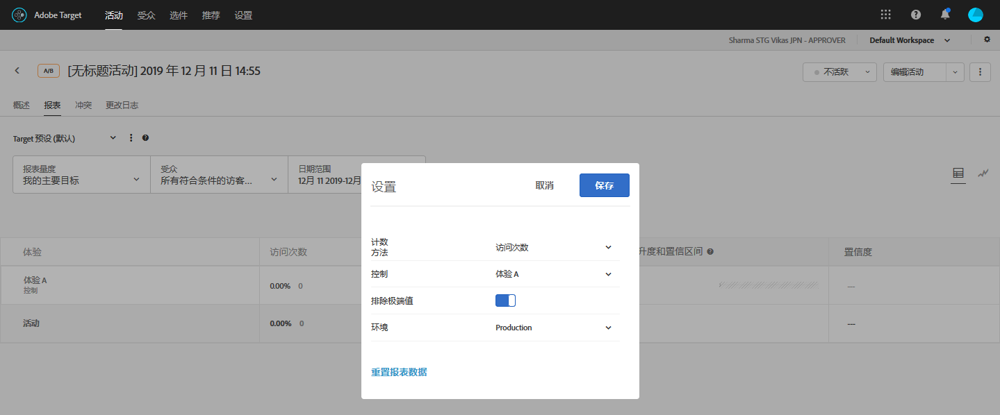

# 排除极端值{#exclude-extreme-values}

您可以从受极端订单影响的报表中排除极端值，这样，一些超常订单便不会影响活动结果。例如，与个人购买者购买个人制服相比，一位教练为整个团队购买统一制服可能会产生一个超常订单。

>[!NOTE]
>
>[!UICONTROL 排除极端值]标记仅适用于包含收入和参与度量度类型的活动。

极端值会根据下面所述的规则自动标记。您可以在查看报表中的极端值和排除报表中的极端值之间进行切换。在活动运行一小时，或订单量达到 15 个后（以先到者为准），活动将排除其极端值。

如果某个值与根据上个月（从当前时间往回算起）的数据计算出来的平均订单值之间的标准偏差超过 +/- 3，则该值会被视为极端值。

例如，使用 RPV 时，极端值筛选器往往很有用。RPV 结合了转化率和平均订单值，并且通常会暴露这些量度的不稳定性。如果您使用 RPV 并确定这些订单显现出未被正常分配的状态，则在应用超常订单筛选器时可能会看到更正常的结果。

如果某个值被标记为极端值，则其订单值会被替换为上个月体验的平均订单值（排除极端值后计算出来的平均值）。相应订单也会在“订单详细信息”报表和下载的包含每日结果的 CSV 文件中标记为极端订单。

**要从报表中排除极端值，请执行以下操作：**

1. 打开包含收入或参与度量度类型的活动，然后单击&#x200B;**[!UICONTROL 报表]**&#x200B;选项卡。
1. 单击齿轮图标。

   

   此时将显示 [!UICONTROL “报告设] 置选项”对话框。

   

1. 根据需要打开或关闭&#x200B;**[!UICONTROL 排除极端值]**&#x200B;选项。
1. 单击&#x200B;**[!UICONTROL 保存]**。
