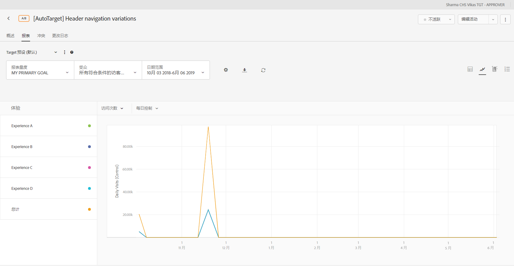
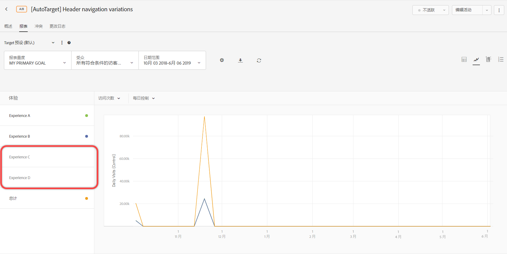
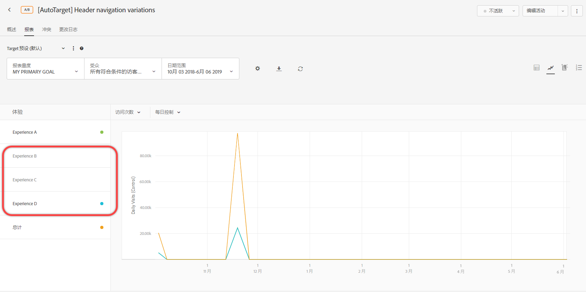

# 报表设置{#report-settings}

此信息可帮助您设置要在报表中显示的元素。可保存报表设置，以供日后使用。

要显示报表，请单击&#x200B;**[!UICONTROL 活动]**，从列表中单击所需的活动，然后单击&#x200B;**[!UICONTROL 报表]**&#x200B;选项卡。

## Target 预设 {#section_51F67341465045BEB4F1A2FB638A8EB1}

根据需要配置单个活动的报表后，您最多可以保存该报表的 10 个不同预设（量度、日期范围、受众、高级设置等）。所有 Target 用户都可以显示、编辑和删除各种预设，而不管是谁创建的这些预设。

您还可以根据需要配置单个活动的报表，然后将该配置保存为默认/收藏预设。当您以后查看该活动的报表时，便会显示此视图。

### 创建预设或默认预设

1. 根据需要配置活动的报告。

   可用设置（包括指标、日期范围、受众、高级设置等）在下面进行说明。

1. 在 **[!UICONTROL Target 预设]**&#x200B;旁边，单击三个垂直省略号图标 > **[!UICONTROL 另存为新预设]**。

   

   此时会显示“新建预设”对话框：

   

1. 查看“筛选器”和“设置”部分中的信息以确保根据需要配置了报表，然后指定&#x200B;**[!UICONTROL 预设名称]**（最多 50 个字符）。
1. （视情况而定）如果您希望将此预设作为默认/收藏报表视图，请将&#x200B;**[!UICONTROL 设为默认预设]**&#x200B;切换开关滑动到“开”位置。
1. 单击&#x200B;**[!UICONTROL 保存]**。

### 选择其他预设

从 **[!UICONTROL Target 预设]**&#x200B;下拉列表中选择所需的预设。

### 编辑预设

1. 选择要编辑的预设。
1. 根据需要编辑报表的配置（量度、日期范围、受众、高级设置等）。

   在编辑报表的配置后单击“[!UICONTROL 保存]”，预设名称后面会显示一个星号 ( * )，表示预设已更改，如下所示：

   

1. 单击三个垂直省略号图标 > **[!UICONTROL 另存为新预设]**&#x200B;以创建新预设。

   或

   单击三个垂直省略号图标 > **[!UICONTROL 更新]**&#x200B;以更新当前预设。

   

### 删除预设

1. 选择要删除的预设。
1. 单击三个垂直省略号图标 > **[!UICONTROL 删除]**。

   

1. 再次单击&#x200B;**[!UICONTROL 删除]**&#x200B;以确认删除操作。

### 预设错误处理

通过报表中的警报和消息，您可以知晓预设是否变为无效。警报或消息会指示您选择其他受众、量度、主机组或体验以创建有效预设。

以下列表描述了可能导致预设变为无效的一些情况：

* 已删除活动中的某个报表受众，但预设定义中仍引用该报表受众。
* 已删除一个（或多个）量度，但预设定义中仍引用该量度。例如，您可能删除了活动中的一个或多个量度，然后添加了新量度。
* 一个（或多个）主机组（环境）不存在，但预设定义中仍引用该主机组（环境）。
* 创建预设后删除了一个（或多个）体验，但预设定义中仍引用该体验。
* 预设在语义上无效，因为所引用的实体虽然仍存在，但是已通过对预设定义进行语义更改的方式进行了更新。例如，假设您最初创建了一个名为“Chrome 上的收入”的预设。稍后，您更新该活动以衡量转化量度而非收入。对活动定义的此次更新在语义上使预设定义无效。

## 报表量度 {#section_894ABD7148244806B7CE556EBBA2AD62}

单击&#x200B;**[!UICONTROL 报表量度]**&#x200B;下拉列表以选择要在图表中显示的其他[成功量度](../../c-activities/r-success-metrics/success-metrics.md#reference_D011575C85DA48E989A244593D9B9924)或多个量度。

默认情况下，主量度在创建活动时的成功量度设置中确定。如果您更改该设置并重新保存活动，则报表的主量度会随之更新。

有关选择要在报表中查看的多个量度的更多信息，请参阅[在报表中查看多个量度](../../c-reports/c-report-settings/view-multiple-metrics.md#concept_9E3C3F6F3EC1412FAF252975AC0720B7)。

## 受众 {#section_70926EB4618945D9AFF2B0564FF3717B}

单击[!UICONTROL 受众]下拉列表以更改报表中显示的受众。

有关更多信息，请参阅[受众](../../c-target/target.md#concept_A782F8481A5041EBA75103CB26376522)。

## 日期范围 {#section_A410A768403C4E01891F95CB357E63ED}

“日期范围”框显示报表的当前日期范围。 单击下拉图标可显示允许您更改报表日期范围的日历。

为报表选择新的&#x200B;**[!UICONTROL 开始]**&#x200B;日期和&#x200B;**[!UICONTROL 结束]**&#x200B;日期。您还可以使用&#x200B;**[!UICONTROL 从活动开始日期起]**&#x200B;和&#x200B;**[!UICONTROL 到活动结束时止]**&#x200B;复选框。

单击&#x200B;**[!UICONTROL 自定义日期]**&#x200B;可选择预定义的日期范围：“最近 7 天”、“最近 15 天”或“最近 30 天”。这些预定义的日期范围是可滚动的范围。如果从开始日期算起的天数少于所选天数，则日历将显示从开始日期起的范围，但是如果随着活动持续时间增加，从开始日期算起的天数多于所选天数，则日期范围会相应滚动。

报表具有以下日期限制：

* 报表的开始日期必须是过去两年内的日期。
* 每日报表限制在 100 天以内。
* 每小时报表限制在 15 天以内。

## 设置 {#section_D99CE462107D45CABE0960F820E1E972}

单击“齿轮”图标可配置报表设置，完成后，单击&#x200B;**[!UICONTROL 保存设置]**。

下图显示了 A/B 活动的“设置”对话框：

根据选定的活动类型，选项会有所不同：

* **计数方法：**&#x200B;选择所需的方法：

   * 访客
   * 访问次数
   * 活动展示次数

* **控制：**&#x200B;选择在计算和比较提升度时要使用的控制体验。
* **环境：**&#x200B;选择要为报表使用的环境（主机组）。有关更多信息，请参阅[主机](../../administrating-target/hosts.md#concept_516BB01EBFBD4449AB03940D31AEB66E)。
* **重置报表数据：**&#x200B;重置报表数据可删除旧数据。当前的访客将保留在活动中。只有具备审批者权限的用户可使用此选项。

   >[!IMPORTANT]
   >
   >这是永久性操作，无法撤消。

* **排除极端值：**“[!UICONTROL 排除极端值]”切换开关仅适用于包含收入和参与度量度类型的活动。有关更多信息，请参阅[排除超常订单](../../c-reports/c-report-settings/excluding-extreme-orders.md#task_2AE7743FFCDD466DAEEB720BE5F33DAA)。

## 下载 {#section_77E65C50BAAF4AB79242DB3A8778ADEF}

单击“下载”图标可下载 [!DNL .csv] 格式的报表数据，以便快速导入到 Excel、Access 或其他数据分析程序中。有关更多信息，请参阅[将数据下载到 CSV 文件](../../c-reports/downloading-data-in-csv-file.md#concept_3F276FF2BBB2499388F97451D6DE2E75)。

## 刷新 {#section_E203729F2F314DF3856D2EE67C60B370}

单击“刷新”图标可刷新报表的表格和图形视图，而不刷新整个页面、报表配置或报表日期范围。

## More options {#section_AB1B5C695D7045A0A0AC0E2698D2E7DE}

单击“更多选项”图标（三个垂直省略号）可访问“[!UICONTROL 编辑活动]”和“[!UICONTROL 查看体验 URL]”选项。

## 查看选项

根据活动类型，可以查看各种格式的报告。 选择所需的选项。

* **表视图**:单击“ **[!UICONTROL 表视图]** ”图标以表的形式查看报告。
* **图形视图**:单击“ **[!UICONTROL 图形视图]** ”图标以图形形式查看报表。
* **自动细分**:(仅适用于自动个性化(AP)和自动定位(AT)活动。)单击**自动[!UICONTROL 化区段图标] ，查看自 [动化区段报告](/help/c-reports/c-personalization-insights-reports/automated-segments-report.md)。
* **重要属性**:(仅适用于自动个性化(AP)和自动定位(AT)活动。)单击“**重要[!UICONTROL 属性] ”图标以查看“重要 [属性”报告](/help/c-reports/c-personalization-insights-reports/important-attributes-report.md)。

## 平均提升度、提升度范围和置信区间 {#section_0D87615B1D3344B3858BA494EEBC16FB}

报表包含一些数据点和可视化图表，有助于了解与您的活动相关的提升度范围和置信水平。这可帮助您更准确地确定入选者。

有关更多信息，请参阅[平均提升度、提升度范围和置信区间](../../c-reports/c-report-settings/average-lift-bounds-and-confidence-interval.md#topic_AFFDC672A8A34D028B100EF6BE5D8129)。

请考虑以下事项：

* 只有在表格视图中查看报表时才可用。
* 此功能不可用于使用 [Analytics 作为报表源 (A4T)](/help/c-integrating-target-with-mac/a4t/a4t.md) 的活动。

## 位置贡献 {#section_5832F126AC114AE1ABFFF4D9B904393B}

单击&#x200B;**[!UICONTROL 位置贡献]**&#x200B;图标可将报表切换为按位置显示贡献。

## 体验 {#section_3A450DE1FA7E43F0AAB73165EC3D1C34}

（仅在图形视图中查看报表时可用）

在图表的左侧选择或取消选择体验，可在图表中显示或隐藏相应的体验。

下图的报表中仅显示了“默认”体验、“中东”体验和“总计”体验。“亚洲”体验在图形中处于隐藏状态。

## 运行平均值 {#section_59066693158C4433B87D07402C2BC6CD}

（仅在图形视图中查看报表时可用）

“运行平均值”表示累积的转化率（从报告窗口的开始到图表上显示的日期）除以累积的访客数。

选择所需的图形视图。

* 运行平均值
* 运行平均值（提升）
* 每日 主控
* 每日目标
* 每日（提升）

>[!NOTE]
>
>此下拉列表的名称因所选视图而异，但将是上面列出的视图之一。

## 计数方法 {#section_01B0ED5665C74AE1AE97259800190C3E}

（仅在图形视图中查看报表时可用）

您可以为报表中的图形选择计数方法。请注意，自动个性化 (AP) 活动不支持此功能。

在图形模式下查看报表时，要访问“计数方法”选项，请单击&#x200B;**[!UICONTROL 我的主要目标]**&#x200B;下拉列表，然后选择计数方法。

计数方法将与在“[!UICONTROL 设置]”对话框中选择的方法相同，具体如上所述。

默认情况下，图形会按“[!UICONTROL 每日]”模式进行绘制。

You can change the mode by clicking the [!UICONTROL Daily] drop-down list, then selecting a cumulative option.

>[!NOTE]
>
>此下拉列表的名称会因所选的模式而异。

自动定位活动有四种模式：“每日（控制）”、“每日（目标）”、“累计（控制）”和“累计（目标）”。

默认的图形绘制顺序如下：

* **A/B测试（包括自动分配和自动个性化）**:体验创建的顺序（按降序排列）。
* **体验定位(XT)**:活动中的体验顺序。
* **Multivariate Test(MVT)**:按体验名称排序。
* **建议**:体验创建的顺序（按降序排列）。

在使用“计数方法”选项时，请考虑以下注意事项：

* For [Auto-Target activities](/help/c-activities/auto-target-to-optimize.md), there is no option for selecting &quot;Visitors&quot; as the counting methodology. 自动定位是唯一一种无法按访客绘制图形的活动类型。
* For activities that use [Analytics as the reporting source (A4T)](/help/c-integrating-target-with-mac/a4t/a4t.md), you cannot plot Visitor, Visit, or Impression cumulatively.

## 使用在活动中具有16个以上体验的图形

如果活动中的体验少于 16 个，则会在图形中分别用不同的颜色绘制每个体验。

如果活动中的体验多于 16 个，则会在图形中用彩色线条显示前 16 个体验。在左侧的“体验”窗格中，其余的体验会呈灰显状态，并且图形中不会显示相应的绘制线条。在给定的时间，只能显示 16 个体验的线条。

如果将鼠标悬停在任意灰显的体验上，图形中会暂时显示与该体验对应的新绘制线条，该线条为灰色。要为某个灰显体验显示彩色绘制线条，您可以单击某个以彩色线条显示的体验的名称来取消选择该体验，然后单击所需灰显体验的名称来将其选中。

下图提供了一个示例，其中显示的活动图形含有 26 个体验：

该图形显示了前 16 个体验的线条（有些线条存在重叠，因此显示的线条不到 16 个）。左侧“体验”窗格中每个体验名称旁边的彩色圆点表示该体验的绘制线条以相应的颜色显示。

如果在“体验”窗格中向下滚动，您会看到第 17 到 26 个体验的名称都处于灰显状态，如下图所示：

如果将鼠标悬停在某个灰显的体验上，图形中会暂时显示与该体验对应的新绘制线条，该线条为灰色。

假设您希望显示体验 R 的绘制线条，而不显示体验 P 的线条，那么可以单击体验 P 的名称来取消选择该体验，然后单击体验 R 的名称来将其选中，如下所示：

