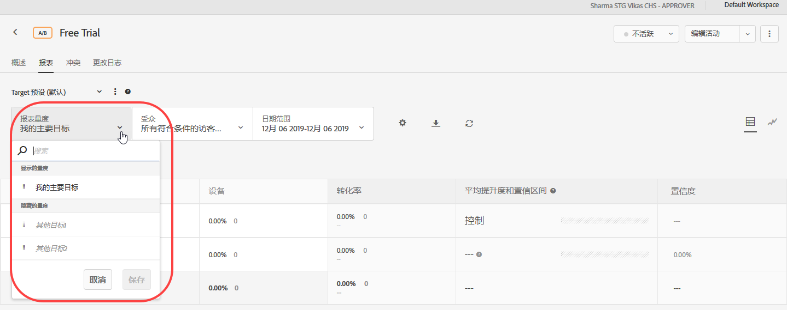
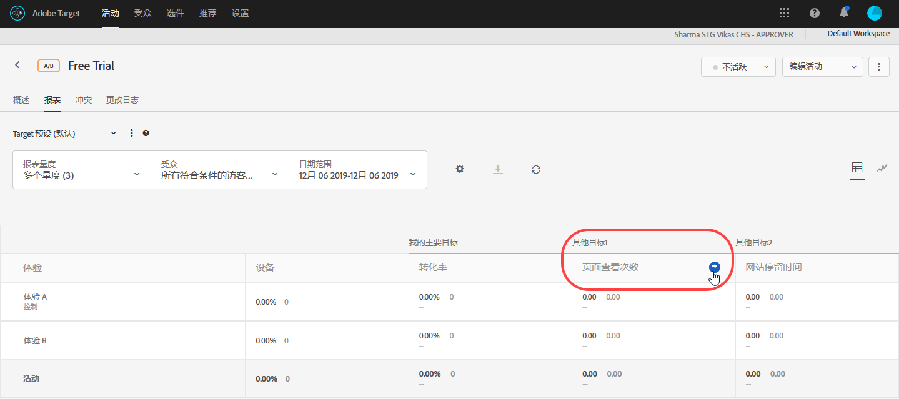
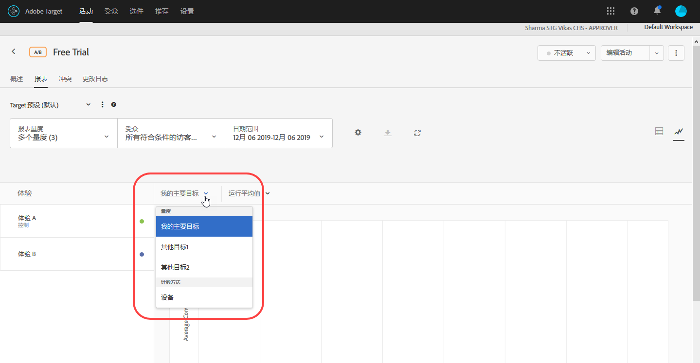

# 在报表中查看多个量度{#view-multiple-metrics-in-a-report}

可选择要在报表中查看的多个量度。

在报表中使用多个量度时，请注意以下信息：

* The ability to view multiple metrics is available for [A/B Test](/help/c-activities/t-test-ab/test-ab.md) and [Experience Targeting](/help/c-activities/t-experience-target/experience-target.md) (XT) activities only.
* You cannot add more than 20 metrics to a report for an activity that uses [Analytics for Target](/help/c-integrating-target-with-mac/a4t/a4t.md) (A4T). You can add as many metrics as you have in your activity to reports for activities that do *not* use A4T.
* 如果您选择了多个量度，则将无法使用“下载”选项将报表下载到 CSV 文件中。要启用“[!UICONTROL 下载]”选项，您必须只选择一个量度。
* 对于在 Target 2015 年 7 月版（2015 年 7 月 30 日）之前创建的活动，您无法查看多个量度。

**选择要在报表中显示的多个量度：**

1. 要显示报表，请单击&#x200B;**[!UICONTROL 活动]**，从列表中单击所需的活动，然后单击&#x200B;**报表]选项卡。[!UICONTROL **
1. 单击&#x200B;**[!UICONTROL 报表量度]**&#x200B;下拉列表，以显示“[!UICONTROL 显示的量度]”和“[!UICONTROL 隐藏的量度]”列表。

   

   您可以使用“[!UICONTROL 搜索]”框快速查找可用量度，以将其添加到“[!UICONTROL 显示的量度]”列表中。

   请注意，您既可以从报表的“[!UICONTROL 表格视图]”模式，也可以从“[!UICONTROL 图形视图]”模式中选择多个量度。

1. 将鼠标指针悬停在“[!UICONTROL 隐藏的量度]”列表中的所需量度上，然后单击&#x200B;**[!UICONTROL 选择]**，以将所需量度移到“[!UICONTROL 显示的量度]”列表中。

   或

   将所需量度从“[!UICONTROL 隐藏的量度]”列表拖放到“[!UICONTROL 显示的量度]”列表中。

   “[!UICONTROL 显示的量度]”列表中必须至少有一个量度。

   您可以在“[!UICONTROL 显示的量度]”列表中按所需顺序将各个量度拖放到相应的位置，以重新排列这些量度。所选的顺序将反映在“表格视图”和“图形视图”中。要从“[!UICONTROL 显示的量度]”列表中删除某个量度，请将鼠标指针悬停在该量度上，然后单击 **X** 图标。

1. 完成后单击&#x200B;**[!UICONTROL 保存]。**
1. （视情况而定）在表视图中查看报表时，将鼠标指针悬停在任何度量的列标题上可显示蓝色箭头。 单击该箭头可展开表格，以便显示该量度的[!UICONTROL 提升度]和[!UICONTROL 置信度]。

   

   您一次只能展开一个量度/列。再次单击该箭头可折叠列。

1. （视情况而定）在“图形视图”中查看报表时，您可以从下拉列表中选择要显示的单个度量：

   

