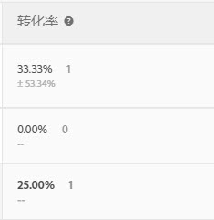

# 转化率{#conversion-rate}

为每次体验报告转化率、提升度、置信度（统计意义）和置信区间。

下图显示了一个示例活动的图表表头，其中高亮显示了“[!UICONTROL 转化率]”、“[!UICONTROL 提升度]”和“[!UICONTROL 置信度]”表头。

>[!NOTE] {class="- topic/note "}
>
>在所有的数据中，如果传递 `orderID`，则会忽略重复订单。审计报表列出了被忽略的重复订单。

## 转化率 {#section_07A36846C4E84D0881906809B9CE5A74}

显示转化率中值、置信区间以及转化次数。

例如，请查看以下“转化率”报表列：

第一行是控制体验。该行显示的转化率为 15%，转化次数为 3。第二行（体验 B）显示的转化率为 15%，置信区间为 ±15.65%，转化次数为 3。

>[!NOTE]
>
>当前仅计算二进制量度的置信区间。

## 提升度 {#section_0F409572C720433D9378092ABC999982}

将每个体验的转化率与控制体验的转化率进行比较。

提升度 =（体验转化率 - 控制转化率）/控制转化率。

如果控制体验为 0，则不存在提升百分比。

## 置信度（统计意义） {#section_35DB6724813D40C7B0808DE18FE595C1}

此数值表示再次运行测试时结果重复的可能性。置信度如果大于或等于 99.995%，则向上舍入为 100.00%。

请参阅[置信水平别和置信区间](../c-reports/conversion-rate.md#concept_0D0002A1EBDF420E9C50E2A46F36629B)。

## 零售数据 {#section_30A674731BA6440E9BB93C421BE990EE}

如果您插入了[下订单](/help/c-implementing-target/c-implementing-target-for-client-side-web/t-mbox-download/orderconfirm-create.md) (`orderConfirmPage`) mbox，并选择该 mbox 作为转化 mbox，则会为每个体验显示 AOV、RPV 和销售额数据。

## 置信水平和置信区间 {#concept_0D0002A1EBDF420E9C50E2A46F36629B}

对于每个体验，都会显示置信水平和置信区间。

基于 Target 的量度（例如收入量度和参与度量度）的转化次数和连续变量可按以下方式进行计算：

* **转化：**&#x200B;是或否
* **所有其他：**&#x200B;一个范围内的值

您可以为 for Target (A4T) 执行离线计算，但需要在 [!DNL Analytics]Analytics 中完成数据导出步骤。有关更多信息，请参阅下面的“为 Analytics for Target (A4T) 执行离线计算”。

### 置信水平 {#section_26FE5E44BDD5478792A65FCFD83DCCDC}

“置信水平”**&#x200B;由每个体验的“转化率”列中颜色较深的百分比值来表示。

  

置信水平或统计意义表示体验成功并非偶然的概率。较高的置信水平表明：

* 与控制组相比，此体验的表现有显著不同。
* 体验的表现不俗。
* 如果您重新进行测试，很有可能看到同样的结果。

如果置信水平超过 90% 或 95%，则可认定此结果具有统计意义。在做出任何业务决策之前，请尝试等待一段时间，直到样本量足够大，并且一个或多个体验的四个置信度条块在一段连续的时间内保持一致，从而确保结果稳定。

>[!NOTE]
>
>置信度如果大于或等于 99.995%，则向上舍入为 100.00%。

### 置信区间 {#section_F582738DFE1648C78B93D81EBC6CACF7}

>[!NOTE]
>
>当前仅计算二进制量度的置信区间。

“置信区间”**&#x200B;是一个范围，在该范围中包含给定置信水平的真值。在“转化率”列中，置信区间显示为浅灰色 +/- 百分比值。在以下示例中，体验 B 的提升度所具有的置信区间为 +/- 15.65%。

**示例：**&#x200B;某一体验的 RPV 为 10 美元，置信水平为 95%，**置信区间**&#x200B;为 5 至 15 美元。如果我们多次运行此测试，那么 RPV 有 95% 的时间介于 5 至 15 美元之间。

**置信区间的影响因素有哪些？**&#x200B;公式遵循计算置信区间的标准统计方法。

* **样本量：**&#x200B;随着样本的增加，区间将缩小。推荐采用较大样本，因为这意味着您的报表更加接近成功量度的真实值。
* **标准偏差减小：**&#x200B;结果越相似（如 AOV 越相似或者每天转化的次数或访客数越相似），标准偏差越小。

## 置信度计算及其离线执行方法 {#section_86F7C231943043A5B8B6BFE67B706E3B}

[下载的 CSV 报表](../c-reports/downloading-data-in-csv-file.md#concept_3F276FF2BBB2499388F97451D6DE2E75)仅包含原始数据，而不包含计算量度，如 A/B 测试中使用的每位访客带来的收入、提升度或置信度。

To calculate these calculated metrics, download the Target's [Complete Confidence Calculator](/help/assets/complete_confidence_calculator.xlsx) Excel file to input the activity's value, or review the [statistical calculations used by Target](/help/assets/statistical-calculations.pdf).

>[!NOTE]
>
>此计算器适用于基于 Target 的报表，而不适用于 A4T 报表。

## 为 Analytics for Target (A4T) 执行离线计算{#section_B34BD016C8274C97AC9564F426B9607E}

您可以为 A4T 执行离线计算，但需要在 [!DNL Analytics] 中完成数据导出步骤。

对于 A4T，我们会使用 Student t 检验来计算连续变量（而非二进制量度）。在 Analytics 中，会始终跟踪访客，并计入所执行的每项操作。因此，如果访客进行了多次购买或多次访问了某个成功量度，则会计入这些额外的点击。这会使量度变为连续变量。要执行 Student t 检验计算，需使用“平方和”。此值可从 [!DNL Analytics] 中进行检索。要获取平方和数据，您需要导出样本时间段内要优化的量度在访客级别对应的数值。

例如，如果您要优化每位访客的页面查看次数，您将需要导出特定期限内（或许是几天）每位访客查看页面的总次数样本（您只需要几千个数据点）。之后，您可以对每个值求平方，然后将总数相加（此处的运算顺序至关重要）。此“平方和”值随后可用在完整置信度计算器中。应在该电子表格的“收入”部分中使用这些值。

**使用[!DNL Analytics]数据导出功能执行此操作：**

1. 登录到 [!DNL Adobe Analytics]。
1. 单击&#x200B;**[!UICONTROL 工具]** &gt; **[!UICONTROL Data Warehouse]**。
1. 在 **[!UICONTROL Data Warehouse 请求]选项卡中，填写相应的字段。**

   有关各个字段的更多信息，请参阅 [Data Warehouse](https://docs.adobe.com/content/help/en/analytics/export/data-warehouse/data-warehouse.html) 中的“Data Warehouse 请求描述”。

   | 字段 | 说明 |
   |--- |--- |
   | 请求名称 | 指定请求的名称。 |
   | 报告日期 | 指定时间段和时间粒度。 对于首次请求，最好选择不超过 1 小时或 1 天的数据。请求的时间段越长，Data Warehouse 文件处理的时间也就会越长，因此第一次最好请求较短时间段内的数据，以确保文件返回预期的结果。之后，转到“请求管理器”，复制您的请求，然后在第二次请求中请求更多的数据。另外，如果您将时间粒度切换为“无”之外的任何其他选项，则文件大小都将显著增加。  |
   | 可用区段 | 根据需要应用区段。 |
   | 划分 | 选择所需的维度：“标准”维度为开箱即用 (OOTB) 维度，而“自定义”维度包含 eVar 和 prop。如果需要访客 ID 级别的信息，建议您使用“访客 ID”，而不是“Experience Cloud 访客 ID”。<ul><li>访客 ID 是 Analytics 使用的最终 ID。访客 ID 将为 AID（如果客户是旧客户）或 MID（如果客户是新客户，或者清除了自 MC 访客 ID 服务启动以来的 Cookie）。</li><li>仅当客户是新客户，或者清除了自 MC 访客 ID 服务启动以来的 Cookie 时，才会为客户设置 Experience Cloud 访客 ID。</li></ul> |
   | 量度 | 选择所需的量度。“标准”量度为开箱即用量度，而“自定义”量度包含自定义事件。 |
   | 报表预览 | 在计划报表之前查看您的设置。  |
   | 计划提交 | 输入要将文件提交到的电子邮件地址，为文件命名，然后选择[!UICONTROL 立即发送]。 注意：可通过[!UICONTROL 高级提交选项] 下方的 FTP 来提交文件。 |

1. 单击&#x200B;**[!UICONTROL 请求此报表]**。

   根据请求的数据数量，文件提交最多可能需要 72 小时。您可以随时查看请求的进度，方法是单击“[!UICONTROL 工具]”&gt;“[!UICONTROL Data Warehouse]”&gt;“[!UICONTROL 请求管理器]”。

   如果您想要重新请求之前已请求过的数据，则可以根据需要从“[!UICONTROL 请求管理器]”中复制之前的请求。

有关 [!DNL Data Warehouse] 的更多信息，请访问 [!DNL Analytics] 帮助文档中的以下链接：

* [创建 Data Warehouse 请求](https://docs.adobe.com/content/help/en/analytics/export/data-warehouse/t-dw-create-request.html)
* [Data Warehouse best practices](https://docs.adobe.com/content/help/en/analytics/export/data-warehouse/data-warehouse-bp.html)

## 计数方法 {#concept_EC19BC897D66411BABAF2FA27BCE89AA}

您可以选择按不同的计数方法查看报表，以便了解在活动的生命周期或在单个会话期间，活动对您的用户产生了何种影响。

以下活动类型支持计数方法：

* A/B 测试

   自动定位 A/B 活动是一个特例，它仅支持默认的“访问”计数方法。

* 体验定位 (XT)
* 多变量测试 (MVT)

   在 MVT 元素贡献报表中，Target 对于收入量度类型不支持活动展示次数。

* 推荐

自动个性化 (AP) 活动当前仅支持默认的计数方法（即“访问次数”）。

您可以按以下计数方法查看报表：

* **访客：**&#x200B;活动生命周期内活动中的独特参加者。

   在以下情况下，可以将一个人计为新参加者：此人从新的计算机或新的浏览器访问网站；此人删除了 Cookie；或此人在转化后使用相同的 Cookie 再次返回到活动。由访客的 mbox Cookie 中的 PCID 对参加者进行标识。如果 PCID 发生更改，则此人会被计为新访客。

* **访问：**&#x200B;独特参加者在持续 30 分钟的单次浏览器会话期间对体验进行的访问。

   如果实现了转化，或者访客在离开至少 30 分钟后再次回到网站，则该访客的回访会被计为新访问。由访客的 mbox Cookie 中的 `sessionID` 对访问进行标识。`sessionID` 发生更改时，该访问将被视为新访问。

* **展示/页面查看：**&#x200B;每次访客加载活动的任何页面时均进行一次计数。

   单次访问可能包含多次展示，例如您的主页在一次访问期间可能会展示多次。

>[!NOTE] {class="- topic/note "}
>
>通常情况下，计数取决于 Cookie 和会话活动。但是，如果您达到了活动的最终转化点，然后又重新进入活动，则您会被视为新参加者，而您对活动的访问也会被视为新访问。即使用户的 PCID 和 `sessionID` 值不变，也是如此。