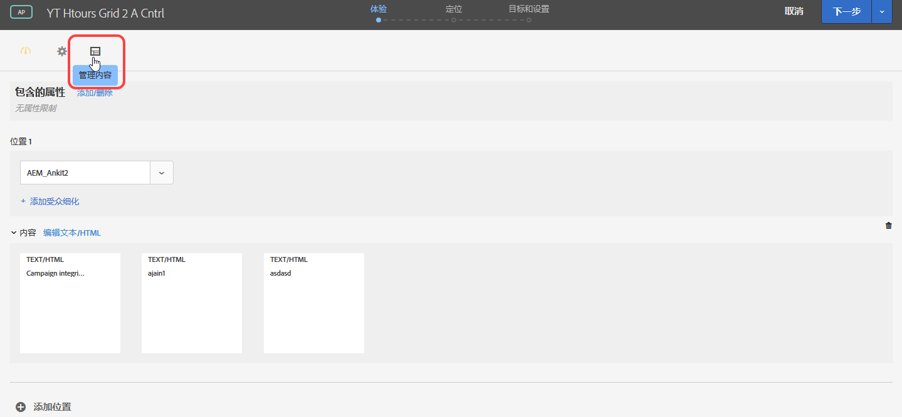
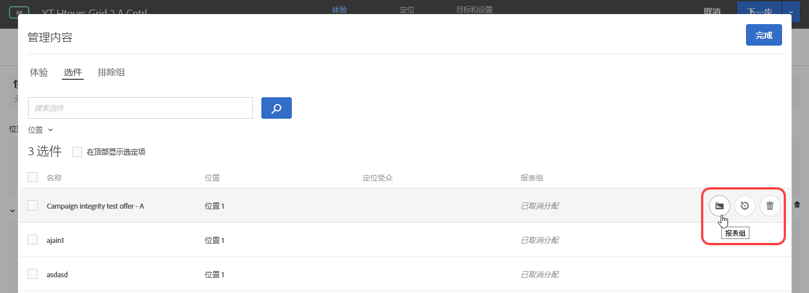
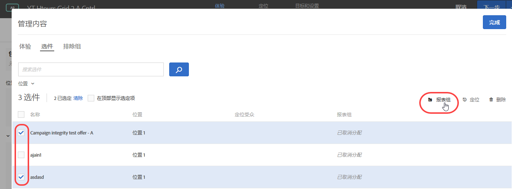
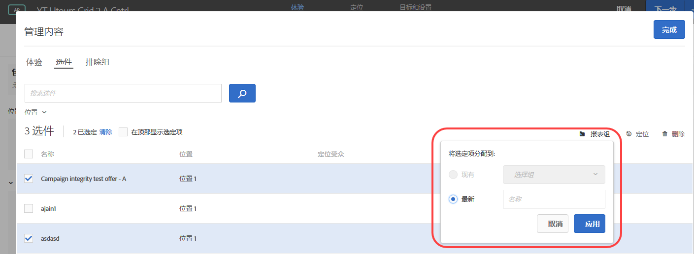

#  自动个性化中的选件报表组{#offer-reporting-groups-in-automated-personalization}

Information about using reporting groups in [Automated Personalization](/help/c-activities/t-automated-personalization/automated-personalization.md) (AP) activities.

报表组执行两项关键功能：

* 它们允许您查看在 AP 活动报表中分组的选件。
* They play a key role with how the [!DNL Target] personalization models function.

When you use reporting groups, [!DNL Target] creates only one personalization model for each reporting group instead of each offer in your AP activity using the data from all offers in that group.

如果您的活动设置没有足够的数据来为每个选件构建个性化模型，则报表组可以帮助降低使用自动个性化的数据要求。报表组还可以通过对相似选件进行分组来帮助解决新选件的“冷启动”问题，以便每个模型获得更多培训数据。对于定期向 AP 活动引入新选件的活动，还可使用建模组。

如果访客以相同的方式响应组中的所有选件，则此方法很有效。最佳做法是对相似访客组以相似方式进行响应的选件进行分组。换句话说，对具有相似转化率的选件进行分组。您绝不应该将所有选件都放置到一个报表组中。Grouping all offers or grouping offers with very different conversion rates likely reduces the effectiveness of the [!DNL Target] personalization models.

>[!NOTE]
>
>如果删除或替换特定建模组中的选件，则也会删除建模组中查看该特定选件的历史流量。In other words, deleted offers do not contribute to what data is used for the [!DNL Target] personalization models to learn.

**设置报表组：**

1. On the [!UICONTROL Experiences] page of an AP activity, click the **[!UICONTROL Manage Content]** icon.

   

1. 单击“**[!UICONTROL 管理内容]**”对话框顶部的[!UICONTROL 选件]选项卡。
1. （视情况而定）将特定体验添加到报表组，方法是将鼠标悬停在所需的选件上，然后单击&#x200B;**[!UICONTROL 报表组]**&#x200B;文件夹图标。

   

1. （视情况而定）在报表组中批量添加体验，方法是选中相关体验的复选框，然后单击对话框右上角的&#x200B;**[!UICONTROL 报表组]**&#x200B;文件夹图标。

   

1. (Conditional) To assign the selected offer to an existing reporting group, select **[!UICONTROL Existing]**, select the desired reporting group from the drop-down list, then click **[!UICONTROL Apply]**.

   或

   要创建新报表组以将所选选件分配到该报表组，请选择&#x200B;**[!UICONTROL 新建]**，为新报表组命名，然后单击&#x200B;**[!UICONTROL 应用]**。

   

