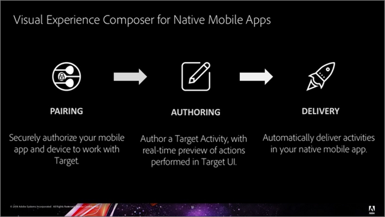
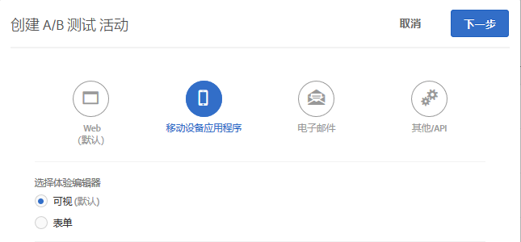
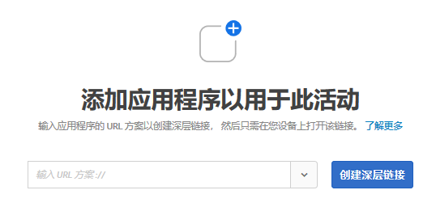

# 移动设备应用程序可视化体验编辑器{#mobile-app-visual-experience-composer}

使用本机移动设备应用程序的可视化体验编辑器 (VEC)，您能够以 DIY（自己动手）方式创建活动并对本机移动设备应用程序上的内容进行个性化，而无需持续依赖开发和应用程序发布周期。

现有的[可视化体验编辑器](../../c-experiences/experiences.md#section_34265986611B4AB8A0E4D6ACC25EF91D)为您提供了以 DIY（自己动手）方式创建活动和个性化体验的功能，这些活动和体验可以通过 Target 的全局 Mbox 以动态方式交付到您的 Web 属性，而无需任何开发人员干预。您现在可以利用 VEC 对本机移动设备应用程序执行相同的操作。[AEP SDK v5](https://aep-sdks.gitbook.io/docs/using-mobile-extensions/adobe-target-vec) 上提供的移动设备应用程序 VEC，可用于为移动设备应用程序创建 [A/B 测试](/help/c-activities/t-test-ab/test-ab.md)和[体验定位 (XT)](/help/c-activities/t-experience-target/experience-target.md) 活动。未来将提供对其他活动类型的支持。

移动设备应用程序 VEC 支持在[受支持的浏览器](../../c-implementing-target/c-considerations-before-you-implement-target/supported-browsers.md#reference_01B4BF99E7D545A7998773202A2F6100)中列出的浏览器。

## 使用本机移动设备应用程序的可视化体验编辑器 {#using-the-mobile-vec}

下图显示了使用移动设备应用程序 VEC 的过程：

| 过程 | 详细信息 |
|--- |--- |
| 配对 | 安全地授权您的移动设备应用程序和设备可以与 Target 配合使用。每个设备只需执行该步骤一次即可。 |
| 创作 | 创作 [Target 活动](/help/c-activities/activities.md)，实时预览在 Target UI 中执行的操作。 |
| 交付 | Target 在您的本机移动设备应用程序中自动交付活动。 |

**配对:**

移动设备应用程序 VEC 实时连接到营销人员的移动设备应用程序，以创作 Target 活动。要实现这一点，第一步是将移动设备和应用程序与 Target 安全配对（授权）。

1. 例如，在创建 A/B 测试活动时，依次选择&#x200B;**[!UICONTROL 移动设备应用程序]**、**[!UICONTROL 可视化（默认）]**，然后单击&#x200B;**[!UICONTROL 下一步]**。

   

1. 输入应用程序的 URL，然后单击&#x200B;**[!UICONTROL 创建深层链接]**。

   

配对过程包含以下步骤：

1. 输入可用于生成深层链接的应用程序 URL 方案。典型的深层链接如下所示：

   `mymobileapp://path?params`

1. 深层链接以二维码或 URL 形式提供。用户可以通过手机扫描二维码，或通过电子邮件/短信将 URL 发送给自己。深层链接 URL 具有授权令牌，用于将移动设备应用程序和设备与 Target 进行安全配对。
1. 在您的移动设备上打开深层链接 URL。此操作将会启动移动设备应用程序。SDK 确定该应用程序已启动，可供进行配对和在 VEC 中进行创作。

   SDK 向 Target 服务器发出请求并自行注册。Target 服务器授权令牌并与相应设备建立实时连接（当前使用 Web 套接字）。

   建立连接后，Target 界面中会显示应用程序的实时视图。应用程序有一个红色叠加边界，指示应用程序已连接到 Target，如下图所示。

   

   可以通过启动应用程序并打开创作界面来重新连接已配对的设备。

**创作：**

连接应用程序并在 VEC 中显示应用程序的实时视图后，您可以开始创作活动。目前支持以下操作：

| 操作 | 详细信息 |
|--- |--- |
| 交换图像 | 通过选择不同的图像选件或直接设置图像的 CDN URL，将图像与另一个图像交换。Target 中的图像选件是通过 [Adobe Scene7](/help/administrating-target/scene7-settings.md) 提供的。 |
| 更改文本 | 更改文本元素、按钮或标签中的文本内容、颜色或字体大小。 |
| 更改背景 | 更改文本区域或按钮的内容或元素背景。 |

应用程序中可实时显示在 VEC 中执行的操作，从而允许在创作期间使用实时预览功能。这些操作与相关的“移动设备屏幕”或“视图”以恰当的方式相关联。

**管理多个应用程序版本**

当检测到新的应用程序版本时，系统将通知您已将该应用程序版本添加到目标版本列表。

可以从“[!UICONTROL 管理版本]”对话框中手动添加和删除多个移动设备应用程序版本。

## Target 视图和移动设备应用程序 {#target-views}

移动设备应用程序 VEC 利用了“视图”的新概念，即视觉元素的逻辑组合，这些元素共同构成了移动设备应用程序体验。

**介绍 Target 视图**

我们以花卉销售应用程序为例。该应用程序允许用户执行以下任务：

* 列出在售的鲜花和花束
* 查看详细信息
* 订购鲜花
* 控制设置，例如付款选项和地址

在此应用程序中，您可以在移动设备应用程序的不同屏幕上完成上述每项任务。当用户浏览该应用程序时，会呈现一个屏幕，允许他们执行后续某一任务。如果您是 Android 开发人员，您很可能会创建四个不同的 Android 活动类，每个类均与其中一项任务相关联。

在这种情况下，可以将每项任务视为由移动设备应用程序转换的视图。我们将这些视图称为 Target 视图，每个视图均具有独特的特征。Target 视图（简称“视图”）是在移动设备屏幕上显示的可视化元素的逻辑容器。例如，Android 中的一个屏幕或活动类就是一个视图。

移动设备应用程序很少能够做到如此简单。让我们使它更实用一点。在第一项列出在售鲜花和花束的任务中，我们可以添加创建多个布局的功能，从而创建不同的屏幕。例如，让我们添加一个“排序依据”功能，该功能有三个选项：

* 按受欢迎程度
* 价格 - 由低到高
* 价格 - 由高到低

在此示例中，每当用户选择不同的“排序依据”选项时，即使活动类相同，也会显示新屏幕。因此，可以将其中的每个屏幕视为不同的 Target 视图。

作为营销人员，您会希望创建不同的体验并对其中每个视图运行不同的选件，而无需要求开发人员设置本地 mbox 或完成应用程序发布周期。

## 设置 Target 移动设备应用程序 VEC {#setting-up}

开发人员必须执行以下操作，才能为移动设备应用程序启用移动设备应用程序 VEC：

* 在 Launch 中配置 Adobe Target VEC 扩展
   * VEC 扩展依赖于 [Adobe Target 扩展](/help/c-implementing-target/c-implementing-target-for-client-side-web/how-to-deployatjs/cmp-implementing-target-using-adobe-launch.md)。确保已配置并启用 Adobe Target 扩展。
* 将 Target VEC 扩展添加到应用程序中。
   * [Android - 设置移动设备应用程序](/help/c-target-mobile-app/c-mobile-visual-experience-composer/mobile-visual-experience-composer-android.md)
   * [iOS - 设置移动设备应用程序](/help/c-target-mobile-app/c-mobile-visual-experience-composer/mobile-visual-experience-composer-ios.md)

## Target VEC 的实施方法

Target VEC 扩展可通过网络请求，检索与您的应用程序相关的 Target 体验。选件是通过这个网络调用来检索的，并将自动应用于目标屏幕。当用户在应用程序的多个屏幕之间浏览时，后续将不会产生检索 VEC 体验的网络请求。

扩展的默认行为是在应用程序启动时发出同步网络请求（阻止调用）。您可以使用 Launch 来控制网络请求的行为，以符合您的应用程序行为。

### 自动获取 Target 活动

这是默认行为，即 Target VEC 扩展自动发起网络请求。您可以使用以下任一选项，发起阻止调用的请求或异步请求。

* 在同步调用中获取（后台已关闭）

   选中此选项后，Target VEC 扩展将在应用程序启动时发起阻止调用的网络请求。将立即应用选件，并且在应用程序中不会出现闪烁。这是扩展的默认行为。

* 在异步调用中获取（后台已开启）

   选中此选项后，Target VEC 扩展将在应用程序启动时在后台发起网络请求，但不会阻止应用程序加载。如果您是在应用程序的主屏幕上创作体验，并且在调用结束之前呈现主屏幕，则选件有可能无法应用于主屏幕。应用程序屏幕呈现往往分别通过 iOS 和 Android 上的生命周期事件 `didFinishLaunchingWithOptions` 和 `onActivityResumed` 来标识。选件将自动应用于所有后续屏幕。

### 以编程方式获取 Target 活动

您可以禁用 Target VEC 扩展以自动发出网络请求，并决定以编程方式调用扩展 API。借助这种方式，开发人员可以控制他们在应用程序中集成 Target VEC 选件的方式。Target VEC 扩展有两种静态方法（`prefetchOffers` 和 `prefetchOffersBackground`），可用于以编程方式检索 Target VEC 选件。

* `prefetchOffers` 方法可隐藏当前屏幕，直到获取 Target VEC 选件为止。选件将自动应用于当前屏幕，如果适用，屏幕将再次可见。
* `prefetchOffersBackground` 方法不隐藏当前屏幕，并且会发起一项调用以检索相关的 Target 选件。Target 选件&#x200B;*不*&#x200B;应用于当前屏幕，而且不会出现闪烁。当用户导航到后续屏幕时，如果选件适用，则会自动得到应用。

### 处理 Target 工作区限制

您可以通过 Launch 界面设置工作区的 `at_property` 值。这样可以确保只向移动设备应用程序交付该工作区中的活动。

## Target API 调用的一般准则 {#section_C7276795F02540DCA230AEEDF882A833}

要为 Android 正确添加 Target 视图，请查看此处的简单表格，其中列出了正确放置 `targetView` 调用的位置：

| 可接受的 TargetView 位置 | 正确添加的条件 |
|--- |--- |
| `Activity::onStart`、`Activity::onResume` 的末尾 | 取决于开发人员是将 `OnStart` 和 `OnResume` 视为相同还是不同的 `targetViews`。如果视为相同，则使用相同的 `viewName`。如果视为不同，则使用不同的 `viewNames`。这些事件由 SDK 自动添加。 |
| 紧跟 `Activity::SetContent` 调用之后 | 如果 UI 不发生更改，我们可以插入一个 `targetView` 调用。 |
| `View::willAppear` 内部 | 如果选定的视图唯一地显示在一个特定视图层次结构中。 |
| 紧跟 `Activity::SetContentView` 调用之后 | 如果活动不更改/修改其在后续代码中的任何内容。 |

对于 Android，可查看此处的表格，了解错误放置 `targetView` 调用的位置：

| 不可接受的 TargetView 位置 | 原因 |
|--- |--- |
| `Activity::onCreate` 内部 | 虽然已创建活动，但不保证已完成与活动关联的视图，并且/或者已将其附加到窗口。放置在此处可能会导致不对创作屏幕进行取样或取样不完整，并且/或者以非确定性方式应用选件。 |
| `View::didAppear` 内部 | 视图已经显示，应用选件将会造成闪烁，从而提供较差的 UI 体验。 |
| `View::didLoad` 内部 | 视图未附加到主视图层次结构，且可能已实例化，但不保证会显示在应用程序 UI 上。 |

## 交付 {#delivery}

使用移动设备应用程序 VEC 创作的 Target 活动会在移动设备应用程序中自动交付。可以在应用程序启动时预取这些活动（基于启动配置），并在用户浏览不同的 Target 视图时加以应用，活动通常会直接映射到屏幕。

调用 `TargetVEC.prefetchOffersBackground()` API 方法时，将从 Target Edge 获取 Target 选件，并缓存到本地。这样可以提供更流畅的用户体验，因为当使用 `targetView()` 调用触发 Target 视图时，会立即从缓存中应用 Target 选件，而不是通过网络获取。

为了获得更大的灵活性，您还可以调用 `TargetVEC.prefetchOffers()` API，该 API 可以预先隐藏当前布局，直到预取 Target 选件并将其应用于可见的 Target 视图（可能导致闪烁）为止。

当用户浏览客户应用程序以使用最合适的内容刷新本地 Target 选件缓存时（在对当前用户的 Target 配置文件进行最新更新后），也可以重复调用 `TargetVEC.prefetchOffersBackground()`。

请注意，每次预取 Target 选件时，如果可能，也会应用通过 `AdobeTargetMobile.targetView()` 触发的最后一个 Target 视图的选件。

## 疑难解答 {#ts}

**移动设备应用程序 VEC 指出我的应用程序已断开连接。**

您的 Internet 连接可能已断开。在 Internet 可用后，重新启动应用程序，此时将会建立新连接。我们建议您通过 Wifi 连接来创作移动设备应用程序 VEC 活动。

**移动设备应用程序 VEC 与我的移动设备应用程序不同步。**

单击 VEC 中的“[!UICONTROL 刷新]”按钮以同步显示的内容。

## 已知限制 {#limitations}

* 移动设备应用程序 VEC 目前可用于为移动设备应用程序创建 [A/B 测试](/help/c-activities/t-test-ab/test-ab.md)和[体验定位 (XT)](/help/c-activities/t-experience-target/experience-target.md) 活动。未来将提供对其他活动类型的支持。
* 尝试将应用程序重新连接到移动设备应用程序 VEC 时，必须完全退出该应用程序，然后重新启动。

   在下面列出的任何情景中，如果移动设备应用程序已经打开，则必须关闭该应用程序，然后重新打开它。但是，您“必须”**&#x200B;从最近使用的应用程序部分中关闭应用程序，而“不是”**&#x200B;通过按“返回”按钮来关闭。如果通过按“返回”按钮来关闭应用程序，可能会出现间歇性连接问题。

   在以下几种情况中，如果应用程序已经打开，您必须重新启动应用程序才能连接到移动设备应用程序 VEC：

   * 创建新活动时，在选择移动设备应用程序后，会显示设备列表对话框。如果应用程序已经打开，您必须将其关闭，然后重新启动，这样才能将其设备显示为可供选择。
   * 开始编辑活动时，会显示设备对话框。如果应用程序已经打开，您必须将其关闭，然后重新启动，这样才能将其设备显示为可供选择。
   * 从“目标和设置”步骤导航回“创作”步骤（步骤 1）时，会显示设备对话框。如果应用程序已经打开，您必须将其关闭，然后重新启动，这样才能将其连接回移动设备应用程序 VEC。
   请确保您是从最近使用的应用程序部分中关闭应用程序，而不是通过按“[!UICONTROL 返回]”按钮来关闭。

## 培训视频：Adobe Target 移动设备应用程序可视化体验编辑器 (3：33) {#video}

>[!VIDEO](https://video.tv.adobe.com/v/27528?captions=chi_hans)