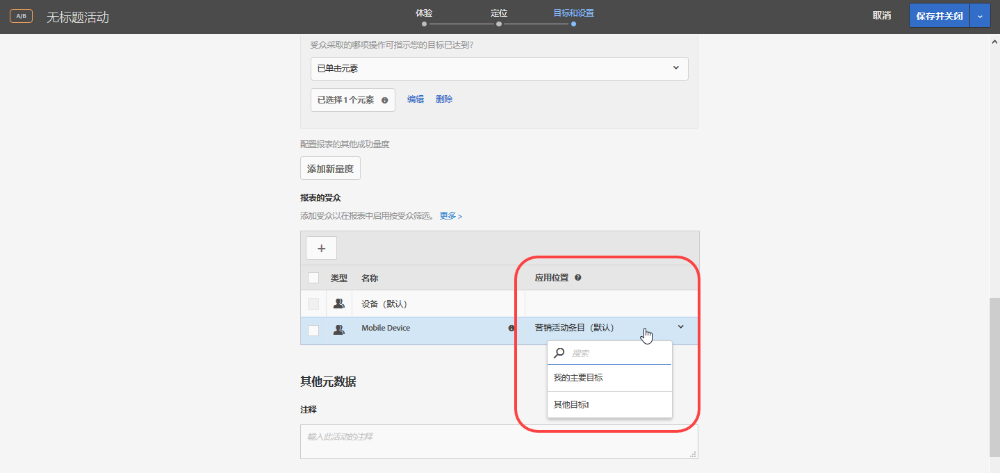
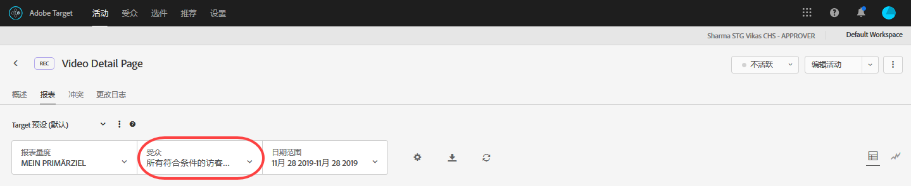

# 将报表受众应用于成功量度{#apply-a-reporting-audience-to-a-success-metric}

可选择一个能够让用户符合报表受众条件的成功量度。

对于所有活动，您都可以通过“[!UICONTROL 应用位置]”下拉列表将受众应用于成功量度，以便查看达到成功量度后的报表数量以及后续操作的报表数量。

例如，假设您为所有从您的主页进入并到达转化页面的访客创建了一个活动，但是您还希望进一步了解在转化之前向购物车中添加的商品金额高于 $50 的访客。

“应用位置”下拉列表可以提供以下三个类别：进入活动的所有访客、仅限到达活动特定步骤的访客，或仅限到达转化步骤的访客。换言之，您可以指定访客必须到达活动登入页面上的 mbox，访客必须到达定义活动中间某个点处的 mbox，或访客必须到达活动结束时的转化 mbox。

[成功量度](../c-activities/r-success-metrics/success-metrics.md#reference_D011575C85DA48E989A244593D9B9924)只有在为活动配置后才可用。如果您没有定义成功量度，您在“应用位置”下拉列表中将只会看到以下两个选项：“营销活动条目”和“转化”。

将报表受众应用于成功量度时，请考虑以下信息：

* 对于在应用了成功量度的操作之前执行的操作，Target 不会应用分段受众。
* 对于在应用了成功量度的操作之后执行的操作，Target 会应用分段受众。

要在报表中查看分段，请从活动报表中的“受众”下拉列表中选择所需的受众。

