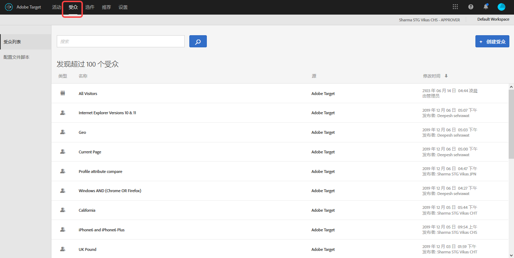
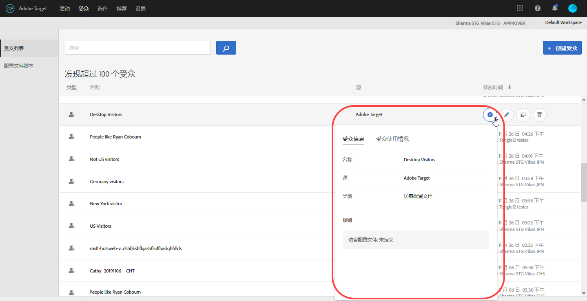
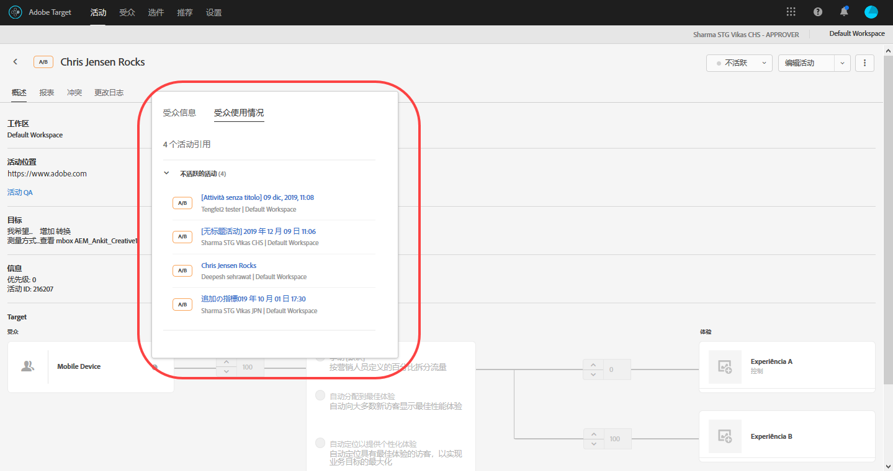
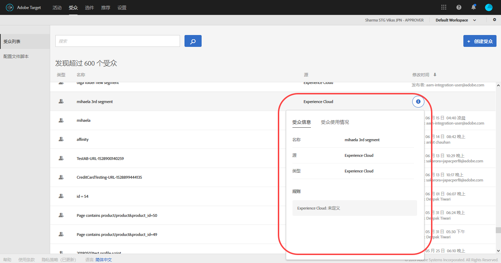

# 创建受众{#create-audiences}

Adobe Target 中的受众可决定将在定位活动中看到内容和体验的人群。

不论在何处，只要可以使用定位，便会用到受众。对活动进行定位时，您可以从“[!UICONTROL 受众]”列表中选择可重复使用的受众、[创建特定于活动的受众](/help/c-target/creating-activity-only-audience.md)并定位到该受众，或[合并多个受众](/help/c-target/combining-multiple-audiences.md#concept_A7386F1EA4394BD2AB72399C225981E5)以创建临时受众。

您还可以在 [!DNL Adobe Target] 及其他 [!DNL Experience Cloud] 解决方案中使用 [!DNL Analytics] 收集的受众数据进行实时定位和个性化。请参 [阅核心](https://docs.adobe.com/content/help/en/core-services/interface/audiences/audience-library.html) 服务用 *户指南中的受众*。

[!DNL Target] 定义了以下两种类型的受众：

* **定位受众：**&#x200B;用于向不同类型的访客交付不同的内容。
* **报表受众：**&#x200B;用于确定不同类型的访客对同一内容有何响应，以便于您分析测试结果。

   在 [!DNL Target] 中，仅当使用 [!DNL Target] 作为报表源时，才能配置报表受众。如果您使用 [ Adobe Analytics 作为报表源](/help/c-integrating-target-with-mac/a4t/a4t.md) (A4T)，则必须在 [!DNL Analytics] 中配置报表受众。

## 使用“受众”列表

要访问“[!UICONTROL 受众]”列表，请单击顶部菜单栏中的&#x200B;**[!UICONTROL 受众]**：

“[!UICONTROL 受众]”列表包含所有可在活动中使用的受众。使用“[!UICONTROL 受众]”列表可创建、编辑、删除、复制或合并受众。此列表还会显示创建受众的源位置（[!DNL Target]、[!DNL Target Classic]、[!DNL Adobe Audience Manager (AAM),]、[!DNL Experience Cloud] 等等）。预定义的受众（例如“新访客”和“旧访客”）无法重命名。

当使用最初在 AAM 中创建的受众时，如果您在 Target 活动中引用的受众之后在 AAM 中被删除，则 Target 会向您发出警报。

* 如果在 AAM 中删除受众，则“[!UICONTROL 受众]”列表和受众选择器均会显示警告图标。UI 中的工具提示也会指示受众已在 AAM 中删除。
* 如果您尝试将多个受众与已删除的受众合并，或者您想保存引用了已删除受众的活动，则会显示一条警告消息。

您还可以定位自定义配置文件参数和 `user.` 参数。When adding an audience, click **[!UICONTROL Add Rule]** > **[!UICONTROL Visitor Profile]**, then choose the parameter you want to use to target your activity. 如果未显示所需的参数，则表明该参数尚未由 mbox 触发。“[!UICONTROL 自定义参数]”下拉列表中提供了其他自定义 mbox 参数。

可使用搜索框来搜索“[!UICONTROL 受众]”列表。您可以搜索受众名称的任意部分，或将特定字符串用引号引住。

您可以按受众名称或上次修改日期对“[!UICONTROL 受众]”列表进行排序。要按名称或上次修改日期进行排序，请单击列标头，然后选择受众显示的顺序（升序或降序）。

## 查看受众定义 {#section_11B9C4A777E14D36BA1E925021945780}

在 Target UI 中的多个位置，您无需打开受众，即可在弹出卡片中查看受众定义详细信息。此功能适用于在 Target Standard/Premium 中创建的受众、从 Target Classic 中导入的受众，或通过 API 创建的受众。

例如，将鼠标悬停在“受众”列表中的某个受众上，然后单击“查看”图标，可访问以下受众定义卡片：

单击活动“概述”页面上的“查看”图标，可访问以下受众定义卡片：

单击“[!UICONTROL 受众使用情况]”选项卡，可查看引用了该受众的其他活动（如果适用）。这样，您就可以避免在编辑受众时对其他活动造成意外影响。该信息包含“实时活动”、“不活跃的活动”、“已存档的活动”和“正在同步的活动”。此功能适用于所有受众（库受众和[仅限该活动的受众](../../c-target/creating-activity-only-audience.md#concept_A6BADCF530ED4AE1852E677FEBE68483)）。

如果将一个受众与另一个受众合并，然后使用组合的受众创建活动，则这两个受众的使用情况信息都将列出这个新创建的活动。

下面是从 Adobe Experience Cloud 中导入的一个受众所具有的受众定义卡片。在本例中，受众是从 Adobe Audience Manager (AAM) 中导入的。

以下类型的导入受众具有下列详细信息：

| 受众类型 | 详细信息 |
|--- |--- |
| 移动设备受众 | 设备营销名称、供应商和型号。 将显示 `matches | does not match` 运算符，而不是`equals | does not equal` 。 |
| 访客行为受众 | **user.categoryAffinity：**&#x200B;带有 `FAVORITE` 参数的 `categoryAffinity`。  **监控：**监控服务等于 true。 **无监控服务：**&#x200B;监控服务等于 false。  |
| 使用 NOT 运算符的受众 | **单一规则：** Target 以 `[All Visitor AND [NOT [rule]` 格式显示受众。单个 NOT 规则会与 AND 及 `AllVisitor` 受众一同显示。  |

使用导入的受众时，请牢记以下几点信息：

* Target Standard/Premium 不再支持使用定位表达式受众。
* Target Standard/Premium 不支持某些已弃用的受众，或改进了运算符以便于使用。因此，导入的受众虽然根据定义可以使用，但这并不意味着可以在 Standard/Premium 界面中创建该受众。例如，虽然社交受众及其规则是可见的，但 Target Standard/Premium 不允许创建社交受众。

## 培训视频：使用受众 教 

以下视频包含有关使用受众的信息。

* 解释术语“受众”
* 介绍使用受众进行优化的两种方式
* 在“受众”列表中查找受众
* 将活动定位到受众
* 在活动中使用受众进行被动报告

>[!VIDEO](https://video.tv.adobe.com/v/17398)
