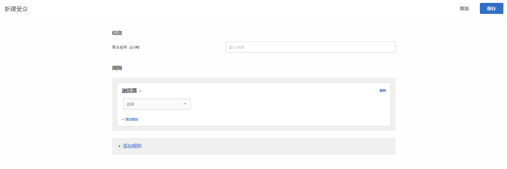

# 浏览器{#browser}

您可以定位使用特定浏览器或特定浏览器选项访问您的页面的用户。

可以定位以下浏览器：

* Chrome
* Microsoft Edge
* Firefox
* Opera
* Safari
* iPad
* Internet Explorer
* iPhone|

定位浏览器的方式有两种：

**预先构建的受众：**&#x200B;如果您希望仅定位使用特定浏览器访问您的网站的访客，请使用预先构建的受众。例如，如果您提供的产品是 Chrome 扩展，您将仅定位 Chrome 用户。

1. 设置活动时，从受众下拉列表中选择浏览器。

   此选项可将活动仅定位到使用指定浏览器的访客。

**自定义的浏览器受众规则：**&#x200B;通过自定义受众，您可以定位多种浏览器，或者针对特定浏览器、浏览器版本或浏览器语言设置规则或排除项。根据浏览器属性定位营销活动可提供很高的灵活性。

1. 在 [!DNL Target] 界面中，单击&#x200B;**[!UICONTROL 受众]** > **[!UICONTROL 创建受众]**。
1. 对受众进行命名。
1. 单击&#x200B;**[!UICONTROL 添加规则]** > **[!UICONTROL 浏览器]**。

   

1. 单击&#x200B;**[!UICONTROL 选择]**，然后选择以下选项之一：

   * **类型：**&#x200B;定位或排除特定浏览器。请参阅[类型](../../../c-target/c-audiences/c-target-rules/browser.md#section_6ADC758F23F145B3A310151546D83D56)。
   * **语言：**&#x200B;定位或排除设置为使用特定语言的特定浏览器。请参阅[语言](../../../c-target/c-audiences/c-target-rules/browser.md#section_7520D1AA464A45A6843EABE2D2B431A1)。
   * **版本：**&#x200B;定位或排除特定浏览器版本。请参阅[版本](../../../c-target/c-audiences/c-target-rules/browser.md#section_37CC8CE45DA04E8682AE6388321BA6EF)。

1. （可选）单击&#x200B;**[!UICONTROL 添加规则]**，然后为受众设置更多规则。
1. 单击&#x200B;**[!UICONTROL 保存]**。

以下示例显示受众为 Internet Explorer 版本 10 或 11 的用户：

## 浏览器选项 {#concept_221D8EEF53CC45AEACEB17CF336A3658}

根据浏览器的类型、语言或版本，定位或排除活动参加者。

### 类型 {#section_6ADC758F23F145B3A310151546D83D56}

定位或排除特定浏览器。

选择&#x200B;**[!UICONTROL 类型]**，然后选择“等于”或“不等于”。

* “等于”：定位选定的浏览器。
* “不等于”：排除选定的浏览器。

选择一种或多种浏览器。多个选项之间使用 OR 进行连接。

### 语言 {#section_7520D1AA464A45A6843EABE2D2B431A1}

定位或排除设置为使用特定语言的特定浏览器。

例如，如果某个选件只有英语版，则您可以定位将语言设置为英语的浏览器。或者，如果您的页面未启用双字节，则您可以排除设置为使用东亚语言的浏览器。

在语言比位置更为重要的情况下，包含或排除浏览器语言与根据地域进行定位相比，前者可以实现更准确的访客定位。例如，如果您提供的是一篇英语文章，您既可以定位讲英语的国家/地区，也可以定位设置为英语的浏览器。不过，使用后者，您还可以将这篇文章提供给来自主要语言并不是英语的国家/地区、但却会讲英语的用户。

选择&#x200B;**[!UICONTROL 语言]**，然后选择“等于”或“不等于”。

* “等于”：定位选定的浏览器语言。
* “不等于”：排除选定的浏览器语言。

选择一种或多种浏览器语言。多个选项之间使用 OR 进行连接。

可以定位或排除以下浏览器语言：

* 英语
* 法语
* 德语
* 日语
* 韩语
* 葡萄牙语
* 俄语
* 西班牙语
* 繁体中文

### 版本 {#section_37CC8CE45DA04E8682AE6388321BA6EF}

定位或排除特定浏览器版本。

例如，如果您的页面无法在 Internet Explorer 11 或更低版本中正常显示，则您可以创建排除这些版本的受众。在这种情况下，您需要先设置“浏览器类型等于 Internet Explorer”的规则，然后再添加“版本低于或等于 11”的规则。

选择&#x200B;**[!UICONTROL 版本]**，然后选择运算符：

* 等于
* 不等于
* 高于
* 高于或等于
* 低于
* 低于或等于

键入版本号。

在文本字段中只能输入主要版本。指定的版本包括该版本的任何次要版本。例如，如果您指定版本 10，则也会包括使用版本 10.1 的访客。

多个选项之间使用 OR 进行连接。

## 培训视频：创建受众 教 

以下视频包含有关使用受众类别的信息。

* 创建受众
* 定义受众类别

>[!VIDEO](https://video.tv.adobe.com/v/17392)