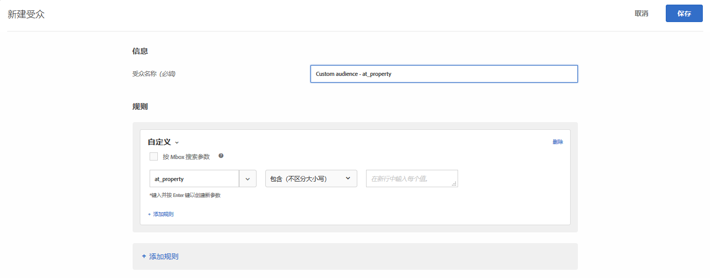

# 自定义参数

自定义参数是[!DNL Adobe Target]中的mbox参数。 如果您将任何mbox参数传递到mbox，或使用`targetPageParams`函数，则这些参数将显示在此处，以供在受众中使用。

有关更多信息，请参阅[将参数传递到全局mbox](/help/c-implementing-target/c-implementing-target-for-client-side-web/t-mbox-download/c-understanding-global-mbox/pass-parameters-to-global-mbox.md)。

创建基于 mbox 参数的自定义受众时，`mboxParameter` 将不再提示您输入 `mboxName`。mbox 名称现在是可选的。通过这项更改，您可以使用多个 mbox 中的参数或引用尚未记录到 Edge 的参数。

1. 在 [!DNL Target] 界面中，单击&#x200B;**[!UICONTROL 受众]** > **[!UICONTROL 创建受众]**。
1. 为受众命名并添加可选描述。
1. 将&#x200B;**[!UICONTROL Custom]**&#x200B;拖放到Audience Builder中。

   要选择所需的参数，请执行以下操作：

   * 创建受众时，从列表中选择参数名称，开始键入所需参数名称的前几个字符，或键入所需参数名称的全名。
   * 如果您记得mbox名称，但没有记得参数名称，请使用[!UICONTROL Filter by]下拉列表对传递所需参数的已知mbox进行筛选。

   无论使用哪种方法，mbox 和参数之间均没有链接。受众基于传递该参数的所有mbox中的参数工作。

   如果您编辑现有受众，则会显示筛选标准以及在创建期间提供的 mbox 名称。

1. 选取计算器：

   * 包含（不区分大小写）
   * 不包含（不区分大小写）
   * 等于
   * 不等于
   * 高于
   * 高于或等于
   * 低于
   * 低于或等于
   * 参数存在
   * 参数不存在
   * 参数值存在
   * 参数值不存在
   * 参数或值不存在
   * 从
   * 结束于

   

1. 在新行中输入每个值。
1. （可选）为受众设置其他规则。
1. 单击&#x200B;**[!UICONTROL 完成]**。

受众的[定义详细信息弹出卡片](/help/c-target/c-audiences/audiences.md#section_11B9C4A777E14D36BA1E925021945780)会在“规则”部分中显示参数名称。****&#x200B;没有对用于筛选的 mbox 的引用。

>[!NOTE]
>
>对于在[!DNL Target] 18.5.1版本（2018年5月22日）之前创建的自定义受众，mbox名称不会显示在受众的定义弹出卡片中。 再次保存自定义受众，以使mbox名称显示在卡片中。

## 注意事项 {#considerations}

* 针对特定 mbox 评估受众和活动。例如，如果全局mbox传递了某个参数，但区域mbox没有传递，则针对该参数的活动/受众将不符合区域mbox上的条件。
* 不会根据内部mbox参数（如mboxPC、mboxSession、mbox3rdPartyId、mboxMCSDID、mboxMCVID、mboxMCGVID、mboxCount、mboxId和mboxVersion）来评估定位。

## 培训视频：创建受众

以下视频包含有关使用受众类别的信息。

* 创建受众
* 定义受众类别

>[!VIDEO](https://video.tv.adobe.com/v/17392)
