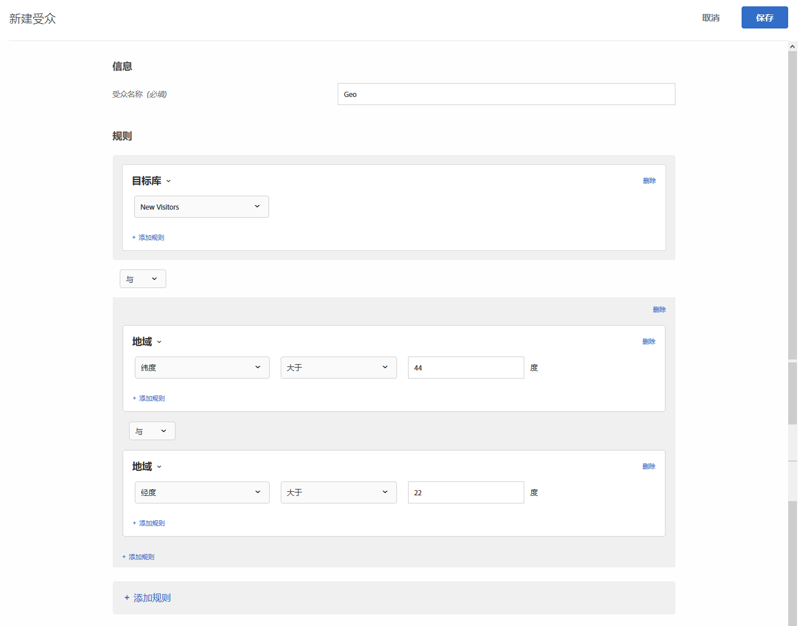

# 地域{#geo}

使用受众基于用户的地理位置（包括其国家/地区、省/自治区/直辖市、城市、邮编/邮政编码、DMA 或移动设备运营商）定位用户。

地理位置参数允许您根据访客的地理位置来定位活动和体验。您可以根据访客的地理位置信息（包括其国家/地区、省/自治区/直辖市、城市、邮编/邮政编码、纬度、经度、DMA 或移动设备运营商）来包含或排除访客。此数据根据访客的 IP 地址确定，随每个 Target 请求一起传送。选择这些参数的方式与选择其他任何定位值一样。

## 通过地域定位创建受众 {#section_49CBFFAAC8694C4AAD3DE4B2DB7B05DE}

1. 在 [!DNL Target] 界面中，单击&#x200B;**[!UICONTROL 受众]** > **[!UICONTROL 创建受众]**。
1. 对受众进行命名。
1. 单击&#x200B;**[!UICONTROL 添加规则]** > **[!UICONTROL 地域]**。

1. 单击&#x200B;**[!UICONTROL 选择]**，然后选择以下选项之一：

   * 国家/地区
   * 省/自治区/直辖市
   * 城市
   * 邮政编码
   * 纬度
   * 经度
   * DMA
   * 移动设备运营商

   访客的 IP 地址使用 mbox 请求来传递，以分析该访客的地域定位参数，每个访问（会话）进行一次。

   对于移动设备运营商，[!DNL Target] 会使用 IP 地址注册数据（即 IP 地址块所有者的注册数据）并根据[移动设备国家/地区代码 (MCC) 和移动设备网络代码 (MNC)](https://www.mcc-mnc.com) 来确定相应的移动设备运营商。

1. 指定运算符和相应的值。
1. （可选）单击&#x200B;**[!UICONTROL 添加规则]**，然后为受众设置更多规则。
1. 单击&#x200B;**[!UICONTROL 保存]**。

下图展示了一个受众，它定位的是从纬度大于 44 度和经度小于 22 度的地区访问活动的用户。

## 精准度 {#section_D63D5FFCB49C42F9933AFD0BD7C79DF1}

地域定位的精准度取决于多个因素。与蜂窝网络相比，使用 WiFi 连接进行地域定位会更加精准。如果访客使用的是蜂窝数据连接，则地理查询的精准度可能会受到位置、提供商与 [DeviceAtlas](https://deviceatlas.com/device-data/user-agent-tester) 之间的数据关系及其他因素的影响。使用基于蜂窝塔的网络连接进行地域定位可能没有使用有线或 WiFi 连接精准。此外，访客的 IP 地址可能已映射到其 ISP 位置，因此 IP 地址可能不是访客的真实位置。Some mobile geo-location issues can be solved using the [Geolocation API](https://developer.mozilla.org/en-US/docs/Web/API/Geolocation_API).

下表显示了使用有线或 WiFi Internet 连接时根据 IP 获取的地理位置信息的精准度，此数据由 [DigitalEnvoy](https://www.digitalelement.com/solutions/) 提供。DigitalEnvoy 能够提供业内最精准的数据。国家/地区级全局精准度超过 99.9%，城市级全局准确度高达 97%。此精准度信息不适用于基于蜂窝塔的网络。

| 国家/地区 | 省/自治区/直辖市 | 城市 | 地区 |
|--- |--- |--- |--- |
| 美国 | 99.99% | 96% | 94% |
| 加拿大 | 99.99% | 96% | 94% |
| 欧洲 | 99.99% |  |  |
| 英国 | 99.99% |  | 87% |
| 德国 | 99.99% | 95% | 93% |
| 斯堪的纳维亚半岛 | 99% | 90% - 95% | 85% 左右 |
| 西班牙 | 99.99% | 大概 90% | 95% - 99% |
| 亚洲 | 99% | 95% 左右 | 90% - 95% |
| 日本 | 99.99% | 95% 左右 | 90% - 95% |
| 澳大利亚 | 99.99% | 94% | 91% |

## 在配置文件脚本中使用地域定位 {#section_92C93138542C4A94997E3F4BE3F5DA28}

您可以将地理位置信息用于配置文件脚本。

例如，使用：

* `profile.geolocation.country`
* `profile.geolocation.state`
* `profile.geolocation.city`
* `profile.geolocation.zip`
* `profile.geolocation.dma`
* `profile.geolocation.domainName`
* `profile.geolocation.ispName`
* `profile.geolocation.connectionSpeed`
* `profile.geolocation.mobileCarrier`

因此，您可以使用以下代码编写名为“来自北美”的定位表达式：

`return profile.geolocation.country == 'united states' || profile.geolocation.country == 'canada' || profile.geolocation.country == 'mexico';`

## 将地域定位值用作令牌 {#section_E7F7FDF62C3B4934A6565D04B24655F6}

现在，您可以在选件、插件及其他位置中直接将 `profile.geolocation` 值用作令牌。

例如，使用：

* `${profile.geolocation.country}`
* `${profile.geolocation.state}`
* `${profile.geolocation.city}`
* `${profile.geolocation.zip}`
* `${profile.geolocation.dma}`
* `${profile.geolocation.domainName}`
* `${profile.geolocation.ispName}`
* `${profile.geolocation.connectionSpeed}`
* `${profile.geolocation.mobileCarrier}`
* `${profile.geolocation.latitude}`
* `${profile.geolocation.longitude}`

## 地域定位常见问题解答 {#section_DD308A53AF0F48FA8C81423580561FE7}

**如何指定纬度和经度？**

* 纬度/经度值应该是以度为单位的数值。
* 纬度/经度值最高可精确到 5 个小数位。
* 纬度值应介于 -90 到 90 之间。
* 经度值应介于 -180 到 180 之间。

**使用移动设备时进行地域定位的效果如何？**

绝大多数移动设备用户都会通过 WiFi 访问内容，这意味着使用移动设备时 Target 基于 IP 进行地域定位可达到与使用桌面时进行定位一样的精准度。使用基于蜂窝塔的连接时，会根据获取信号的塔所在的位置来确定访客的 IP 地址，因此精准度可能会有所降低。Some mobile geo-location issues can be solved using the [Geolocation API](https://developer.mozilla.org/en-US/docs/Web/API/Geolocation_API).

**地域定位功能如何处理来自 AOL（美国在线公司）的访客？**

鉴于 AOL 采用的流量代理方式，我们只能在国家/地区级别对其进行定位。例如，如果将营销活动定位到法国，则将能够成功定位法国的 AOL 用户。但是如果营销活动定位到巴黎，则不能成功定位巴黎的 AOL 用户。如果您的目的是特别定位 AOL 用户，您可以将地区字段设为“aol”。实际上，您可以通过指定以下两个定位条件来定位美国的 AOL 用户：国家/地区完全匹配“美国”，而地区完全匹配“aol”。

**地域定位提供了哪些位置粒度？**

* 国家/地区 - 全球
* 州/省/地区 - 全球
* 市 - 全球
* 邮政编码 - 美国、德国、加拿大
* DMA/ITV (UK) - 美国、英国
* 移动设备运营商 - 全球

**我如何模拟其他位置的用户身份测试活动？**

您可以使用其他位置的 IP 地址来覆盖您的 IP 地址，并使用 `mboxOverride.browserIp url` 参数。如果您的公司位于英国，但是您的全球营销活动要定位奥克兰和新西兰的访客，请使用以下形式的 URL（假设 `60.234.0.39` 是奥克兰的一个 IP 地址）：

`https://www.mycompany.com?mboxOverride.browserIp=60.234.0.39`

此操作前需要清除您的 Cookie。

>[!NOTE]
>
>`mboxOverride.browserIp` 仅在at.js 1.jx *中* 。 at.js 2不支持此功能。*x* 目前不支持选择加入支持。

**如何将波多黎各和中国香港特别行政区等区域映射到地理定位结构？**

系统将波多黎各、中国香港特别行政区和其他区域视为单独的“国家/地区”值。

**当活动[!DNL Target]被定位到地理位置定位功能时，是否会捕获（并存储）诸如邮政编码等信息？**

否， [!DNL Target] 仅在会话期间使用地理数据，然后丢弃数据。

## 培训视频：创建受众 

以下视频包含有关使用受众类别的信息。

* 创建受众
* 定义受众类别

>[!VIDEO](https://video.tv.adobe.com/v/17392)
