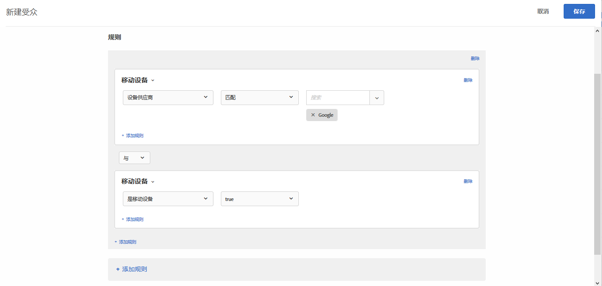

# 移动设备{#mobile}

创建受众以根据移动设备、设备类型、设备供应商、屏幕大小（按像素）等参数定位移动设备。

例如，您可能希望向从手机访问您页面和从计算机访问您页面的用户显示不同的内容。在这种情况下，您可以选择“移动设备”受众，再选择&#x200B;**[!UICONTROL 是移动电话]**&#x200B;选项，然后添加任何对您而言重要的特定信息，例如手机类型、屏幕大小（以像素为单位）等等。

移动设备定位是由 [DeviceAtlas](https://deviceatlas.com/device-data/user-agent-tester) 提供的，属于 DotMobi 的一个服务。DeviceAtlas 是一种综合的移动设备数据库，它基于从众多来源收集的数据构建，其中包括制造商和网络运营商。然后，系统对这些数据进行确认、交叉引用和验证，以构建准确的大型移动设备数据库。

可通过分析用户-代理字符串来实现设备检测。但是，有些设备制造商（例如 Apple）不会在用户-代理中提供足够的信息，从而无法使用此功能。

例如，Apple 设备不会在用户-代理中共享特定于设备型号的令牌。因此，无法使用基于关键字的简单方法来检测 iPhone 机型（例如 iPhone 5S、iPhone SE、iPhone 6，等等）。

为解决此问题，Target 使用以下参数收集其他数据来准确检测 iPhone 和其他 Apple 设备：

| 参数 | 类型 | 描述 |
|--- |--- |--- |
| devicePixelRatio | 字符串 | 浏览器中物理像素和与设备无关的像素 (dip) 之间的比率。例如“1.5”或“2” |
| screenOrientation | 字符串 | 设备和浏览器的 JavaScript 引擎支持“设备方向”。可以是“横向”或“纵向”。 |
| webGLRenderer | 字符串 | 图形驱动程序的浏览器渲染器。 |

>[!NOTE]
>
>使用 Mobile SDK 的客户无需执行任何操作即可使用此功能。使用 at.js 的客户必须[升级至 at.js 版本 1.5.0](../../../c-implementing-target/c-implementing-target-for-client-side-web/target-atjs-versions.md#reference_DBB5EDB79EC44E558F9E08D4774A0F7A)（或更高版本）。

您可以选择多个移动设备属性。选择的多个属性将使用 OR 来连接。

使用自定义集成（不使用 at.js 或 Mobile SDK）的客户可以自己收集这些参数并将其作为 mbox 参数传递。

1. 在 [!DNL Target] 界面中，单击&#x200B;**[!UICONTROL 受众]** > **[!UICONTROL 创建受众]**。
1. 对受众进行命名。
1. 单击&#x200B;**[!UICONTROL 添加规则]** > **[!UICONTROL 移动设备]**。
1. 单击&#x200B;**[!UICONTROL 选择]**，然后选择以下选项之一：

   * 设备营销名称
   * 设备型号
   * 设备供应商
   * 是移动设备
   * 是移动电话
   * 是平板电脑
   * 操作系统
   * 屏幕高度（像素）
   * 屏幕宽度（像素）

   >[!NOTE]
   >
   >由于 iOS 12.2 中引入了新更改，使用由设备营销名称和设备型号（用于指定 iPhone 型号）定义的规则创建受众这一功能受到了影响。我们无法再定位使用安装了 iOS 12.2 的 iPhone 的用户。但是，如果这些用户未使用 iOS 12.2，则“iPhone 型号”定位功能将可以继续正常使用。
   >
   >iOS 12.2 更新不会影响下列型号的识别，因为这些型号不支持升级到 iOS 12.2：iPhone、iPhone 3G、iPhone 3GS、iPhone 4、iPhone 4s、iPhone 5、iPhone 5c、iPad、iPad 2、iPad/Retina 显示屏、iPad Retina（第 4 代）、iPod Touch 4 和 iPod Touch 5。

   >[!NOTE]
   >
   >您可以使用[地域设置](../../../c-target/c-audiences/c-target-rules/geo.md#concept_5B4D99DE685348FB877929EE0F942670)通过移动设备运营商进行定位。

1. （可选）单击&#x200B;**[!UICONTROL 添加规则]**，然后为受众设置更多规则。
1. 单击&#x200B;**[!UICONTROL 保存]**。

下图展示了一个受众，它定位的是使用由 Google 制造的移动设备的访客。

## 培训视频：创建受众

以下视频包含有关使用受众类别的信息。

* 创建受众
* 定义受众类别

>[!VIDEO](https://video.tv.adobe.com/v/17392)
