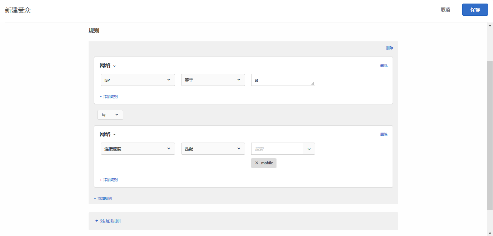

# 网络{#network}

您可以基于网络详细信息创建受众。

1. 在 [!DNL Target] 界面中，单击&#x200B;**[!UICONTROL 受众]** > **[!UICONTROL 创建受众]**。
1. 对受众进行命名。
1. 单击&#x200B;**[!UICONTROL 添加规则]** > **[!UICONTROL 网络]**。
1. 单击&#x200B;**[!UICONTROL 选择]**，然后选择以下选项之一：

   * **ISP：** ISP 是指向订户提供 Internet 接入服务的组织，订户需按月或按年向该组织缴纳相应费用。很多 ISP 还提供其他服务项目，例如 Web 托管或电子邮件服务。“ISP”字段中填写的内容可以是一个商业 ISP（例如 Comcast 或 TimeWarner），也可以是其他实体（例如企业或教育机构）。

      下面列举了美国常用的一些 ISP：

      | 常用名 | ISP 名称 | 域名 | 示例 IP 地址 |
      |---|---|---|---|
      | Cablevision | Cablevision Systems Corp. | *.optonline.net | 68.196.130.239 |
      | CenturyLink | Qwest Communications Company, LLC | *.centurylink.net | 64.40.65.0 |
      | Charter Communications | Charter Communications | *.charter.com | 71.85.225.124 |
      | Comcast | Comcast Cable Communications, Inc. | *.comcast.net | 76.27.24.28 |
      | Cox | Cox Communications Inc. | *cox.net | 68.224.174.22 |
      | Speakeasy | MegaPath Corporation | *.speakeasy.net | 66.93.240.0 |
      | Time Warner | Time Warner Cable Internet LLC | *.res.rr.com | 72.229.28.185 |
      | Verizon FiOS | MCI Communications Services, Inc. d/b/a Verizon Business | *.fios.verizon.net | 173.68.112.34 |
      | Vivint | Smartrove Inc. | *.vivintwireless.net | 170.72.26.105 |
      | AT&amp;T Wireless | AT | *.mycingular.net |  |
      | Sprint mobile | Sprint Personal Communications Systems | IP 地址 |  |
      | T-Mobile | T-Mobile USA, Inc. | IP 地址 | 208.54.86.0 |
      | Verizon Wireless | Cellco Parternship DBA Verizon Wireless | *.myvzw.com | 70.195.74.199 |

      >[!NOTE]
      >
      >基于 ISP 进行定位时，请使用 ISP 名称，而不要使用通用名。此外，还请确保您构建的规则不区分大小写，或者始终使用小写格式。

      您可以对 ISP 和域名值进行测试。https://www.whoismyisp.org 是用于定位的有用资源。您可以使用上表中给出的示例 IP 地址，也可以输入您自己的 IP 地址。然后，使用 `themboxOverride.browserIp= URL` 参数来模拟该 IP 地址。

   * **域名：**&#x200B;这是指访客 IP 地址的域名，而不是您在 [!DNL Target] 中使用的网站的域名。此域名与访客的 IP 地址有关，有时也称为主机名。通常情况下，此域名和 ISP 名称非常相似。有时，主机名会引用公司在变更其 ISP 名称之前使用的旧名称，而不引用域名。
   * **连接速度：**&#x200B;这是指访客连接到 Internet 的速度。选项包括：宽带、有线、拨号、移动、oc3、oc12、卫星、t1、t2、无线和 xdsl。

      此字段基于连接类型，而并非实际速度本身。[!DNL Target] 无法确定各种连接方式的精确连接速度。如果没有迹象显示使用了其他连接类型，则会使用宽带连接类型，因此无法选择特定的类型。

1. （可选）单击&#x200B;**[!UICONTROL 添加规则]**，然后为受众设置更多规则。
1. 单击&#x200B;**[!UICONTROL 保存]**。

下图展示了一个受众，它定位的是使用 AT&amp;T 且连接速度为“[!UICONTROL 移动设备]”的访客。

## 培训视频：创建受众

以下视频包含有关使用受众类别的信息。

* 创建受众
* 定义受众类别

>[!VIDEO](https://video.tv.adobe.com/v/17392)