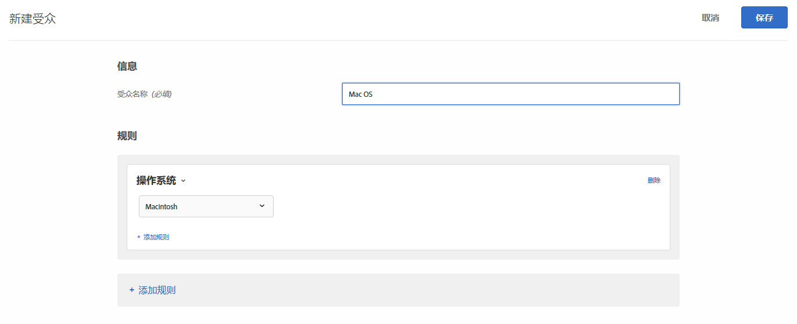

# 操作系统{#operating-system}

您可以定位使用某种操作系统的访客。

1. 在 [!DNL Target] 界面中，单击&#x200B;**[!UICONTROL 受众]** &gt; **[!UICONTROL 创建受众]**。
1. 对受众进行命名。
1. 单击&#x200B;**[!UICONTROL 添加规则]** &gt; **[!UICONTROL 操作系统]**。
1. 单击&#x200B;**[!UICONTROL 选择]**，然后选择以下选项之一：

   * Linux
   * Macintosh
   * Windows

1. （可选）单击&#x200B;**[!UICONTROL 添加规则]，然后为受众设置更多规则。**
1. 单击&#x200B;**[!UICONTROL 保存]**。

下图展示了一个受众，它定位的是使用 Macintosh 操作系统的访客。

## 培训视频：创建受众

以下视频包含有关使用受众类别的信息。

* 创建受众
* 定义受众类别

>[!VIDEO](https://video.tv.adobe.com/v/17392?captions=chi_hans)
