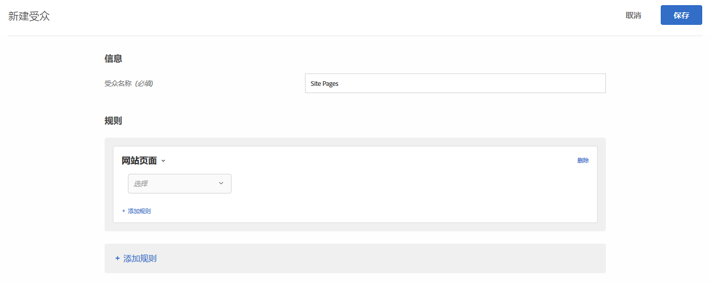

# 网页{#site-pages}

您可以目标站点上特定页面的访客。

1. 在 [!DNL Target] 界面中，单击&#x200B;**[!UICONTROL 受众]** > **[!UICONTROL 创建受众]**。
1. 对受众进行命名。
1. 单击&#x200B;**[!UICONTROL 添加规则]** > **[!UICONTROL 网站页面]**。

   

1. 单击 **[!UICONTROL 选择]** (Select)下拉列表，选择以下选项之一，然后根据需要配置规则。

   规则中后续下拉列表中的可用选项和计算器因您选择的选项而异。 下图显示了如果选择“当前页面”时可用 [!UICONTROL 的选项]:

   

   选择“选择”后，初始下拉列表中提供以下 [!UICONTROL 选项]。

   * **当前页：** 用户当前所在的页面。

      如果选择此选项，则第二个下拉列表中提供以下选项：

      * URL(有关目标如何评估URL的更多信息，请参 [阅目标和受众常见问题解答](/help/c-target/c-troubleshooting-targets-and-audiences/troubleshooting-targets-and-audiences.md)。)
      * 域
      * 查询
      * 子域
      * 顶级域
      * 路径
      * 哈希 (#) 碎片
   * **上一页：**&#x200B;用户在点击到当前页面之前所在的页面。（必须是用户从前一页点击进入当前页的情况下才能跟踪此页。如果用户通过在浏览器输入新 URL 进入当前页，则上一页不会被跟踪。）该页的实际内容取决于网站设计。例如，如果当前页显示某特定产品的信息，上一页则可能是供访客选择此特定项目的产品类别页（比如展示同类型的几款相机的页面），也有可能是导向最终页面的主页。

      如果选择此选项，则第二个下拉列表中提供以下选项：

      * URL(有关目标如何评估URL的更多信息，请参 [阅目标和受众常见问题解答](/help/c-target/c-troubleshooting-targets-and-audiences/troubleshooting-targets-and-audiences.md)。)
      * 域
      * 查询
      * 子域
      * 顶级域
      * 路径
   * **登陆页面：**&#x200B;登陆页面指访客访问您的网站时看到的第一个页面。例如，如果访客点击了 Google 上的某个通往类别页面的链接，则该类别页面即登陆页面。如果链接通往主页，该主页为登录页。访客会话将记住登录页。您可以根据该会话中访客的登录页向网站的更深层次定位。

      如果选择此选项，则第二个下拉列表中提供以下选项：

      * URL(有关目标如何评估URL的更多信息，请参 [阅目标和受众常见问题解答](/help/c-target/c-troubleshooting-targets-and-audiences/troubleshooting-targets-and-audiences.md)。)
      * 域
      * 查询
      * 子域
      * 顶级域
      * 路径
      * 哈希 (#) 碎片

      >[!NOTE]
      >
      >`landing.url` 对象会在更改子域或直接替换 URL 时重置。

   * **HTTP头：** 此选项评估目标请求的HTTP头中的信息。 例如，如果HTTP头包含语言信息，您可以创建一个规则，该规则包含用西班牙语 `Accept-Language: es` 访问页面的目标访客的条件。

      如果选择此选项，则第二个下拉列表中提供以下选项：

      * Accept
      * 接受——字符集
      * 接受编码
      * Accept-Language
      * 授权
      * Cache-Control
      * 连接
      * Content-Length
      * 内容MDS
      * Content-Type
      * 日期
      * 期望
      * 从
      * 主机
      * If-Match
      * If-Modified-Since
      * If-None-Match
      * If-Range
      * If-Uniquied-Since
      * 最大转发
      * Pragma
      * 代理授权
      * 范围
      * Referer
      * TE
      * 升级
      * User-Agent
      * Via
      * 警告

   如果选择“当 [!UICONTROL 前页]”、 [!UICONTROL “上一页”或]“登陆页 [!UICONTROL ”，则可] 以使用查询和选项。 选择这些选项时，请考虑以下事项：

   * **域：**&#x200B;页面的完整域。指定域时，最佳做法是使用“包含”。例如，“域等于 facebook.com”将不接受 `m.facebook.com` 或 `www.facebook.com`。而“域包含 facebook.com”则将接受 facebook.com 的任何变体。
   * **查询：** URL 中第一个问号 (?) 后面的内容。

      `foo.html?e0a72cb2a2c7`

1. （可选）单击&#x200B;**[!UICONTROL 添加规则]**，然后为受众设置更多规则。
1. 单击&#x200B;**[!UICONTROL 保存]**。

您还可以使用自己的“用户定义的查询参数”或“用户定义的标头”来创建网站页面受众。

使用：

* 查询参数，如果用户选择的规则是“当前页面”、“登陆页面”或“上一页”。
* 如果用户选择的规则是HTTP头，则为头。

如下图所示：

## 疑难解答 {#ts}

* 要使登陆页受众正常工作，请 `mboxReferrer` 求必须设置at.js JavaScript库从页面 `context.address.referringUrl` 使用属性获取的参数(对于投放API，参数 `document.referrer` )。 此 `HTMLDocument` 属性返回用户从中导航的页面的URI。 当用户直接导航到页面时（不是通过链接，而是通过书签），此属性的值为空字符串。

   如果此行为与您的要求不符，请考虑执行下列操作之一：

   * 传 [递mbox参数](/help/c-implementing-target/c-implementing-target-for-client-side-web/t-mbox-download/c-understanding-global-mbox/pass-parameters-to-global-mbox.md) , [!DNL Target] 以用于定位目的。
   * 使用 [A/B测试活动](/help/c-activities/t-test-ab/test-ab.md) ，而不是登陆页活动。 A/B测试活动不会为同一访客切换体验。
   * 请改 [用访客](/help/c-target/c-audiences/c-target-rules/visitor-profile.md) 用户档案。

* 对包含逗号的字符串使用“开始/结尾”计算器时，请注意，这些值将作为一组值进行计算，其中每个以逗号分隔的值都会进行计算。 例如，如果我们有标题的值： `Accept-Language: en,zh;q=0.9,en-IN;q=0.8,zh-CN;q=0.7` 它将满足以下条件：
   * 开始使用zh,
   * 开始,
   * 以0.7结束，
   * 以0.8结束。

## 培训视频：创建受众

以下视频包含有关使用受众类别的信息。

* 创建受众
* 定义受众类别

>[!VIDEO](https://video.tv.adobe.com/v/17392)
