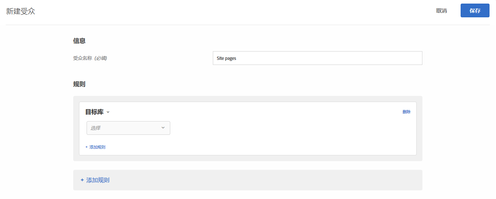

# Target 库{#target-library}

可基于预先构建的定位规则定位用户。

“定位库”类别中预先构建的受众是旧版受众，它们存在于其他类别中。有关更多信息和最佳实践，请参阅[定位和受众常见问题解答](../../../c-target/c-troubleshooting-targets-and-audiences/troubleshooting-targets-and-audiences.md#concept_C4EE4B8F4840430CBD798D579A8F208D)。

1. 在 [!DNL Target] 界面中，单击&#x200B;**[!UICONTROL 受众]** > **[!UICONTROL 创建受众]**。
1. 对受众进行命名。
1. 单击&#x200B;**[!UICONTROL 添加规则]** > **[!UICONTROL 定位库]**。

   

1. 单击&#x200B;**[!UICONTROL 选择]**，然后选择一个预先构建的定位规则。

   预先构建的定位规则包括：Windows 操作系统、平板电脑设备、Safari 浏览器、回访访客、从 Google 引荐的访客，等等。

   当用户代理包含以下任一字符串（其中一些字符串代表设备型号）时，用户便已符合预定义受众“平板电脑设备”的条件。您不必为这些设备创建自定义定位规则。

   Kindle、Silk、iPad、Sony Tablet、TF101、GT-P1000、GT-P1000R、GT-P1000M、SGH-T849、SHW-M180S、GT-I9000T、BNTV250 和 Tablet PC。

1. （可选）单击&#x200B;**[!UICONTROL 添加规则]**，然后为受众设置更多规则。
1. 单击&#x200B;**[!UICONTROL 保存]**。

## 培训视频：创建受众

以下视频包含有关使用受众类别的信息。

* 创建受众
* 定义受众类别

>[!VIDEO](https://video.tv.adobe.com/v/17392)
