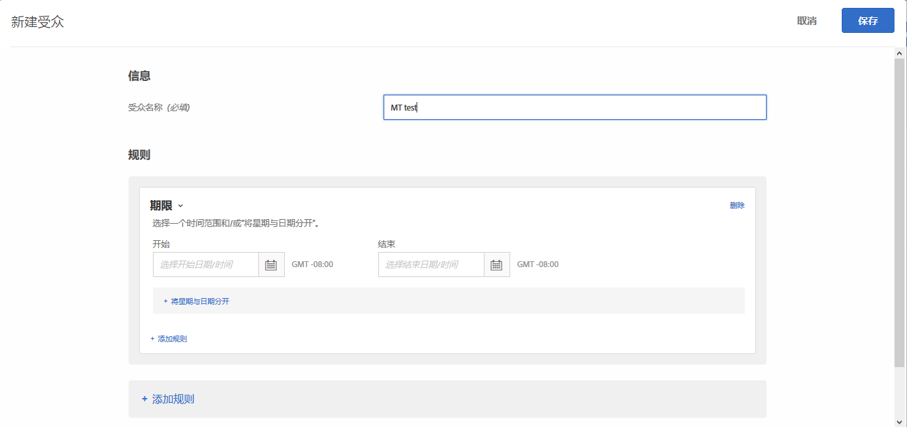
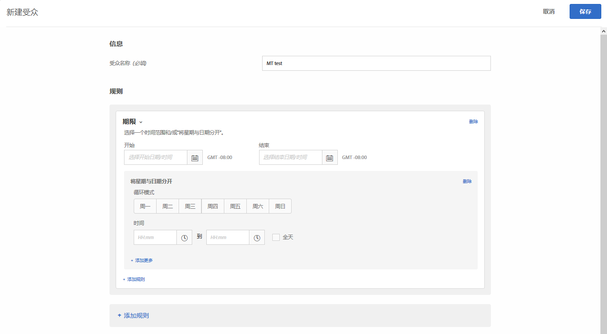

# 期限{#time-frame}

您可以添加开始/结束日期和时间来定位在特定期限内访问您网站的用户。您也可以设置“将星期与日期分开”选项来为受众定位创建循环模式。

例如，使用[合并的临时受众功能](../../../c-target/combining-multiple-audiences.md#concept_A7386F1EA4394BD2AB72399C225981E5)，您可以定位黑色星期五之前的三天内特定内容的低消费人群，以及黑色星期五之后其他内容的低消费人群。

1. 在 [!DNL Target] 界面中，单击&#x200B;**[!UICONTROL 受众]** > **[!UICONTROL 创建受众]**。
1. 对受众进行命名。
1. 单击&#x200B;**[!UICONTROL 添加规则]** > **[!UICONTROL 时间范围]**。

   

1. 指定受众的开始和结束日期与时间。

   将开始日期留空，可根据活动的计划开始定位。将结束日期留空，可一直定位到活动的结束日期和时间。

   您也可以将开始日期和结束日期都留空。这样，在活动级别控制开始日期和结束日期时，您可以在多个活动中使用相同的受众（无需复制受众）。

   >[!NOTE]
   >
   >开始/结束日期的时区显示为 GMT +/- NN:NN，其中 NN:NN 是与 GMT 的时间差，它反映的是帐户级别的时区，而不是访客所在时区。例如，加利福尼亚的时区会显示为 GMT -08:00。

1. （视情况而定）单击&#x200B;**[!UICONTROL 将星期与日期分开]**，以设置循环模式，包括星期几和具体时间。

   

   例如，您可以使用“将星期与日期分开”选项，以便仅在您的呼叫中心有人值班的工作日和时间段向访客显示“立即聊天”选项。

   选择一周中的一天或多天，然后设置开始时间和结束时间。单击“**[!UICONTROL 添加更多]**”以根据需要指定更多模式。

   >[!NOTE]
   >
   >[!UICONTROL 将星期与日期分开]的时区显示为 GMT +/- NN:NN，其中 NN:NN 是与 GMT 的时间差，它反映的是帐户级别时区，而不是访客所在时区。例如，加利福尼亚的时区会显示为 GMT -08:00。

1. （可选）单击&#x200B;**[!UICONTROL 添加规则]**，然后为受众设置更多规则。

   请注意，如有需要，您可以对每个规则重复执行步骤 5。

1. 单击&#x200B;**[!UICONTROL 保存]**。

## 培训视频：创建受众 

以下视频包含有关使用受众类别的信息。

* 创建受众
* 定义受众类别

>[!VIDEO](https://video.tv.adobe.com/v/17392)
