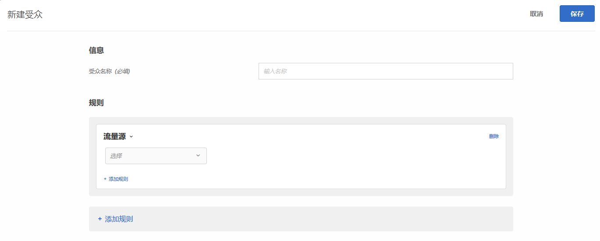

# 流量源{#traffic-sources}

创建受众以根据将访客引荐至您网站的搜索引擎或登陆页面来定位访客。

例如，您可以根据访客的浏览器、搜索引擎或引荐登陆页面来确定目标。引荐登陆页面是指一个会话中的某个网页，访客通过在该网页中点击而来到当前网站。（例如，如果访客点击了 Google 上的一则广告后，它将访客引荐至 `adobe.com` 主页，则 `google.com` 即为引荐登陆页面。）

您可以组合多个流量源来创建一个复杂的目标规则。

1. 在 [!DNL Target] 界面中，单击&#x200B;**[!UICONTROL 受众]** &gt; **[!UICONTROL 创建受众]**。
1. 对受众进行命名。
1. 单击&#x200B;**[!UICONTROL 添加规则]** &gt; **[!UICONTROL 流量源]**。

   

1. 单击&#x200B;**[!UICONTROL 选择]**，然后选择以下选项之一：

   * 来自 Baidu
   * 来自 Bing
   * 来自 Google
   * 来自 Yahoo
   * 引荐登陆页面: URL
   * 引荐登陆页面: 域
   * 引荐登陆页面: 查询
   根据您的选择，您可能需要提供其他信息（计算器和/或值）。

1. （可选）单击&#x200B;**[!UICONTROL 添加规则]，然后为受众设置更多规则。**
1. 单击&#x200B;**[!UICONTROL 保存]**。

您可以定位由特定搜索引擎或从特定登陆页面引荐至您网站的用户。

## 培训视频：创建受众

以下视频包含有关使用受众类别的信息。

* 创建受众
* 定义受众类别

>[!VIDEO](https://video.tv.adobe.com/v/17392?captions=chi_hans)
