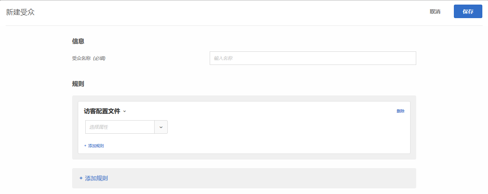

# 访客配置文件{#visitor-profile}

创建受众以定位满足特定配置文件参数的访客。

1. 在 [!DNL Target] 界面中，单击&#x200B;**[!UICONTROL 受众]** &gt; **[!UICONTROL 创建受众]**。
1. 对受众进行命名。
1. 单击&#x200B;**[!UICONTROL 添加规则]** &gt; **[!UICONTROL 访客配置文件]**。

   

1. 单击&#x200B;**[!UICONTROL 选择]**，然后选择以下选项之一：

   访客配置文件参数通过 mbox（配置文件）进行传递。您可以定位新访客或回访访客，也可以包含所有用户。

   * 新访客
   * 回访访客
   * 在其他测试中
   * 不在其他测试中
   * 会话首页
   * 不是会话首页
   * 类别亲和度
   使用新的 `mboxPC` 为每个 mbox 调用在本地 Edge 内存中创建访客配置文件。在处于不活动状态超过 30 分钟之后，配置文件会保存到 Target 数据库，以便可从其他 Edge 访问。

   当网站访客在会话期间登录并获得 `3rdpartyId` 时，之前加载的所有与该 `3rdPartyId` 关联的配置文件属性便会立即可用。

   您可以定位自定义配置文件参数和 `user.` 参数。选择要用来定位活动的参数。如果未显示所需的参数，则表明该参数尚未由 mbox 触发。

1. （可选）单击&#x200B;**[!UICONTROL 添加规则]，然后为受众设置更多规则。**
1. 单击&#x200B;**[!UICONTROL 保存]**。

## 培训视频：创建受众

以下视频包含有关使用受众类别的信息。

* 创建受众
* 定义受众类别

>[!VIDEO](https://video.tv.adobe.com/v/17392?captions=chi_hans)
