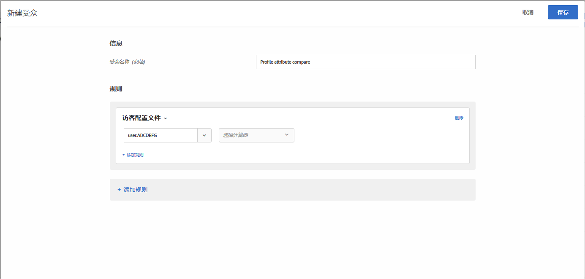
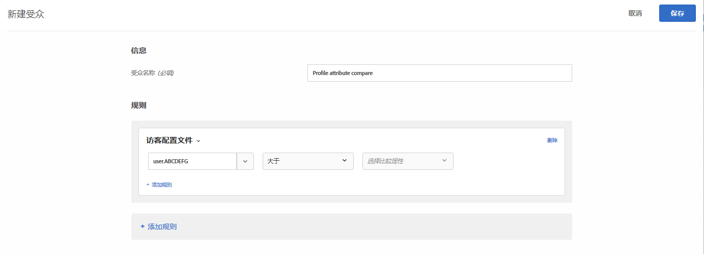
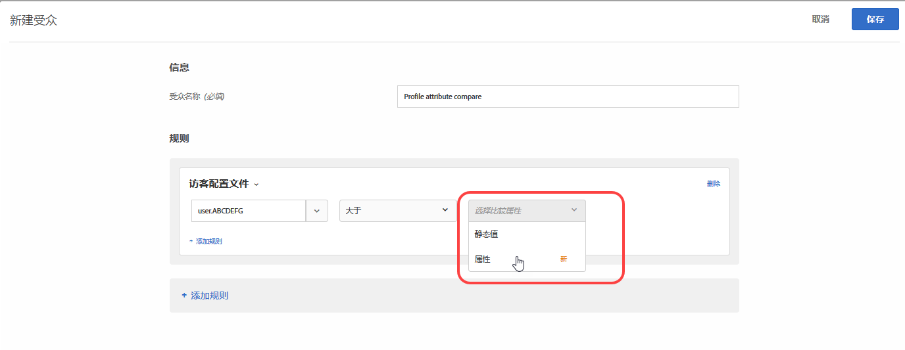
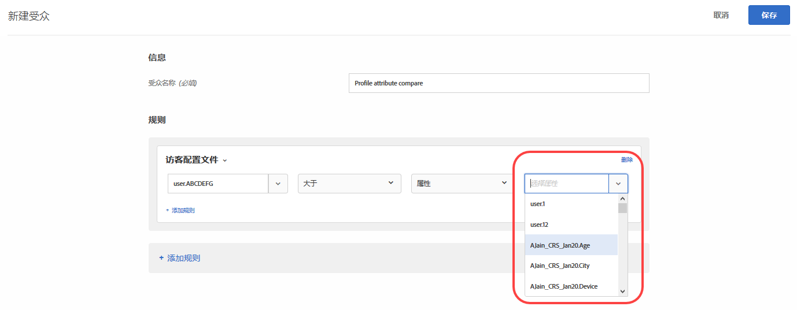

# 创建配置文件属性比较受众{#create-a-profile-attribute-comparison-audience}

将受众定义为比较[受众库](/help/c-target/c-audiences/audiences.md)或[仅限该活动的受众](/help/c-target/creating-activity-only-audience.md)的两个配置文件属性。使用诸如大于、小于或等于的运算符来定义受众，以动态比较两个不同配置文件属性的值。

>[!NOTE]
>
>此功能仅适用于[访客配置文件](../../c-target/c-audiences/c-target-rules/visitor-profile.md#concept_E972690B9A4C4372A34229FA37EDA38E)类别。

## 概述 {#section_303CBC78194D49A2A004945D425441E1}

受众由确定在 Target 活动中包含或排除哪些访客的规则来定义。一个受众定义可以包含多个规则，而每个规则可以包含多个参数。如果您包含的某个规则使用“访客配置文件”类别，则可以根据访客配置文件属性的特定值定义规则，或者将该属性的值与另一个访客配置文件属性进行比较。

例如，假设您在一个家具公司工作，并且将两个客户倾向得分上传到 Target：

* 在接下来的 90 天内购买餐厅家具的可能性
* 在接下来的 90 天内购买客厅家具的可能性

您可以创建一个受众，将其定义为购买餐厅家具的倾向大于购买客厅家具的倾向。然后，Target 将动态比较特定访客的餐厅和客厅倾向得分，以确定访客是否符合该受众的条件。

有关更多信息，请参阅[将数据导入 Target 的方法](../../c-implementing-target/c-considerations-before-you-implement-target/c-methods-to-get-data-into-target/methods-to-get-data-into-target.md#concept_0069C0EFB56C4700BB33F2F35C2B9B17)。

## 创建配置文件属性比较受众 {#section_7A62FD47D5C74C3EBC3417ACDBB85013}

1. 单击&#x200B;**[!UICONTROL 受众]** > **[!UICONTROL 创建受众]** > **[!UICONTROL 添加规则]** > **[!UICONTROL 访客配置文件]**。
1. 从&#x200B;**[!UICONTROL 访客配置文件]**&#x200B;下拉列表中选择一个属性：

   

1. 选择您的计算器：

   

1. 从&#x200B;**[!UICONTROL 选择比较类型]**&#x200B;下拉列表中选择&#x200B;**[!UICONTROL 属性]**。

   “静态值”比较类型允许您将访客配置文件属性与特定值进行比较。

   

   >[!NOTE]
   >
   >如果您在步骤 1 中使用其中一个默认访客配置文件类别（例如，“新访客”或“旧访客”），则只能选择静态值选项。动态比较选项不适用于默认类别。不能使用动态比较选项的其他示例包括“会话首页”、“不在其他测试中”、“不是会话首页”和“类别亲和度”。

1. 选择要与初始属性进行比较的其他属性。

   

## 培训视频  {#section_3BB8DBF3418F4520B3E274B6F40AF8F3}

请观看以下视频，了解更多信息以及可使用此功能的情景：

>[!VIDEO](https://video.tv.adobe.com/v/23218/)