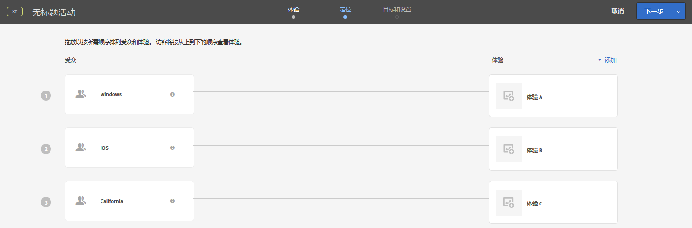

# 定位和受众常见问题解答{#targets-and-audiences-faq}

有关体验定位和受众的常见问题解答 (FAQ) 列表。

## 创建复杂的URL字符串时，是否 [!DNL Target] 会评估整个URL?

如果在URL字符串中多次使用相同的参数名称，HTTP会考虑第一个参数名称并忽略后续同名的参数。

例如，在以下URL字符串中：

`https://www.adobe.com/SearchResults.aspx?sc=BM&fi=1&fr=1&ps=0&av=0&Category=C0010438&Category=C000047`

计算该参数的第一 `Category` 实例并忽略第二 `Category` 参数。

最佳实践是将多个值与单个类别关联，如下所示：

`https://www.adobe.com/SearchResults.aspx?sc=BM&fi=1&fr=1&ps=0&av=0&Category=C0010438,C000047`

## 构建受众时，为何会在其他类别下找到“定位库”下预先构建的受众？{#section_9EBF5B0F9DF94168A15B92B905CCF7E0}

“定位库”类别中预先构建的受众是旧版受众，它们存在于其他类别中。例如，旧版“定位库”&gt;“新访客”中的受众在更新后会相应地移到“访客配置文件”&gt;“新访客”。

最佳做法是使用新版受众，因为新版受众在性能方面做出了改进。有些客户可能还在使用预先构建的旧版受众，因此旧版受众尚未从 Target 用户界面中删除。

## 我如何了解受众间的流量分配方式？ {#section_067EEFB956E7465CBF77EC86834470AB}

默认情况下，流量会在体验之间平均拆分。但是，您可以为每个体验指定百分比定位。在这种情况下，会生成随机编号，这个编号用于选择要显示的体验。最终的百分比可能与指定定位不完全匹配，但是流量越多，体验的划分应越接近定位目标。

## 如果用户符合某个活动的参加条件，而该活动包含多个体验且具有多个符合条件的受众，那么会显示哪个体验？ {#section_94A60B11212D48FD8AB0803C6C7E7253}

用户将符合活动“[!UICONTROL Target]”页面上显示的第一个体验/受众的条件。

例如，在下图中，一位使用 Windows 设备的加利福尼亚用户既符合体验 A（Windows 受众）的参加条件，又符合体验 C（加利福尼亚受众）的参加条件。但由于在“Target”页面上的列表中，体验 A 显示在体验 C 上方，因此会向该用户显示体验 A。

## 为何同一个受众在 Target、Adobe Audience Manager (AAM) 以及核心服务的受众库中具有不同的名称？{#section_F67E61A607B6444C8DAA4F99C3E95AED}

[!DNL Target] 中的受众名称是唯一的；但是，在 [!DNL AAM] 和 [!DNL Audience Library] 中，您可以使用同一个名称来命名多个受众（前提是这些受众位于不同的文件夹中）。如果 [!DNL Target] 中某个受众名称恰巧与 [!DNL AAM] 或 [!DNL Audience Library] 中相应受众的名称相同，则 [!DNL Target] 会将“#&lt;number&gt;”附加到该受众名称。

例如，您可能会看到以下受众：“PC Users”（位于 [!DNL AAM] 中）和“PC Users #1”（位于 [!DNL Target] 中）。

## 为何无法重命名受众？{#section_54E420556F534D20836E261E253D8B97}

有些 Target 受众是预先构建的，例如“新访客”和“旧访客”。用户无法对这些预先构建的受众进行重命名。

## 为何 Target 用户界面中并未显示所有配置文件参数？ {#section_3CD947D15C984EE9AD19550220E0E8BD}

[!DNL Target] 限制每个 mbox 调用只能包含 50 个唯一的配置文件属性。如果您需要将 50 个以上的配置文件属性传递到 [!DNL Target]，则可以使用[!UICONTROL 配置文件更新] API 方法进行传递。有关更多信息，请参阅 Adobe Target API 文档中的[配置文件更新](https://developers.adobetarget.com/api/#authentication-tokens)。

## 为何访客在 AP 活动中看到他们不应看到的体验？{#section_41CECEAE0881446A8D9F3B016857914B}

自动个性化活动会在每次会话中都进行一次评估。如果之前已有活跃会话符合某个特定体验的条件，且现在已在该体验中添加了新选件，则用户会同时看到新的内容以及之前显示的选件。因为用户之前符合这些体验的参加条件，因此他们在会话持续期间仍会看到这些体验。如果您希望在每一次进行页面访问时都进行评估，则应该切换到体验定位 (XT) 活动类型。

## 为何对通过 API 创建的受众所做的更改没有反映在 Target UI 中？ {#section_6BEB237CAC004A06A290F9644E5BF0FB}

与选件和配置文件脚本不同，API 对通过 Target Standard 创建的受众所做的更改当前不会同步回 Target UI。

## 表示数字的字符串（也支持浮点数）作为数字进行比较。{#strings-that-represent-numbers}

如果等式的左侧和右侧部分可以解析为数字，则这两部分将作为数字进行比较，而不是作为字符串进行比较。

例如：

| 值 | 定位标准 | 结果 |
| --- | --- | --- |
| 1.0 | 等于 1 | true |
| 1 | equalsIgnoreCase 1.0 | true |
| 1.230 | 等于 1 | true |
| 1.500 | 等于 1.5 | true |
| 1.200 | 小于 2 | true |
| 2 | 大于 3.0 | false |
| 045 | 等于 45 | true |

用科学记数法编写的数字将始终作为字符串进行比较。

例如：

“4e-2”将仅等于“4e-2”。而&#x200B;*不*&#x200B;等于“0.04”。