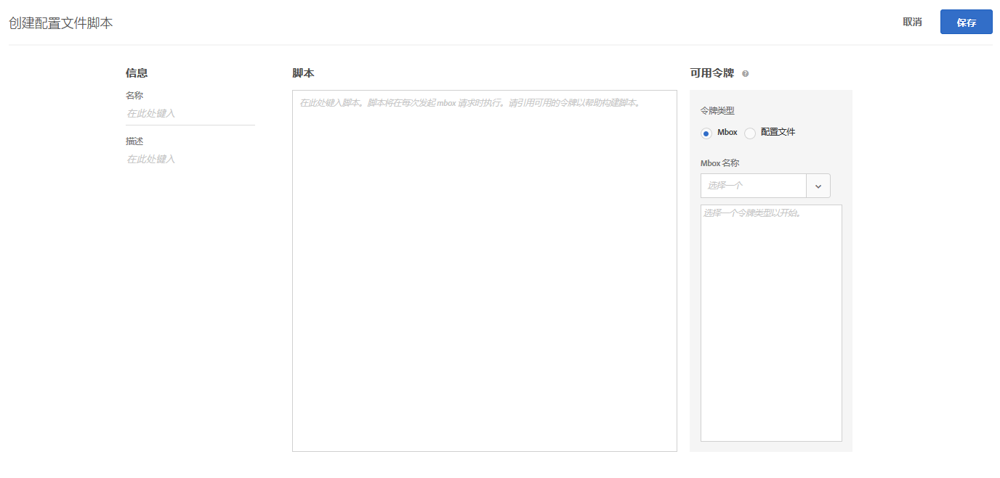
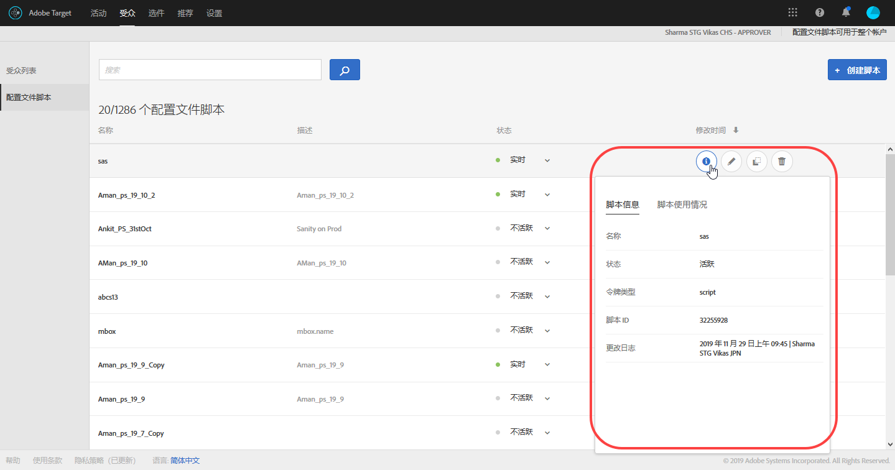
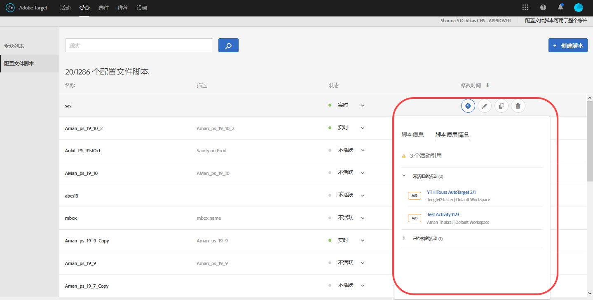
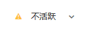

# 配置文件属性{#profile-attributes}

配置文件属性是特定于访客的参数。这些属性存储在访客的配置文件中，提供了可在您的活动中使用的关于访客的信息。

当访客浏览您的网站或者返回网站进行另一个会话时，可使用保存的配置文件属性定位内容或记录信息以便筛选客户群。

要设置配置文件属性，请单击&#x200B;**[!UICONTROL 受众]** &gt; **[!UICONTROL 配置文件脚本]**。


可以使用以下类型的配置文件属性：

| 参数类型 | 描述 |
|--- |--- |
| mbox | 创建 mbox 时，直接通过页面代码传入。请参阅[将参数传递到全局 mbox](/help/c-implementing-target/c-implementing-target-for-client-side-web/t-mbox-download/c-understanding-global-mbox/pass-parameters-to-global-mbox.md)。<br>****&#x200B;注意：Target 限制每个 mbox 调用只能包含 50 个唯一的配置文件属性。如果您需要将 50 个以上的配置文件属性传递到 Target，则可以使用配置文件更新 API 方法进行传递。For more information, see [Profile Update  in the Adobe Target API documentation](http://developers.adobetarget.com/api/#updating-profiles). |
| 脚本 | 直接使用 JavaScript 代码段定义。这些参数能够保存运行的总数，如消费者花费的总金额，并能基于每个 mbox 请求来执行。请参阅下面的“配置文件脚本属性”。 |

## 配置文件脚本属性 {#concept_8C07AEAB0A144FECA8B4FEB091AED4D2}

可使用关联的 JavaScript 代码段定义配置文件脚本属性。

您可以使用配置文件脚本，在多次访问中捕获访客属性。配置文件脚本是在 Target 中使用服务器端 JavaScript 形式定义的代码片段。例如，您可以使用配置文件脚本来捕捉访客访问您网站的频率以及上次访问的时间。

配置文件脚本与配置文件参数不同。配置文件参数使用 Target 的 mbox 代码实施来捕捉有关访客的信息。

>[!NOTE]
>
>[!DNL Target] 具有每个帐户 1,000 个配置文件脚本的限制。

## 创建配置文件脚本 {#section_CB02F8B97CAF407DA84F7591A7504810}

配置文件脚本位于 [!UICONTROL  界面的“]受众[!DNL Target]”选项卡下。

要添加新的配置文件脚本，请依次单击&#x200B;**[!UICONTROL 配置文件脚本]**&#x200B;选项卡和&#x200B;**[!UICONTROL 创建脚本]**，然后编写您的脚本。

或

要复制现有的配置文件脚本，请在[!UICONTROL 配置文件脚本]列表中将鼠标悬停在所需脚本上，然后单击&#x200B;**[!UICONTROL 复制]**&#x200B;图标：(assets/icon_copy.png)

然后，您可以对受众进行编辑以创建一个类似的受众。



配置文件脚本会对每个位置请求运行配置文件属性“catchers”。收到位置请求后，Target 会确定应运行的活动，显示对该活动和该体验适用的内容，跟踪活动是否成功，并运行任何相关的配置文件脚本。这样，您可以跟踪有关访问的信息，例如访客的位置、时间、该访客访问网站的次数以及他们之前是否购买过商品等。然后，这些信息将添加到访客的配置文件中，以便您可以更好地跟踪访客在您网站上的活动。

配置文件脚本属性在属性名称之前插入 `user.` 标记。例如：

```
if (mbox.name == 'Track_Interest') { 
    if (profile.get('model') == "A5" &&; profile.get('subcat') == "KS6") { 
        return (user.get('A5KS6') || 0) + 1; 
    } 
}
```

* 在代码中使用 `user.get('parameterName')` ') 引用配置文件脚本属性（包括其自身）。
* 保存下次使用 `user.setLocal('variable_name', 'value')` ') 运行脚本时（对下一个 mbox 请求）可能访问的变量。使用 `user.getLocal('variable_name')` 引用变量。当您想引用上次请求的日期和时间时，此脚本非常有用。
* 参数和值区分大小写。请匹配您在活动或测试期间接收到的参数和值的大小写。
* 有关更多的 JavaScript 语法，请参阅下文中的“脚本配置文件参数的 JavaScript 引用”部分。

## 查看配置文件脚本信息卡片 {#section_18EA3B919A8E49BBB09AA9215E1E3F17}

您可以查看配置文件脚本信息弹出卡片，该卡片类似于选件信息卡片。通过这些配置文件脚本信息卡片，您可以查看引用了所选配置文件脚本的活动列表，以及其他有用的元数据。

例如，通过将鼠标悬停在“配置文件脚本列表”（“受众”&gt;“配置文件脚本”）中的配置文件脚本上，然后单击“信息”图标，可以访问以下配置文件脚本信息卡片。

“[!UICONTROL 脚本信息]”选项卡包含以下信息：“名称”、“状态”、“令牌类型”、“脚本 ID”、“更改日志”和“描述”。



“[!UICONTROL 脚本使用情况]”选项卡列出了引用所选配置文件脚本的活动（及其工作空间）。



>[!N注意]
>
>在以下情况中，“脚本使用情况”选项卡不会显示引用所选配置文件脚本的活动：
> * 活动处于“草稿”状态。
> * 活动中使用的内容或选件使用了脚本变量（活动中的内联选件或选件库中的选件）。


## Target 在某些情况下会禁用配置文件脚本 {#section_C0FCB702E60D4576AD1174D39FBBE1A7}

在某些情况下（例如，如果配置文件脚本执行时间过长或者指令过多），[!DNL Target] 会自动禁用配置文件脚本。

禁用某个配置文件脚本后，Target UI 中的该配置文件脚本旁边会显示一个黄色警报图标，如下图所示：



将鼠标悬停在该配置文件脚本上时，会显示有关错误的详细信息，如下图所示：


系统禁用配置文件脚本的典型原因包括：

* 引用了未定义的变量。
* 引用了无效值。这通常是由于未进行正确验证而引用 URL 值和其他用户输入数据所导致。
* 使用了过多 JavaScript 指令。Target 限制每个脚本只能使用 2,000 条 JavaScript 指令，但这不能简单地通过人工读取 JavaScript 的方式来计算。例如，Rhino 会将所有函数调用和“新”调用视为 100 条指令。此外，任何输入数据（例如 URL 值）的大小可能会对指令计数产生影响。
* 不遵循以下[最佳实践](../../c-target/c-visitor-profile/profile-parameters.md#section_64AFE5D2B0C8408A912FC2A832B3AAE0)部分重点列举的项目。

## 最佳实践 {#best}

下列准则旨在帮助编写简化的配置文件脚本，尽量减少出现错误，从而无需强制中断系统脚本即可对脚本进行处理。这些准则是从经过验证可高效运作的最佳实践中得出的。这些规范将与 Rhino 开发社区制定的原则和建议一起应用。

* 将当前脚本值设定为用户脚本中的局部变量，将故障转移设置为空字符串。
* 通过确保局部变量为非空字符串验证局部变量。
* 使用基于字符串的操作函数和正则表达式。
* 使用限制性 for 循环与开放式 for 或 while 循环。
* 切勿超过 1,300 个字符或 50 次循环迭代。
* 切勿超过 2,000 条 JavaScript 指令。Target 限制每个脚本只能使用 2,000 条 JavaScript 指令，但这不能简单地通过人工读取 JavaScript 的方式来计算。例如，Rhino 会将所有函数调用和“新”调用视为 100 条指令。此外，任何输入数据（例如 URL 值）的大小可能会对指令计数产生影响。
* 不仅要注意脚本性能，还要注意所有脚本的组合性能。作为最佳实践，我们建议指令总数要少于 5,000 条。计算指令数量的效果并不明显，但需要注意的重要事项是，超过 2 KB 的脚本会被自动禁用。对于您可以运行的脚本数量，没有设置限制，但在每一次 mbox 调用时均会执行每个脚本。应只运行所需数量的脚本。
* 在正则表达式中，几乎不需要在开头使用点和星形符号（例如：`/.*match/`、`/a|.*b/`）。正则表达式搜索将从字符串中的任意位置开始（除非与 `^` 绑定），因此其已经假定包含点和星形符号。如果此类正则表达式与足够长的输入数据相匹配（最少可达几百个字符），则脚本执行可能会中断。
* 如果全部失败，则将脚本嵌套在 try/catch 中。
* See the JS Rhino engine documentation for more information: [https://www.mozilla.org/rhino/doc.html](https://www.mozilla.org/rhino/doc.html).

## 用于测试互斥活动的配置文件脚本 {#section_FEFE50ACA6694DE7BF1893F2EFA96C01}

您可以使用配置文件属性来设置比较两个或更多活动的测试，但是不允许同一访客参加所有活动。

测试互斥活动可防止一个活动中的访客影响其他活动的测试结果。当访客参加多个活动时，很难确定访客在一个活动中的体验产生的是正提升度还是负提升度，或者多个活动之间的交互是否影响了一个或多个活动的结果。

例如，您可以测试电子商务系统的两个区域：测试红色的“添加至购物车”按钮，而非蓝色按钮；另外还测试从五个步骤减少到两个的新的结账流程。如果两个活动具有相同的成功事件（完成的购买），则很难确定红色按钮是否提高了转化次数，或者改进的结账流程是否也导致增加了这些相同的转化次数。通过将测试分为互斥活动，您可以独立测试每个更改。

使用下面的任一配置文件脚本时，请注意以下信息：

* 配置文件脚本必须在活动启动之前运行，且该脚本必须在活动持续时间段内保持不变。
* 此技巧将会减少活动中的流量，从而导致活动可能需要运行更长时间。您在估算活动的持续时间时必须考虑到这一事实。

### 设置两个活动

要将访客分到可查看不同活动的各个组中，您必须创建一个配置文件属性。配置文件属性能够将一个访客分类到两个或多个群组的某一组中。创建下面的脚本可设置名为“twogroups”的配置文件属性：

```
if (!user.get('twogroups')) { 
    var ran_number = Math.floor(Math.random() * 99); 
    if (ran_number <= 49) { 
        return 'GroupA'; 
    } else { 
        return 'GroupB'; 
    } 
}
```

`if (!user.get('twogroups'))` 确定 *twogroups* 配置文件属性是否针对当前访客设定。如果是，则无需进行下一步操作。

`var ran_number=Math.floor(Math.random() *99)` 声明了一个名为 ran_number 的新变量，将其值设置为介于 0 和 1 之间的随机小数，然后乘以 99 并进行四舍五入以创建 100 (0-99) 以内的范围，这用于指定查看活动的访客百分比。

`if (ran_number <= 49)` 开始一个例程，确定访客属于哪一群组。如果返回 0-49，则将访客分配到 GroupA。如果返回 50-99，则分配到 GroupB。组决定了访客可查看的活动。

创建配置文件属性后，通过要求用户配置文件参数 user.twogroups 匹配 GroupA 指定的值，设置第一个活动以定位所需的群体。

>[!NOTE]
>
>请尽早在页面上选择一个 mbox。这段代码判定某位访客是否体验了营销活动。只要浏览器第一次遇到 mbox，就能利用该 mbox 设置此值。

设置第二个营销活动，使用户配置文件参数 `user.twogroups` 匹配 GroupB 指定的值。

### 设置三个或更多活动

设置三个或更多互斥活动的方式与设置两个活动类似，只不过您必须更改配置文件属性 JavaScript 来为每个活动创建单独的组并确定可查看每个活动的对象。随机数生成是不同的，取决于您创建了偶数个组还是奇数个组。

例如，要创建四个组，请使用下面的 JavaScript：

```
if (!user.get('fourgroups')) { 
    var ran_number = Math.floor​(Math.random() * 99); 
    if (ran_number <= 24) { 
        return 'GroupA'; 
    } else if (ran_number <= 49) { 
        return 'GroupB'; 
    } else if (ran_number <= 74) { 
        return 'GroupC'; 
    } else { 
        return 'GroupD'; 
    } 
}
```

在此例中，用于创建随机数的数学方法与创建两个组的方法相同，该随机数用于将访客分配到某个组。随机小数生成之后，向下取整创建一个整数。

如果创建了奇数个组或者群组数量无法被 100 整除，则不应将小数向下取整。不取小数的整数就会指定一个非整数范围。要实现此操作，请将以下行：

`var ran_number=Math.floor(Math.random()*99);`

更改为：

`var ran_number=Math.random()*99;`

例如，若要将访客划分到三个相等的群组时，可使用如下代码：

```
if (!user.get('threegroups')) { 
    var ran_number = Math.random() * 99; 
    if (ran_number <= 32.33) { 
        return 'GroupA'; 
    } else if (ran_number <= 65.66) { 
        return 'GroupB'; 
    } else { 
        return 'GroupC'; 
    } 
}
```

## 调试配置文件脚本 {#section_E9F933DE47EC4B4E9AF2463B181CE2DA}

以下方法可用于调试配置文件脚本：

>[!NOTE]
>
>在配置文件脚本中使用 [!DNL console.log] 将不会输出配置文件值，因为配置文件脚本在服务器端执行。

* **将配置文件脚本添加为响应令牌以调试配置文件脚本：**

   在 Target 中，依次单击&#x200B;**[!UICONTROL 设置]**&#x200B;和&#x200B;**[!UICONTROL 响应令牌]**，然后启用要调试的配置文件脚本。

   每当您为包含 Target 的网站加载页面时，Target 的部分响应都将包含给定配置文件脚本的值，如下所示：

   

* **使用 mboxTrace 调试工具来调试配置文件脚本。**

   此方法需要授权令牌，您可以通过单击 **[!UICONTROL Target]** &gt; **[!UICONTROL 设置]** &gt; **[!UICONTROL 实施]** &gt; **[!UICONTROL 生成授权令牌]**&#x200B;来生成该令牌。

   然后，将以下两个参数添加到页面 URL 中的“?”之后：`mboxTrace=window&authorization=YOURTOKEN`。

   这比响应令牌更具信息性，因为您可以获取配置文件在执行之前和之后的快照。它还会显示您的所有可用配置文件。

   

## 配置文件脚本常见问题解答 {#section_1389497BB6D84FC38958AE43AAA6E712}

**是否可以使用配置文件脚本捕获位于数据层中的页面信息？**

由于配置文件脚本在服务器端执行，因此它们无法直接读取页面。数据必须通过 mbox 请求或其他[将数据传入 Target 的方法](../../c-implementing-target/c-considerations-before-you-implement-target/c-methods-to-get-data-into-target/methods-to-get-data-into-target.md#concept_0069C0EFB56C4700BB33F2F35C2B9B17)传递。数据传入 Target 中后，配置文件脚本可以将数据作为 mbox 参数或配置文件参数读取。

## 脚本配置文件参数的 JavaScript 引用

需要具备简单的 Javascript 知识才能有效地使用脚本配置文件参数。本节提供了一个快速参考，借助此参考，您在几分钟内便可以高效地使用此功能。

“脚本配置文件参数”位于 mbox/配置文件选项卡下。您可以编写返回任何 Javascript 类型（字符串、整数、数组等）的 Javascript 程序。

### 脚本配置文件参数示例

**名称：***user.recency*

```
var dayInMillis = 3600 * 24 * 1000;
if (mbox.name == 'orderThankyouPage') {
    user.setLocal('lastPurchaseTime', new Date().getTime());
}
var lastPurchaseTime = user.getLocal('lastPurchaseTime');
if (lastPurchaseTime) {
    return ((new Date()).getTime() - lastPurchaseTime) / dayInMillis;
}
```

创建一个以毫秒为单位的“天数”变量。如果 mbox 名称为 `orderThankyouPage`，请将名为 `lastPurchaseTime` 的本地（不可见）用户配置文件属性设置为采用当前日期和时间的值。读取上次购买时间的值，如果定义了该值，则返回自上次购买时间以来已经过的时间，同时除以一天中的毫秒数（其结果是自上次购买以来的天数）。

**名称：***user.frequency*

```
var frequency = user.get('frequency') || 0;
if (mbox.name == 'orderThankyouPage') {
    return frequency + 1;
}
```

创建一个名为“频率”的变量，将其初始化为前一个值，如果没有前一个值，则初始化为 0。如果 mbox 名称为 `orderThankyouPage`，则返回递增的值。

**名称：***user.monetaryValue*

```
var monetaryValue = user.get('monetaryValue') || 0;
if (mbox.name == 'orderThankyouPage') {
    return monetaryValue + parseInt(mbox.param('orderTotal'));
}
```

创建一个名为 `monetaryValue` 的变量，查找给定访客的当前值（如果没有前一个值，则设置为 0）。如果 mbox 名称为 `orderThankyouPage`，则通过添加前一个值和传递给 mbox 的 `orderTotal` 参数值来返回新的货币值。

### 对象和方法

脚本配置文件参数可以引用以下属性和方法：

| 对象或方法 | 详细信息 |
| --- | --- |
| `page.url` | 当前 URL。 |
| `page.protocol` | 页面使用的协议（http 或 https）。 |
| page.domain | 当前的 URL 域（第一个斜杠之前的所有内容）。例如，`http://www.acme.com/categories/men_jeans?color=blu e&size=small` 中的 `www.acme.com`。 |
| `page.query` | 当前页面的查询字符串。“?”之后的所有内容。例如，`http://www.acme.com/categories/mens_jeans?color=blue&size=small` 中的 `blue&size=small`。 |
| `page.param(‘<par_name>’)` | `<par_name>` 表示的参数的值。如果当前 URL 是 Google 搜索页面，而且您已经输入 `page.param('hl')`，则对于 URL `http://www.google.com/search?hl=en& q=what+is+asdf&btnG=Google+Search`，您将获得“en”。 |
| `page.referrer` | 与上述相同的一组操作适用于反向链接和登陆（即 referrer.url 将是反向链接的 URL 地址）。 |
| `landing.url`, `landing.protocol`, `landing.query`, 和 `landing.param` | 类似于此类页面，但登陆页面除外。 |
| `mbox.name` | 活动 mbox 的名称。 |
| `mbox.param(‘<par_name>’)` | 活动 mbox 中给定名称的 mbox 参数。 |
| `profile.get(‘<par_name>’)` | 客户端创建的用户配置文件参数，名称为 `<par_name>`。例如，如果用户设置了名为“gender”的配置文件参数，则可以使用“profile.gender”提取该值。返回为当前访客设置的“`profile.<par_name>`”值；如果未设置任何值，则返回 null。 |
| `user.get(‘<par_name>’)` | 返回为当前访客设置的“`user.<par_name>`”值；如果未设置任何值，则返回 null。 |
| `user.categoryAffinity` | 返回最佳类别的名称。 |
| `user.categoryAffinities` | 返回具有最佳类别的数组。 |
| `user.isFirstSession` | 如果这是访客的第一个会话，则返回 true。 |
| `user.browser` | 返回 HTTP 标头中的用户代理。例如，您可以创建仅针对 Safari 用户的表达式目标：`if (user.browser != null && user.browser.indexOf('Safari') != -1) { return true; }` |

### 常用运算符


所有标准的 JavaScript 运算符均已列出并可用。JavaScript 运算符可用于字符串和数字（以及其他数据类型）。简要介绍：

| 运算符 | 描述 |
| --- | --- |
| `==` | 表示相等。当两边的操作数相等时，为 true。 |
| `!=` | 表示不相等。当两边的操作数不相等时，为 true。 |
| `<` | 表示左侧的变量小于右侧的变量。如果变量相等，则计算结果为 false。 |
| `>` | 表示左侧的变量大于右侧的变量。如果变量相等，则计算结果为 false。 |
| `<=` | 与 `<` 相同，除非变量相同，否则其计算结果为 true。 |
| `>=` | 与 `>` 相同，除非变量相同，否则其计算结果为 true。 |
| `&&` | 从逻辑上讲，对于“AND”左侧和右侧的表达式，仅当两侧都为 true 时才为 true（否则为 false）。 |
| `||` | 从逻辑上讲，对于“OR”左侧和右侧的表达式，仅当一侧为 true 时才为 true（否则为 false）。 |
| `//` | 检查源是否包含目标布尔值所包含的所有元素（源数组，目标数组）。<br>`//` 从目标（对应于 regexp）中提取子字符串并将其解码为 `Array/*String*/ decode(String encoding, String regexp, String target)`。<br>该功能还支持使用常量字符串值、分组 (`condition1 || condition2) && condition3` 和正则表达式 (`/[^a-z]$/.test(landing.referring.url)`)。 |

## 培训视频：配置文件脚本

以下视频包含有关使用和创建配置文件脚本的信息。

* 阐明配置文件脚本是什么
* 介绍配置文件脚本与配置文件参数的不同之处
* 创建简单的配置文件脚本
* 使用“可用令牌”菜单访问可用选项
* 启用和禁用配置文件脚本

>[!VIDEO](https://video.tv.adobe.com/v/17394?captions=chi_hans)