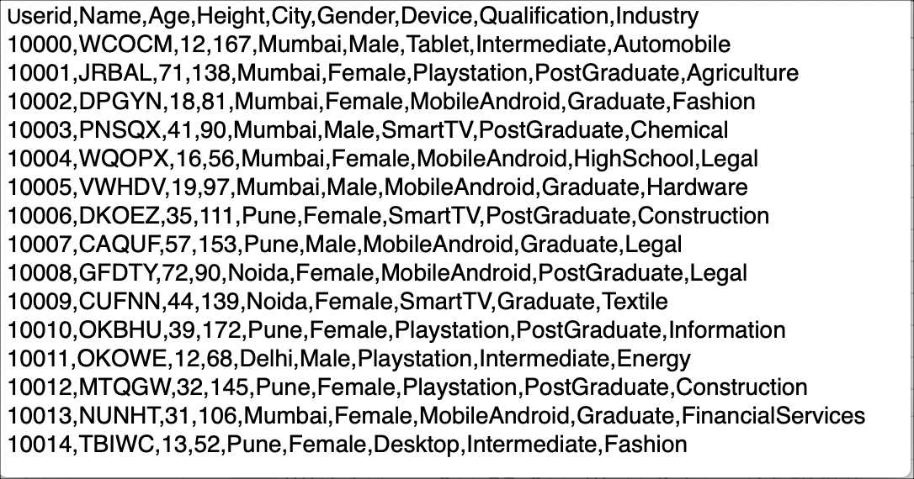
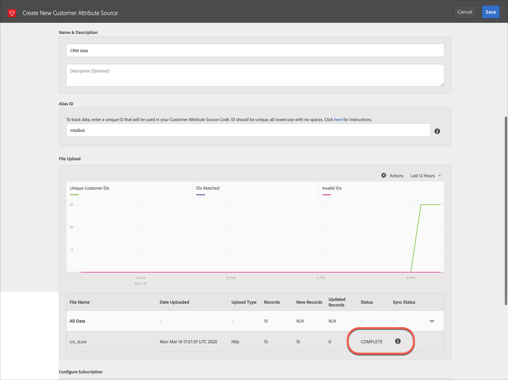

# 客户属性{#customer-attributes}

有关如何利用 Adobe Profiles &amp; Audiences 核心服务中的客户属性将客户关系管理 (CRM) 数据库的企业客户数据用于 Adobe Target 中的内容定位的信息。

通过多个源收集并存储在 CRM 数据库中的企业客户数据可以在 [!DNL Target] 中使用，以便向客户战略性地交付最相关的内容，尤其是旧客户。[!DNL People] 核心服务（以前称为“配置文件和受众”）将数据收集和分析与测试和优化结合在一起，使数据和分析具有可操作性。

## 客户属性概述 {#section_B4099971FA4B48598294C56EAE86B45A}

“人员”核心服务是 [!DNL Adobe Experience Cloud] 的一部分，为企业提供了一个将其客户数据推送到 [!DNL Experience Cloud] 平台的工具。载入到 [!DNL Experience Cloud] 的数据适用于所有 [!DNL Experience Cloud] 工作流。[!DNL Adobe Target] 将利用这些数据，根据属性定位旧客户。[!DNL Adobe Analytics] 也会使用这些属性，它们可用于分析和分段。


在您使用客户属性和 Target 时，请考虑以下信息：

* 在使用 [!DNL People] 核心服务中的[!UICONTROL 客户属性]功能之前，您必须满足一些先决条件要求。有关详细信息，请参阅《Experience Cloud 和核心服务产品文档》**[客户属性](https://marketing.adobe.com/resources/help/en_US/mcloud/attributes.html)中的“上传客户属性的先决条件”。请注意，必须使用 [!DNL at.js]（任何版本）或 [!DNL mbox.js] 版本 58 或更高版本。
* Adobe 不保证来自 CRM 数据库中 100% 的客户属性（访客配置文件）数据都会被载入到 Experience Cloud 从而可用于在 Target 中进行定位。在我们目前的设计中，可能有一小部分数据不会被载入。
* 从 Experience Cloud 导入 Target 的客户属性数据的生命周期取决于访客配置文件的生命周期，默认为 14 天。有关更多信息，请参阅[访客配置文件生命周期](../../c-target/c-visitor-profile/visitor-profile-lifetime.md#concept_D9F21B416F1F49159F03036BA2DD54FD)。
* 如果 `vst.*` 参数是对用户进行标识的唯一参数，则只要 `authState` 是 UNAUTHENTICATED (0)，就不会获取现有的“已经过身份验证”的配置文件。只有当 `authState` 变为 UNAUTHENTICATED (1) 时，配置文件才会起作用。

   例如，如果使用 `vst.myDataSource.id` 参数对用户进行标识（其中 `myDataSource` 是数据源别名），并且没有 MCID 或第三方 ID，则使用参数 `vst.myDataSource.authState=0` 将不会获取可能已通过“客户属性”导入而创建的配置文件。如果获取已经过身份验证的配置文件是必需的行为，则 `vst.myDataSource.authState` 必须具有值 1 (AUTHENTICATED)。

* 不能在 `mbox3rdPartyID` 中发送下列字符：加号 (+) 和正斜线 (/)。

## 适用于 Target 的客户属性工作流 {#section_00DAE94DA9BA41398B6FD170BC7D38A3}

完成以下步骤以在 [!DNL Target] 中使用 CRM 数据，如下所示：


有关完成以下每项任务的详细说明，请参阅《Experience Cloud 和核心服务产品文档》**&#x200B;中的[创建客户属性源并上传数据文件](https://marketing.adobe.com/resources/help/en_US/mcloud/t_crs_usecase.html)。

1. 创建数据文件。

   将客户数据从 CRM 导出为 CSV 格式以创建 [!DNL .csv] 文件。或者，也可以创建 zip 或 gzip 文件进行上传。确保 CSV 的第一行是标题，且所有行（客户数据）都具有相同的条目数。

   

   

1. 创建属性来源并上传数据文件。

   指定数据源的名称和描述以及别名 ID。别名 ID 是在 VisitorAPI.js 的客户属性代码中使用的唯一 ID。

   >[!IMPORTANT]
   >
   >数据源名称和属性名称不得包含句点。

   使用 HTTP 方式最多可以上传 100 MB 的数据文件。大于 100 MB 小于等于 4 GB 的文件则可通过 FTP 上传。

   * **HTTPS：**&#x200B;您可以拖放 [!DNL .csv] 数据文件或单击[!UICONTROL 浏览]以从您的文件系统上传。
   * **FTP：**&#x200B;单击 FTP 链接以便[通过 FTP 上传文件](https://marketing.adobe.com/resources/help/en_US/mcloud/t_upload_attributes_ftp.html)。第一步是为 Adobe 提供的 FTP 服务器提供密码。输入密码，然后单击“[!UICONTROL 完成]”。

      现在，将您的 CSV/ZIP/GZIP 文件传输到 FTP 服务器。此文件传输成功后，请创建一个具有相同名称和 [!DNL .fin] 扩展名的新文件。将此空文件传输到服务器。此操作用于指示传输结束，Experience Cloud 开始处理数据文件。

1. 验证架构。

   验证过程允许您将显示名称和描述映射到已上传的属性（字符串、整数、数字等等）。将每个属性映射到其正确的数据类型、显示名称和描述。

   架构验证完成后，单击“[!UICONTROL 保存]”。文件上传时间因其大小而异。

   

   

1. 配置订阅并激活属性来源。

   单击&#x200B;**[!UICONTROL 添加订阅]**，然后选择解决方案以订阅这些属性。[配置订阅](https://marketing.adobe.com/resources/help/en_US/mcloud/subscription.html)可设置 Experience Cloud 与各解决方案之间的数据流。激活属性来源允许数据流动到订阅的解决方案。您上传的客户记录与您的网站或应用程序中的传入 ID 信号相匹配。

   

   

   在执行此步骤时，请注意以下限制：

   * 使用 HTTP 方法每次上传的最大文件大小为 100 MB。
   * 使用 HTTP 方法每次上传的最大文件大小为 4 GB。
   * 允许订阅的属性数量：[!DNL Target Standard] 为 5，[!DNL Target Premium] 为 200。

## 在 Target 中使用客户属性 {#section_107E3A0F0EC7478E82E6DBD17B30B756}

您可以通过以下方式在 [!DNL Target] 中使用客户属性：

### 创建定位受众

在 [!DNL Target] 中，您可以在创建受众时从“访客配置文件”区域选择一个客户属性。列表中的所有客户属性都有前缀 &lt; data_source_name &gt;。可根据需要，将这些属性与其他数据属性结合使用以构建受众。


### 使用令牌创建配置文件脚本

可以在配置文件脚本中使用格式 `crs.get('<Datasource Name>.<Attribute name>')` 引用客户属性。

此配置文件脚本可直接在选件中使用以交付属于当前访客的属性。

### 在您的网站中使用 mbox3rdPartyID 以便成功实施和使用

将 mbox3rdPartyId 作为参数传递给 `targetPageParams()` 方法内的全局 mbox。mbox3rdPartyId 的值应设为 CSV 数据文件中出现的客户 ID。

```
<script type="text/javascript">
            function targetPageParams() {
               return 'mbox3rdPartyId=2000578';
            }
</script>
```

### 使用 Experience Cloud ID 服务

如果您使用 Experience Cloud ID 服务，则需要设置客户 ID 和身份验证状态以在定位中使用客户属性。有关详细信息，请参阅《Experience Cloud ID 服务文档》**&#x200B;中的[客户 ID 和身份验证状态](https://marketing.adobe.com/resources/help/en_US/mcvid/mcvid-authenticated-state.html)。

有关在 [!DNL Target] 中使用客户属性的更多信息，请参阅以下资源：

* 《Experience Cloud 和核心服务产品文档》**&#x200B;中的[创建客户属性来源并上传数据文件](https://marketing.adobe.com/resources/help/en_US/mcloud/t_crs_usecase.html)
* 数字营销产品组的博客文章&#x200B;**[客户属性：了解的越多，关联的越好](https://blogs.adobe.com/digitalmarketing/analytics/customer-attributes-know-better-connect/)

## 客户经常遇到的问题 {#section_BE0F70E563F64294B17087DE2BC1E74C}

搭配 [!DNL Target] 使用客户属性时，您可能会遇到以下问题：

| 问题 | 详细信息 |
|--- |--- |
| 客户属性因配置文件过大而被删除 | 用户配置文件中的特定字段没有字符限制，但如果配置文件大于 64 K，则会通过删除最早的属性来截断配置文件，直到其再次小于 64 K。 |
| 即使在几天之后，[!DNL Target] 的受众库中仍未列出属性 | 这通常是管道连接问题。您可以让您的客户属性团队重新发布该信息源来解决此问题。 |
| 不能根据属性进行交付 | 该配置文件尚未在 Edge 上更新。您可以让您的客户属性团队重新发布该信息源来解决此问题。 |
| 实施问题 | 请注意以下实施问题：<ul><li>未正确传递访客 ID。该 ID 是在 mboxMCGVID 中传递，而不是 `setCustomerId`。</li><li>已正确传递访客 ID，但“AUTHENTICATION”状态未设置为“已验证”。</li><li>未正确传递 `mbox3rdPartyId`。</li> |
| 未正确执行 `mboxUpdate` | 未能通过 `mbox3rdPartyId` 正确执行 mboxUpdate。 |
| 未将客户属性导入到 Target 中。 | 如果您在 Target 中找不到客户属性数据，请确保导入过程在最近 x 天内完成，其中 x 是 Target [访客配置文件生命周期](/help/c-target/c-visitor-profile/visitor-profile-lifetime.md)值（默认为 14 天）。 |

与客户属性相关的问题中，大约 60% 是因上述第 1 行和第 2 行的问题所致。大约 30% 是因第 3 行中的问题所致。大约 5% 是因第 4 行中的问题所致。其余 5% 是由于其他问题所致。

## 培训视频：使用客户属性上传离线数据 {#section_9A4E0FA0D0934D06BD8D5BFA673E9BD8}

以下视频演示了如何将离线 CRM、支持中心、销售点和其他营销数据导入 Experience Cloud“人员”服务，并使用访客已知 ID 将其与访客进行关联。

>[!VIDEO](https://video.tv.adobe.com/v/17802t1/?captions=chi_hans)
