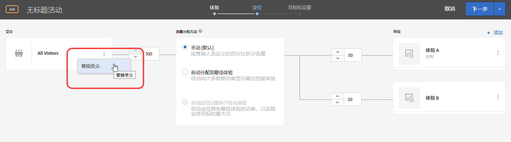
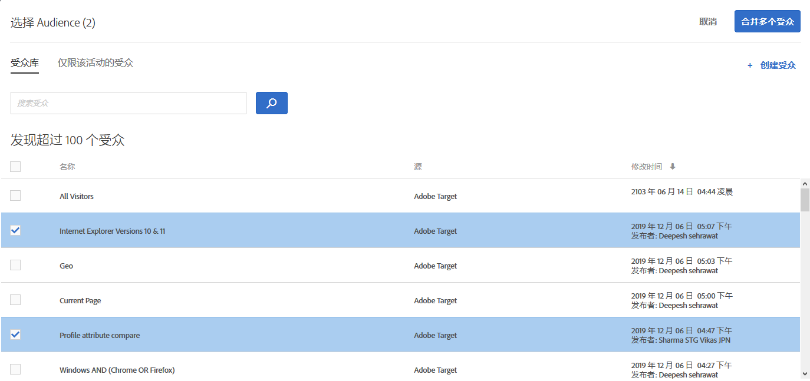
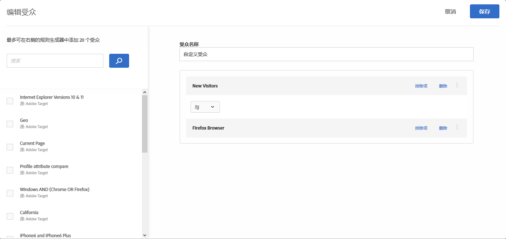
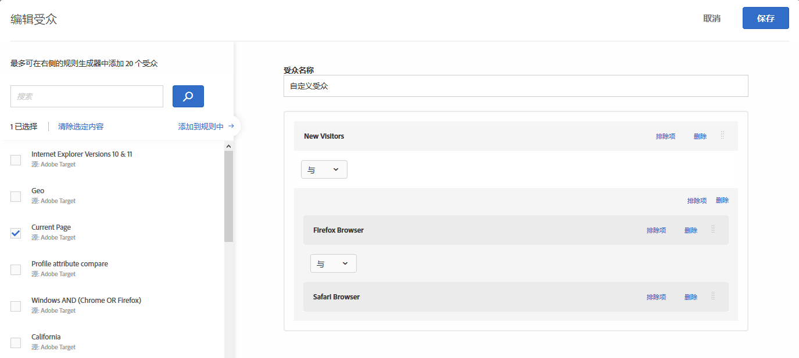
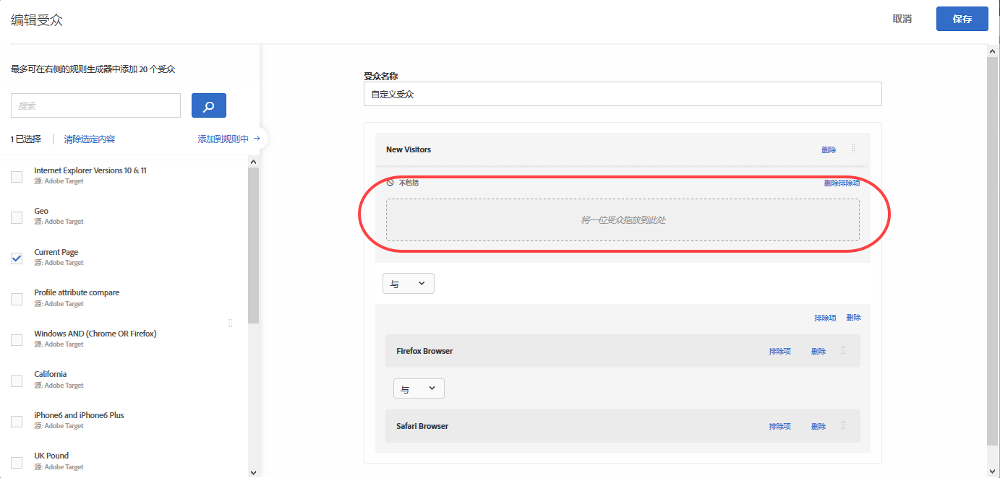
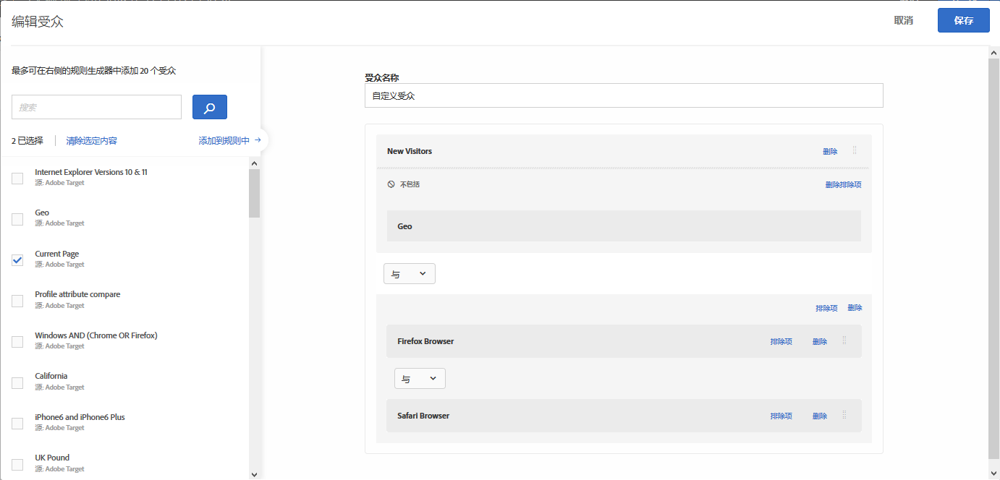
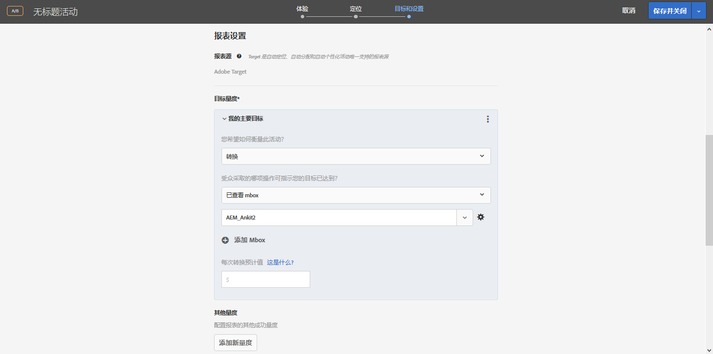
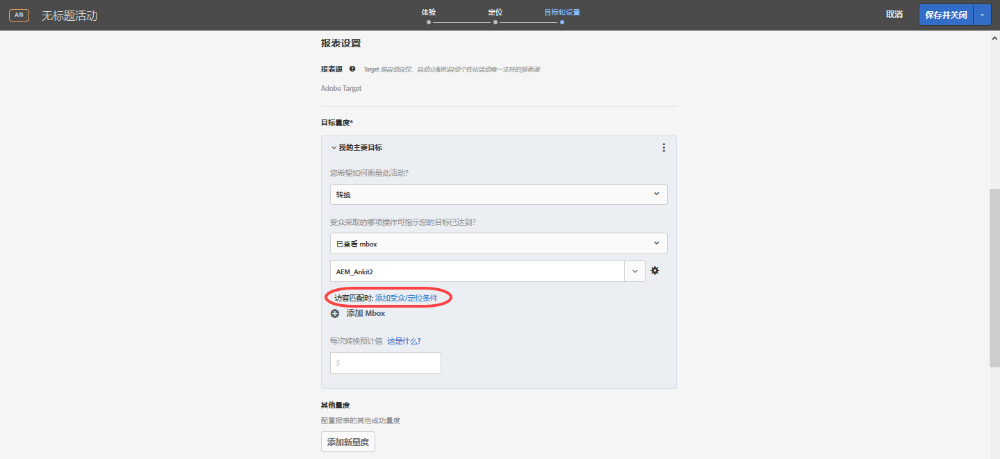
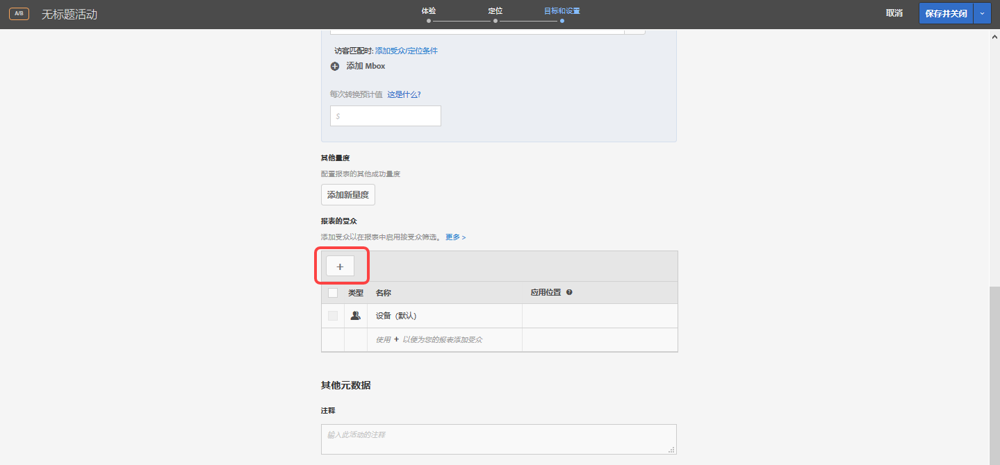

# 合并多个受众{#combine-multiple-audiences}

可随手合并多个受众（包括 Adobe Experience Cloud 受众和 Target 受众）以创建临时受众。您也可以创建排除规则，从某个规则中排除相应受众。

假设您有两个受众：“新访客”和“Chrome 用户”。在某个特定活动中，您可能想要合并这两个现有受众，以定位使用 Chrome 浏览器的新访客。您可以在创建活动或编辑现有活动时合并这两个受众，而无需再另外创建一个受众，并将其存储到[!UICONTROL 受众]库中。

再比如，为定位所有忠诚客户，您可以先包含一个状态为忠诚的特定 [!DNL Audience Manager] 区段，然后再将其与一个由在当前会话中注册了忠诚度计划的用户组成的 [!DNL Target] 区段合并，而无需再另外创建一个永久性受众。

您最多可以使用“与”和“或”运算符合并 10 个受众。

您可以在 [!DNL Target] UI 中的多个位置创建并使用组合受众。

## 创建活动时创建组合的受众 {#section_2F1CE9434CC04174B4BA2BFC89B85D77}

在三步引导式工作流中，您可以在活动的“[!UICONTROL 定位]”页面上创建临时组合受众。

1. 创建[活动](../c-activities/activities.md#concept_D317A95A1AB54674BA7AB65C7985BA03)，在 **[!UICONTROL Target]** 页面上单击三个垂直椭圆，然后单击 **[!UICONTROL 替换受众]**。

   

1. 在“[!UICONTROL 选择受众]”页面上，选中要用作组合受众构建基块的所需受众旁边的复选框。

   

1. 单击右上角的 **[!UICONTROL 合并多个受众]。**

   

1. （可选）根据需要编辑新创建的组合受众。

   使用“[!UICONTROL 编辑受众]”对话框，您可以从左侧将更多的受众构建基块拖放到新创建的组合受众中，还可以添加排除规则以排除受众。

   1. 您可以使用拖放功能，在现有区域中添加受众作为第 2 级构建基块。要添加第 1 级构建基块，请选中所需受众旁边的复选框，然后单击 **[!UICONTROL 添加到规则中]**。

      例如，假设在上一个示例中，您现在希望在组合的受众中包含Safari用户。搜索并将“Safari Browser”受众拖放到右侧的“Firefox Browser”框中，如以下示例所示：

      

      请注意，这两个基于浏览器类型的受众之间使用的运算符为“与”。选择和下拉列表，然后将其更改为“OR”，以使用Firefox或Safari为新访客创建新的组合受众。务必要避免创建会将所有潜在受众成员都排除在外的规则。例如，某人无法同时使用Firefox和Safari访问页面。

      >[!NOTE]
      >
      >合并受众时，使用的运算符（“与”或“或”）必须保持相同。运算符不能混搭使用。

   1. 要在规则中添加排除项，请单击 **[!UICONTROL 排除项]** &gt; **[!UICONTROL 添加排除项]**。

      

      将受众拖放到框中：

      

      例如，要从新访客排除美国访客，您可以拖动市场：美国受众进入此框，如下所示：

      

      由此形成的组合受众将包含使用 Safari 或 Firefox 访问您网站的所有新访客（旧金山访客除外）。

   1. 要从规则中排除受众，请单击 **[!UICONTROL 排除项]** &gt; **[!UICONTROL 不包括该受众]**。

      例如，您可以创建一个组合受众，以包含使用 Firefox 以外的其他所有浏览器访问您网站的所有新访客。与创建一个明确包含各种浏览器（Safari、Chrome 和 Internet Explorer）用户但不包含 Firefox 用户的组合受众相比，排除使用 Firefox 的访客要更加简单快速。

1. 为组合受众提供一个描述性名称，然后单击 **[!UICONTROL 保存]**。

## 创建组合受众以用于指标定位 {#section_A42E795AFCBD4575809C5942039910F0}

您可以在活动的“[!UICONTROL 目标和设置]”页面上创建一个临时组合受众，以将其用于量度定位。例如，可以使用组合受众创建基于转化的定位：

1. 编辑或创建[活动](../c-activities/activities.md#concept_D317A95A1AB54674BA7AB65C7985BA03)时，在 **[!UICONTROL 目标和设置]** 页面上选择 **[!UICONTROL 转化]作为成功量度，然后选择** 已查看 Mbox **作为操作。[!UICONTROL ]**
1. 在 **[!UICONTROL 搜索 mbox]字段中选择所需的 mbox。**

   

1. 单击齿轮图标，然后单击 **[!UICONTROL 添加受众定位]**。
1. 单击 **[!UICONTROL 添加受众/定位条件]** 链接，以显示“[!UICONTROL 选择受众]”对话框。

   

1. 执行“创建活动时创建组合受众”中的[步骤 2](../c-target/combining-multiple-audiences.md#section_2F1CE9434CC04174B4BA2BFC89B85D77)，以创建组合受众。

## 创建用于报表的组合受众 {#section_4682D342EFBB43C38E54B99B3A1E14CD}

您可以在活动的“[!UICONTROL 目标和设置]”页面上创建一个临时组合受众，以将其用于报表。

1. 编辑或创建[活动](../c-activities/activities.md#concept_D317A95A1AB54674BA7AB65C7985BA03)时，在 **[!UICONTROL 目标和设置]** 页面上单击 **[!UICONTROL 报表的受众]** 下方的“[!UICONTROL 添加受众]”图标，以显示“[!UICONTROL 选择受众]”页面。

   

1. 执行“创建活动时创建组合受众”中的[步骤 2](../c-target/combining-multiple-audiences.md#section_2F1CE9434CC04174B4BA2BFC89B85D77)，以创建组合受众。

## 在编辑活动时创建组合的受众 {#section_364A12CE96E04B61B7C18113AA586C2C}

您可以在编辑现有活动时创建临时组合受众。

1. 在“[!UICONTROL 活动]”页面上，将鼠标悬停在所需活动上，然后单击 **[!UICONTROL 编辑]图标。**

   或

   单击所需活动以将其打开，然后单击 **[!UICONTROL 编辑活动]**。

1. 单击 **[!UICONTROL “配置]** ”&gt; **[!UICONTROL “受众]** ”&gt;“ **[!UICONTROL 多个受众]**”。

   

1. 单击活动的当前受众旁边的更多选项图标（三个垂直省略号），然后单击 **[!UICONTROL 更改受众]**。

   

1. 执行“创建活动时创建组合受众”中的[步骤 2](../c-target/combining-multiple-audiences.md#section_2F1CE9434CC04174B4BA2BFC89B85D77)，以创建组合受众。