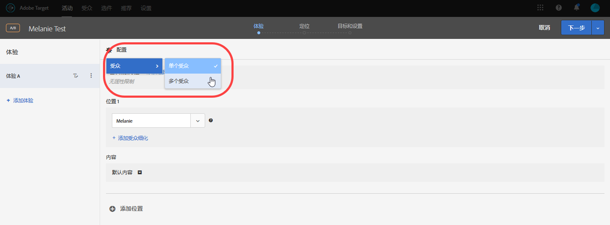
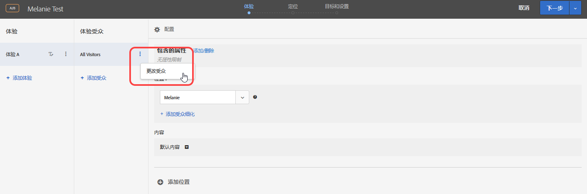

# 合并多个受众

合并多个受众(包括 [!DNL Adobe Experience Cloud], [!DNL Adobe Experience Platform]和 [!DNL Target] 受众)以创建临时受众。 您也可以创建排除规则，从某个规则中排除相应受众。

>[!NOTE]
>
>的 [!DNL Adobe Experience Platform] 源可供所有人使用 [!DNL Target] 使用 [Adobe Experience Platform Web SDK](/help/c-implementing-target/c-implementing-target-for-client-side-web/aep-web-sdk.md). 受众 [!DNL Adobe Experience Platform] 可以按原样使用，或与现有受众组合使用，如本主题中所述)。

假设您有两个受众：“新访客”和“Chrome 用户”。在某个特定活动中，您可能想要合并这两个现有受众，以定位使用 Chrome 浏览器的新访客。您可以在创建活动或编辑现有活动时合并这两个受众，而无需再另外创建一个受众，并将其存储到[!UICONTROL 受众]库中。

再比如，您可以定位所有忠诚客户。 例如，您可以包含 [!DNL Audience Manager] 忠诚度状态的受众，并将其与 [!DNL Target] 受众由在当前会话中注册了忠诚度计划的用户组成。 合并这两个受众比创建第三个永久受众更简单。

您最多可以使用“与”和“或”运算符合并 10 个受众。

您可以在 [!DNL Target] UI 中的多个位置创建并使用组合受众。

## 创建活动时创建组合受众 {#section_2F1CE9434CC04174B4BA2BFC89B85D77}

在三步引导式工作流中，您可以在活动的[!UICONTROL 定位]页面上创建临时组合受众。

1. 创建 [活动](/help/c-activities/activities.md#concept_D317A95A1AB54674BA7AB65C7985BA03)，在 **[!UICONTROL 定位]** 页面，单击三个垂直省略号，然后单击 **[!UICONTROL 替换受众]**.

   

1. 在“[!UICONTROL 选择受众]”页面上，选中要用作组合受众构建基块的所需受众旁边的复选框。

   单击 [!UICONTROL 过滤器] 按钮来缩小对所需受众的搜索范围。 您可以按受众的来源过滤受众： [!DNL Adobe Target], [!DNL Adobe Target Classic], [!DNL Experience Cloud], [!DNL Adobe Experience Platform].

   

1. 单击 **[!UICONTROL 合并受众]** 中。

   

1. （可选）根据需要编辑新创建的组合受众。

   的 [!UICONTROL 编辑受众] 利用对话框，可将左侧的其他受众构建基块拖放到新的组合受众中。 您还可以添加排除规则并排除受众。

   1. 使用拖放功能将现有部分中的受众添加为第2级构建基块。

      例如，假设您现在想要将 Safari 用户添加到上一示例的组合受众中。为此，可搜索“Safari 浏览器”受众，并将其拖到右侧的“Firefox 浏览器”框中，如以下示例所示：

      

      请注意，这两个基于浏览器类型的受众之间使用的运算符为“与”。选择“与”下拉列表，并将其更改为“或”，以便为使用 Firefox 或 Safari 的新访客创建一个新的组合受众。务必要避免创建会将所有潜在受众成员都排除在外的规则。例如，某个人不可能同时使用 Firefox 和 Safari 访问页面。

      >[!NOTE]
      >
      >合并受众时，使用的运算符（“与”或“或”）必须保持相同。运算符不能混搭使用。

   1. 要向规则添加排除项，请单击 **[!UICONTROL 排除]**.

      

      拖放受众。

      例如，要从新访客中排除美国访客，您可以拖动市场：美国受众进入盒子。

      由此形成的组合受众将包含使用 Safari 或 Firefox 访问您网站的所有新访客（旧金山访客除外）。

   1. 要从规则中排除受众，请单击&#x200B;**[!UICONTROL 排除项]** > **[!UICONTROL 不包括该受众]**。

      例如，您可以创建一个组合受众，以包含使用 Firefox 以外的其他所有浏览器访问您网站的所有新访客。与创建一个明确包含各种浏览器（Safari、Chrome 和 Internet Explorer）用户但不包含 Firefox 用户的组合受众相比，排除使用 Firefox 的访客要更加简单快速。

1. 为组合受众提供一个描述性名称，然后单击 **[!UICONTROL 完成]**.

## 创建用于量度定位的组合受众 {#section_A42E795AFCBD4575809C5942039910F0}

您可以在活动的“[!UICONTROL 目标和设置]”页面上创建一个临时组合受众，以将其用于量度定位。例如，可以使用组合受众创建基于转化的定位：

1. 编辑或创建[活动](/help/c-activities/activities.md#concept_D317A95A1AB54674BA7AB65C7985BA03)时，在&#x200B;**[!UICONTROL 目标和设置]**&#x200B;页面上选择&#x200B;**[!UICONTROL 转化]**&#x200B;作为成功量度，然后选择已查看 Mbox **[!UICONTROL 作为操作。]**
1. 在&#x200B;**[!UICONTROL 搜索 mbox]** 字段中选择所需的 mbox。

   

1. 单击齿轮图标，然后单击&#x200B;**[!UICONTROL 添加受众定位]**。
1. 单击&#x200B;**[!UICONTROL 添加受众/定位条件]**&#x200B;链接，以显示“[!UICONTROL 选择受众]”对话框。

   

1. 执行“创建活动时创建组合受众”中的[步骤 2](/help/c-target/combining-multiple-audiences.md#section_2F1CE9434CC04174B4BA2BFC89B85D77)，以创建组合受众。

## 创建用于报表的组合受众 {#section_4682D342EFBB43C38E54B99B3A1E14CD}

您可以在活动的“[!UICONTROL 目标和设置]”页面上创建一个临时组合受众，以将其用于报表。

1. 编辑或创建[活动](/help/c-activities/activities.md#concept_D317A95A1AB54674BA7AB65C7985BA03)时，在&#x200B;**[!UICONTROL 目标和设置]**&#x200B;页面上单击&#x200B;**[!UICONTROL 报表的受众]**&#x200B;下方的“[!UICONTROL 添加受众]”图标，以显示“[!UICONTROL 选择受众]”页面。

   

1. 执行“创建活动时创建组合受众”中的[步骤 2](/help/c-target/combining-multiple-audiences.md#section_2F1CE9434CC04174B4BA2BFC89B85D77)，以创建组合受众。

## 编辑活动时创建组合受众 {#section_364A12CE96E04B61B7C18113AA586C2C}

您可以在编辑现有活动时创建临时组合受众。

1. 在“[!UICONTROL 活动]”页面上，将鼠标悬停在所需活动上，然后单击&#x200B;**[!UICONTROL 编辑]**&#x200B;图标。

   或

   单击所需活动以将其打开，然后单击&#x200B;**[!UICONTROL 编辑活动]**。

1. 单击 **[!UICONTROL 配置]** > **[!UICONTROL 受众]** > **[!UICONTROL 多个受众]**.

   

1. 单击活动的当前受众旁边的更多选项图标（三个垂直省略号），然后单击&#x200B;**[!UICONTROL 更改受众]**。

   

1. 执行“创建活动时创建组合受众”中的[步骤 2](/help/c-target/combining-multiple-audiences.md#section_2F1CE9434CC04174B4BA2BFC89B85D77)，以创建组合受众。
