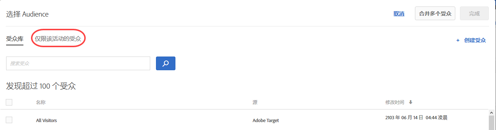

# 创建仅限该活动的受众{#create-an-activity-only-audience}

创建活动时，可在三步引导式工作流中创建仅限该活动的受众。These ad hoc audiences can be used in other places within the same activity, but are not stored in the [!UICONTROL Audiences Library] for use in other activities.

仅限该活动的受众可提供以下好处：

* You can use activity-only audiences to create an audience that you want to use only once and you do not want to store it in the [!UICONTROL Audiences Library]. This prevents the [!UICONTROL Audiences Library] from being cluttered with audiences that you never want to use again.
* Activity-only audiences are not visible in the [!UICONTROL Audiences Library]. 因此，可以避免组织中的他人对其进行不必要的更改。

1. While creating an [activity](../c-activities/activities.md#concept_D317A95A1AB54674BA7AB65C7985BA03), on the **[!UICONTROL Target]** page, click the three vertical ellipses, then click **[!UICONTROL Replace Audience]**.

   

1. On the [!UICONTROL Choose Audience] page, click **[!UICONTROL Activity Only Audience]**.

   

1. 单击&#x200B;**[!UICONTROL 创建受众]**。
1. 键入描述性受众名称。
1. 单击 **[!UICONTROL + 添加规则]**。

   规则可将您的受众限制为网站访客的子集。

1. 选择规则类型。

   每种规则类型都有其自身的参数。请参阅[受众类别](../c-target/c-audiences/c-target-rules/target-rules.md#concept_E3A77E42F1644503A829B5107B20880D)，以详细了解如何配置每种类型的受众规则。

1. 定义规则参数。
1. 单击&#x200B;**[!UICONTROL 保存]**。

## 注意事项

使用仅限该活动的受众时，请牢记以下信息：

* 您可以在可视化体验编辑器 (VEC) 或基于表单的体验编辑器中创建仅限该活动的受众。此功能取代了 Target 以前版本中的细化规则。
* You can create an activity to store in the [!UICONTROL Audience Library] for reuse in other activities or you create an activity-only audience. 保存受众后，无法更改受众类型。
* 现有活动的细化规则已迁移到仅限该活动的受众。
* Activity-only audiences have a status of [!UICONTROL Used] or [!UICONTROL Unused]. 未使用的仅限该活动的受众在保存活动后将不会显示。如果将仅限该活动的受众保留为“未使用”状态，在您尝试保存活动时，系统会显示一条警告消息，告知您未使用的仅限该活动的受众将被删除。
* 您可以从受众选取器中访问弹出卡片，以查看该卡片上的受众定义详细信息，而无需打开受众。
* 您可以[合并多个受众](../c-target/combining-multiple-audiences.md#concept_A7386F1EA4394BD2AB72399C225981E5)，以创建仅限该活动的受众。

