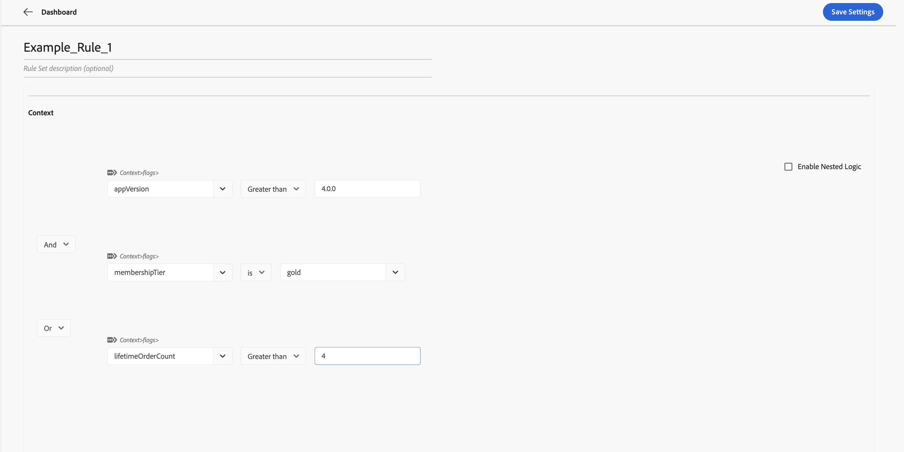
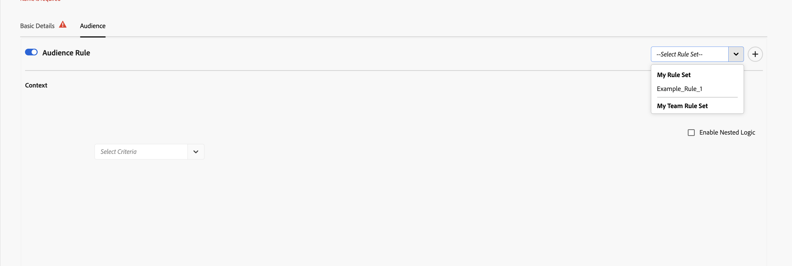

# 创建和使用规则集 {#creating-and-using-rule-sets}

规则集是可重用的受众上下文标准集合。 当多个功能标记或功能组需要相同的受众时，请创建规则集。 然后，您可以导入规则集，而不是为每个功能重新创建受众标准。

## 规则集要求 {#requirements}

| UI标签 | 使用 | 必需 |
| --- | --- | --- |
| **输入规则集** | 输入规则集的名称。 | 是 |
| **规则集描述** | 描述规则集的用途。 | 否 |
| **上下文** | 定义至少一个受众条件。 上下文属性是命名字段，例如订阅层、应用程序版本或区域。 | 是 |

## 创建规则集 {#create-rule-set}

### 步骤1：启动新规则集 {#step-1-start}

在标记中，从左侧导航中选择&#x200B;**规则集**，然后选择&#x200B;**新建规则集**。

**我的规则集**&#x200B;选项卡显示您创建的规则集。 **团队规则集**&#x200B;选项卡显示可用于您团队的规则集。

### 步骤2：添加规则集详细信息和标准 {#step-2-details}

1. 输入规则集的名称。
1. （可选）输入说明。
1. 在&#x200B;**上下文**&#x200B;下，定义要重用的受众条件。
1. 使用&#x200B;**And**&#x200B;或&#x200B;**Or**&#x200B;组合多个条件。
1. 若要创建更复杂的表达式，请选择&#x200B;**启用嵌套逻辑**。

### 步骤3：保存规则集 {#step-3-save}

选择&#x200B;**保存设置**。 保存的规则集显示在&#x200B;**我的规则集**&#x200B;下。

## 在功能标志或功能组中使用规则集 {#use-rule-set}

### 步骤1：打开并启用受众设置 {#step-1-open}

打开要在其中使用规则集的功能标志或功能组，选择&#x200B;**受众**&#x200B;选项卡，然后打开&#x200B;**受众规则**&#x200B;以启用受众条件。

### 第2步：选择规则集 {#step-2-select}

打开&#x200B;**选择规则集**&#x200B;下拉列表。 从&#x200B;**我的规则集**&#x200B;或&#x200B;**我的团队规则集**&#x200B;中选择规则集。

### 步骤3：查看导入的标准 {#step-3-review}

所选规则集中的上下文标准将导入受众。 查看标准，然后保存功能标志或功能组。

您可以在需要相同受众的多个功能标记和功能组中使用相同的规则集。

### 步骤4：保存功能标志或功能组 {#step-4-save}

查看导入的受众条件后，选择&#x200B;**保存设置**。

>[!NOTE]
>
>导入规则集会将其受众条件复制到功能标记或功能组中。 如果以后需要更新受众标准，请在导入规则集的每个功能标志和功能组中单独更新这些标准。 更新原始规则集不会自动更新以前导入的受众。

## 从功能标志或功能组创建规则集 {#create-from-feature}

您还可以直接从功能标志或功能组的“受众”屏幕创建规则集：

1. 打开功能标志或功能组，然后选择&#x200B;**受众**&#x200B;选项卡。
1. 打开&#x200B;**受众规则**。
1. 定义要重用的上下文标准。
1. 选择&#x200B;**选择规则集**&#x200B;下拉列表旁边右上角的&#x200B;**+**&#x200B;按钮。
1. 在&#x200B;**保存规则集**&#x200B;对话框中，输入规则集名称。
1. 选择&#x200B;**保存规则集**。

## 另请参阅 {#see-also}

* [创建上下文属性](creating-your-context-attributes.md)
* [在受众规则中使用上下文](using-context-in-audience-rules.md)
* [功能标志和功能组中的受众](audience-in-feature-flags-and-feature-groups.md)

<!-- -->
