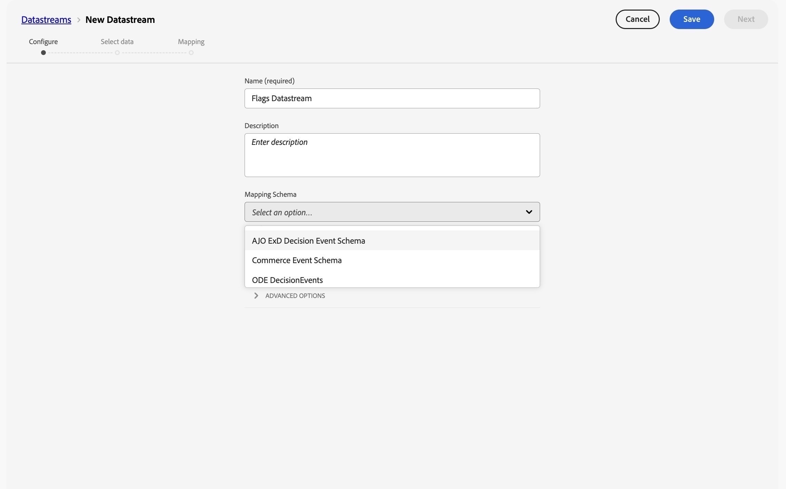
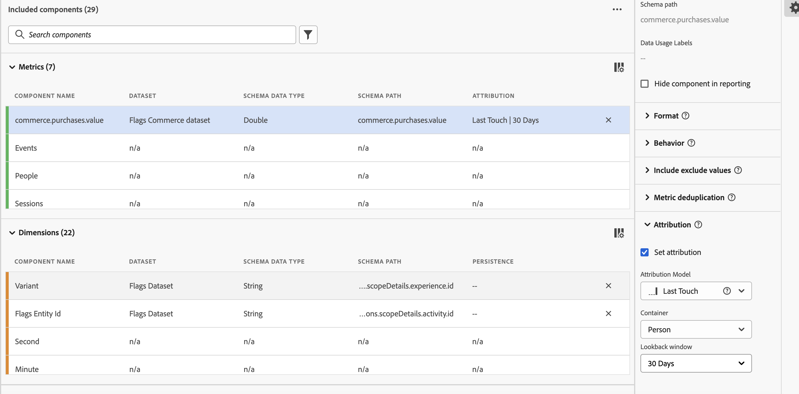
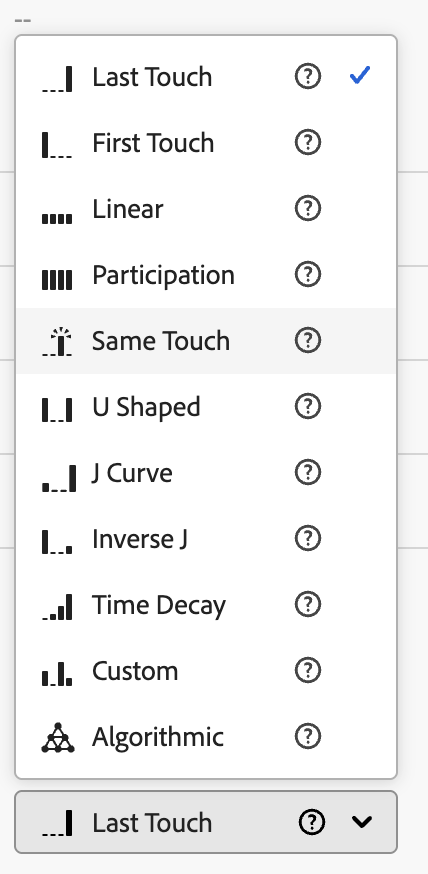

# 设置CJA以生成功能标记报表 {#set-up-cja-reporting}

标记与Adobe Customer Journey Analytics (CJA)之间的集成提供了一种统一的方式来衡量功能标记变体的业务影响。 随时将CJA成功量度应用于标记报表，并利用Customer Journey Analytics功能（如[试验面板](https://experienceleague.adobe.com/en/docs/analytics-platform/using/cja-workspace/panels/experimentation)）来评估试验性能并了解功能变体如何影响客户行为。

## 注意事项 {#considerations}

在使用Customer Journey Analytics和Flags集成之前，请考虑以下信息：

* 您和您的组织必须有权访问Adobe Customer Journey Analytics (CJA)。
* 必须在沙盒中配置&#x200B;**AJO ExD决策事件数据集**&#x200B;以标记公开事件。
* 包含要用作成功量度的成功转化事件的数据集必须可用。

## 设置数据流 {#set-up-datastream}

>[!NOTE]
>
>本指南仅使用Commerce Experience Event数据集和`commerce.purchases.value`作为示例。 选择适用于您的用例的架构和映射的成功量度字段。

1. 在数据收集中，转到&#x200B;**数据流**&#x200B;并创建或打开标志公开数据流。
1. 将其映射架构设置为&#x200B;**AJO ExD决策事件架构**。
1. 打开数据流并选择&#x200B;**添加服务**。
1. 选择现有的&#x200B;**AJO ExD决策事件数据集**&#x200B;作为事件数据集并保存。

>[!NOTE]
>
>您刚刚创建的数据流ID用于在数据收集标记中配置Flags扩展。

## 设置Customer Journey Analytics连接 {#set-up-connection}

如果已设置连接，则可以使用现有连接并跳至下面的步骤3。 通过连接，Customer Journey Analytics可以开始从数据集中提取数据以便进行报告。

1. 在Customer Journey Analytics的&#x200B;**连接**&#x200B;页面上，选择&#x200B;**创建新连接**。
1. 使用正确的信息配置您的[连接和数据设置](https://experienceleague.adobe.com/en/docs/analytics-platform/using/cja-connections/overview)。
1. 添加配置数据流时使用的ExD事件数据集。
1. 添加要用作转化事件的数据集，然后选择&#x200B;**下一步**。
1. 在&#x200B;**添加数据集**&#x200B;对话框中，逐一为每个选定的数据集[&#128279;](https://experienceleague.adobe.com/en/docs/analytics-platform/using/cja-connections/create-connection#dataset-settings)配置设置。

在添加任何数据集之前

## 设置数据视图 {#set-up-data-view}

在Customer Journey Analytics中设置数据视图。 数据视图确保可以正确使用您的连接中的数据。

1. 设置数据视图并确保视图指向您在上文中创建的连接。 有关详细信息，请参阅&#x200B;*Adobe Customer Journey Analytics指南*&#x200B;中的[创建或编辑数据视图](https://experienceleague.adobe.com/en/docs/analytics-platform/using/cja-dataviews/create-dataview)。
1. 转到&#x200B;**数据管理** > **数据视图**。
1. 选择&#x200B;**创建新数据视图**&#x200B;并选择标记CJA连接。
1. 输入数据视图名称和稳定的外部ID。
1. 确认时区和日历设置，然后继续&#x200B;**组件**。

### 配置试验维度和变体维度 {#configure-experiment-variant-dimensions}

1. 将`_experience.decisioning.propositions.scopeDetails.activity.id` （映射到&#x200B;**标记实体ID**）添加到维度中，并将其重命名为“标记实体ID”或其他分析人员友好名称。
1. 将其上下文标签设置为“试验性试验”。
1. 将`_experience.decisioning.propositions.scopeDetails.experience.id`（映射到功能标志或功能组的变体）添加到维度。
1. 将其上下文标签设置为“试验变体”。

>[!WARNING]
>
>如果没有这两个试验上下文标签，CJA试验面板将无法识别标记试验和变体。

### 配置持久性和归因 {#configure-persistence-attribution}

配置维度和量度，以便风险承担可以接收信用以用于以后的转化。 如果没有适当的持久性或归因，CJA可能只关联与暴露在相同事件中发生的结果。

1. 在“量度”下添加必需的转化字段，如`commerce.purchases.value`。
1. 为量度提供一个清晰的名称，如&#x200B;**购买值**。
1. 启用归因并选择分析所需的模型：最近联系、首次联系、参与率或同一联系。 有关归因模型、容器和回顾时间范围的更多信息，请参阅[归因组件](https://experienceleague.adobe.com/en/docs/analytics-platform/using/cja-workspace/attribution/models)。
1. 选择与试验策略匹配的容器和回顾窗口。 具有访问或会话感知型回顾的人员容器是一个常见的起点，但需针对用例验证它。
1. 保存数据视图。

## 另请参阅 {#see-also}

* [报告](reporting.md)

<!-- -->
