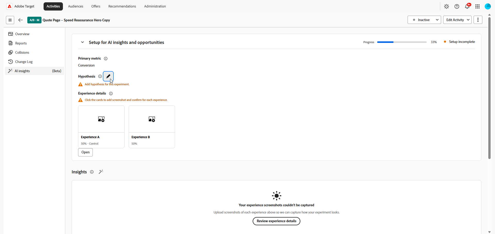
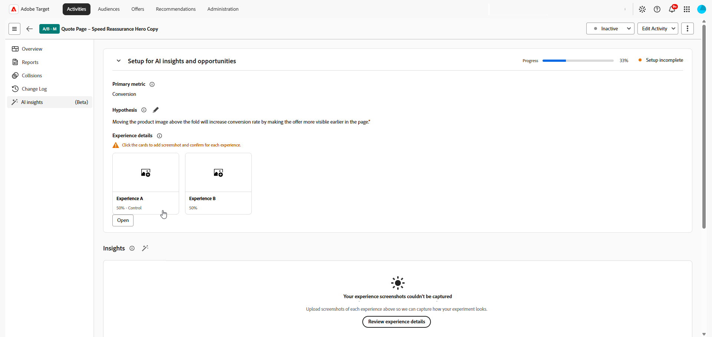

# AI分析

>[!AVAILABILITY]
>
>AI分析功能目前作为测试版功能提供。
> 
>**[!UICONTROL AI分析]**&#x200B;部分仅适用于具有&#x200B;**[!UICONTROL 手动]**&#x200B;流量分配的&#x200B;**[!UICONTROL A/B测试]**&#x200B;活动。

您的&#x200B;**[!UICONTROL 活动概述]**&#x200B;中的&#x200B;**[!UICONTROL AI分析]**&#x200B;菜单提供对分析和优化机会的访问。 使用此选项卡可审查试验学习情况、比较处理方法并确定可提高转化率的更改。

## 设置AI见解和机会

>[!CONTEXTUALHELP]
>id="target_ai_insights"
>title="分析"
>abstract="试验洞察是指在试验数据达到统计显著性后，AI 从中发现的有价值的信息。"

>[!CONTEXTUALHELP]
>id="target_ai_insights_primary_metric"
>title="主要量度"
>abstract="主要量度会自动从报表设置中获取。 如需更改，请修改“目标和设置”中的目标量度。"

>[!CONTEXTUALHELP]
>id="target_ai_insights_hypothesis"
>title="假设验证"
>abstract="假设是您定义的一项陈述，用于说明试验的预期结果。 请描述要更改的内容及其位置，然后说明您预期哪个量度会发生变化，以及具体如何变化。"

>[!CONTEXTUALHELP]
>id="target_ai_insights_treatment_details"
>title="体验详细信息"
>abstract="体验详细信息显示了用户符合体验条件时体验的外观。 您可以查看所有试验的这些图像。 某些试验可能会要求您确认图像，或在必要时进行替换。"

>[!CONTEXTUALHELP]
>id="target_ai_insights_primary_metric"
>title="主要量度"
>abstract="主要量度会自动从报表设置中获取。 如需更改，请修改“目标和设置”中的目标量度。"

>[!CONTEXTUALHELP]
>id="target_ai_insights_hypothesis"
>title="假设验证"
>abstract="假设是您定义的一项陈述，用于说明试验的预期结果。 请描述要更改的内容及其位置，然后说明您预期哪个量度会发生变化，以及具体如何变化。"

>[!CONTEXTUALHELP]
>id="target_ai_insights_opportunities"
>title="机会"
>abstract="试验机会是指 AI 根据在试验屏幕截图和结果中发现的规律，提出的试验处理方案构想。"

>[!CONTEXTUALHELP]
>id="target_ai_insights_treatment_details"
>title="试验处理方案详情"
>abstract="试验处理方案详情通过图像展示用户符合方案适用条件时所看到的实际效果。 您可以查看所有试验的这些图像。 某些试验可能会要求您确认图像，或在必要时进行替换。"

在访问AI生成的洞察和机会之前，您首先需要通过确认主要量度、假设验证和体验屏幕截图来设置活动。

主要指标将自动从报表设置中提取，具体取决于您如何设置目标和设置。 必须在AI分析面板中创建假设验证。 [了解详情](../c-activities/t-test-ab/t-test-create-ab/ab-goals-and-settings.md)

1. 在[!DNL Adobe Target]中打开您的活动。

1. 选择&#x200B;**[!UICONTROL AI Insights]**&#x200B;菜单以打开配置面板。

1. 单击为您的试验创建一个假设验证。

   

1. 通过描述已作出的更改以及这些更改将如何影响主要量度，键入您的假设验证。

   单击&#x200B;**[!UICONTROL 保存]**。

1. 在&#x200B;**[!UICONTROL 体验详细信息]**&#x200B;下，单击卡片为您的体验添加屏幕快照。

   >[!NOTE]
   >某些图像可能已自动捕获。 如果是这样，请单击&#x200B;**[!UICONTROL 确认]**&#x200B;以确认屏幕快照。

   

1. 选择&#x200B;**[!UICONTROL 上载图像]**&#x200B;从本地文件上载每个体验的首选屏幕快照。

   

1. 复制预览链接或直接打开它以预览体验。

1. 每个体验都有一个屏幕快照后，查看详细信息并单击&#x200B;**[!UICONTROL 确认]**&#x200B;以完成设置。

设置完成后，您的活动便可生成机会。 试验具有足够的数据进行统计验证并确认所需的试验详细信息后，分析即可使用。

## 分析 {#insights}

>[!CONTEXTUALHELP]
>id="target_ai_insights_insights"
>title="分析"
>abstract="试验洞察是指在试验数据达到统计显著性后，AI 从中发现的有价值的信息。"

实验见解是来自此实验的AI生成的学习。 一旦试验达到统计学意义并提供有助于其成功的背景信息，这些见解即可使用。 它们会突出显示入选体验中存在的与控制体验不同的关键属性，并且可能会影响结果。

1. 单击卡以访问&#x200B;**[!UICONTROL 分析]**&#x200B;菜单。

   

1. 浏览由AI生成的见解，以查看试验学习并将入选体验与控制体验进行比较。

   

1. 在&#x200B;**[!UICONTROL 中，是什么让此体验获胜了？]**，请查看详细信息，解释为什么此体验优于控制体验。

## 机会

>[!CONTEXTUALHELP]
>id="target_ai_insights_opportunities"
>title="机会"
>abstract="实验机会是AI建议的体验想法，这些想法基于在您的实验屏幕截图和结果中找到的模式AI。"

**[!UICONTROL 机会]**&#x200B;面板显示AI生成的推荐，这些推荐旨在提高测试性能并符合更广泛的业务目标和KPI。

1. 浏览建议的机会，然后选择要复查的机会。

   

1. 选择一个Opportunity以打开Opportunity Details窗口，该窗口概述了特定的Experience或Variation。 此视图包括：

   * 用于生成机会的当前体验图像。

   * AI生成的假说，它解释了建议的体验的预期结果以及它可能会改善性能的原因。

   * 有关如何在“体验”中实施推荐以及衡量对所选量度影响的指导。

   

