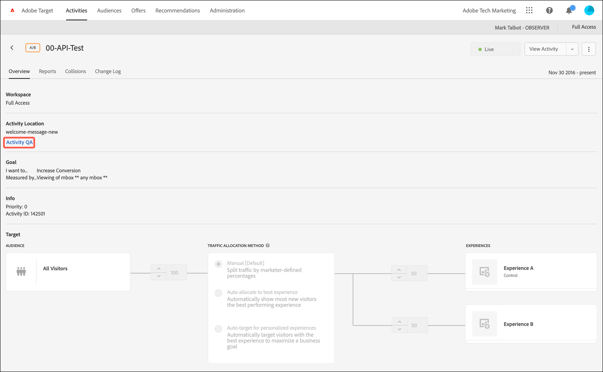

# 活动 QA

在中使用QA URL [!DNL Adobe Target] 通过永不变更的预览链接、可选的受众定位以及从实时活动数据中分段的QA报表，轻松执行端到端活动QA。

[!UICONTROL 活动QA] 可让您全面测试 [!DNL Target] 活动在启动之前处于活动状态。 此 [!UICONTROL 活动QA] 功能包括：

* 可与团队成员共享链接，不论体验或活动是否进行了更新，这些链接永远不会更改，也不需要重新生成. 利用此功能，您可以在整个用户历程中全面测试您的活动。
* 可选择遵守受众条件，在对体验外观进行 QA 时，营销人员可以选择测试定位标准或忽略定位标准，而不一定非要满足受众条件.
* 可捕获 QA 报表，以便营销人员能够确认量度可按预期递增，并且 QA 报表数据可与生产报表（对于非 A4T 报表）分开保存。
* 能够单独预览体验，或预览其他满足交付标准的实时活动(页面/[!DNL Target] 请求/受众)。
* 能够对整个用户历程进行 QA。在活动 QA 过程中，只需使用 QA 链接访问网站一次，即可浏览整个网站。您可以一直停留在“活动 QA”模式中，直到您结束会话或使用 [QA Target书签](/help/main/c-activities/c-activity-qa/activity-qa-bookmark.md#concept_A8A3551A4B5342079AFEED5ECF93E879) 强迫自己离开 [!UICONTROL 活动QA]. 如果您的活动跨多个网页，则此功能非常有用。

  >[!NOTE]
  >
  >此功能适用于版本2中的at.js实施。*x* 或更高版本。 对于at.js 1.*x* 实施，仅当访客的浏览器不阻止第三方Cookie时，此功能才为true。

## 访问和共享 QA URL {#section_1C59BAA247B247BDB125D1BE8EAD4547}

1. 从活动的 [!UICONTROL 概述] 页面，单击 **[!UICONTROL 活动QA]**.

   

1. 配置以下设置：

   

   * **[!UICONTROL 匹配受众规则以查看体验]：** 有时，您需要确认受众匹配是否可以正常工作。 其他时候，您需要检查活动的外观。 如果将此设置切换到“开”位置，则测试人员必须满足定位要求，才有资格查看体验。对于体验定位 (XT) 活动，只提供了一个活动 URL。您所看到的体验取决于您符合哪一个定位规则。

     如果将此设置切换到“关”位置，则单击链接即可查看体验，而不论您是否符合相应条件。执行 QA 时，您可以在要求遵守受众定位条件或不要求遵守受众定位条件之间来回切换。

   * **显示所有其他活动的默认内容：** 如果将此选项切换到“开”位置，则会为所有其他活动显示默认内容。 例如，单独显示预览，而不考虑同一页面上的所有其他实时活动/[!DNL Target] 请求。

     如果将此设置切换到“关”位置，请考虑以下几点：

      * 如果您测试的活动与其他实时活动之间存在冲突，则会应用[常规的优先级规则](/help/main/c-activities/priority.md#concept_1780C11FEA57440499F0047DD6900E0F)。由于发生冲突，您可能无法看到您打算进行QA的活动。
      * 量度会在已查看的活动中递增，但这仅限于 QA 报表环境。

1. 单击 **[!UICONTROL 完成]**，以保存所做的更改。
1. 与组织成员共享活动链接URL以进行测试。

   活动链接永不过期，如果有人更改了活动或体验，则无需重新发送链接。 但是，如果您应用的 [!UICONTROL 受众库]，而不是简单地编辑活动，而是会生成一个您必须再次共享的新链接。

   通过每个活动链接URL（适用于体验A、体验B等），您可以从相应的体验开始用户历程。 单击为体验生成的URL，然后继续正常网站浏览，以查看多个页面上的体验（如果存在多个页面）。 每个体验只会生成一个 URL，即使体验涉及多个页面（模板测试或多页面测试）也是如此。

   您可以导航站点以查看其他页面，因为 [!UICONTROL 活动QA] 模式为粘性。 这种情况适用于版本2中的at.js实施。*x* 或更高版本。 对于at.js 1.*x* 实施中，仅当访客的浏览器不阻止第三方Cookie时，才会出现这种情况。

1. 要查看从活动链接URL生成的报表，请单击活动的 **[!UICONTROL 报表]** 页面上，单击 **[!UICONTROL 设置]** 图标(   )，然后选择 **[!UICONTROL QA模式流量]** 从 **[!UICONTROL 环境]** 下拉列表。

## 注意事项 {#section_B256EDD7BFEC4A6DA72A8A6ABD196D78}

* 因为活动QA现在对所有人可用 [!DNL Target] 活动类型后，“使用体验预览URL预览Automated Personalization活动”功能便不再需要。
* [!UICONTROL 如果帐户中保存的活动过多，则可能无法加载已保存活动的活动 QA 预览链接。]重试预览链接应该有效。 为防止这种情况继续发生，请存档不再主动使用的已保存活动。
* [!UICONTROL 活动QA] URL可用于包含以下项的活动： [将Analytics作为报表源](/help/main/c-integrating-target-with-mac/a4t/a4t.md) (A4T)。 使用执行QA时生成的点击 [!UICONTROL 活动QA] 流向活动数据流的同一报表包，即使活动已上线。
* [!UICONTROL “活动 QA”不会显示已存档活动或已过期活动的内容。]如果停用已结束的活动，则必须再次保存该活动 [!UICONTROL 活动QA] 去工作。
* 活动已导入到 [!DNL Target Standard/Premium] (从 [!DNL Target Classic]例如)不支持QA URL。
* 在 [!UICONTROL 自动分配] 和 [!UICONTROL Recommendations] 活动，则模型不受中捕获的访问的影响 [!UICONTROL 活动QA].
* [!UICONTROL 活动QA] 有粘性。 在中浏览网站之后 [!UICONTROL 活动QA]，您的 [!DNL Target] 会话必须过期或您必须拥有 [!DNL Target] 从以下位置释放您 [!UICONTROL 活动QA] 以典型访客身份查看您的网站之前。

   * **at.js 2.*x***：如果您的网站具有at.js 2.*x* 已部署，请使用 [Target QA书签](/help/main/c-activities/c-activity-qa/activity-qa-bookmark.md#concept_A8A3551A4B5342079AFEED5ECF93E879) 强迫自己离开 [!UICONTROL 活动QA]. 在网站上加载具有空值的页面时（如下一个项目符号所述），会 *非* 在at.js 2.*x* 已部署。

   * **at.js 1.*x***：如果您的网站具有at.js 1.*x* 已部署，除了使用 [Target QA书签](/help/main/c-activities/c-activity-qa/activity-qa-bookmark.md#concept_A8A3551A4B5342079AFEED5ECF93E879)，您也可以手动强制自己退出该模式，方法是在网站上使用 `at_preview_token` 具有空值的参数。 例如：

     `https://www.mysite.com/?at_preview_token=`

   * **[!DNL Adobe Experience Platform Web SDK]**：如果您的网站具有 [[!UICONTROL 平台Web SDK]](https://experienceleague.adobe.com/docs/target-dev/developer/client-side/aep-web-sdk.html){target=_blank} 部署后，您可以通过以下方式手动强制自己退出该模式：在网站上加载页面，其中 `at_qa_mode` 具有空值的参数。 例如：

     `https://www.mysite.com/?at_qa_mode=`

* 如果您在创建活动时指定了“URL is” [基于表单的编辑器中的细化](/help/main/c-experiences/form-experience-composer.md#task_FAC842A6535045B68B4C1AD3E657E56E) 或 [可视化体验编辑器中的页面交付选项)](/help/main/c-experiences/c-visual-experience-composer/viztarget-options.md#reference_3BD1BEEAFA584A749ED2D08F14732E81)， QA URL不起作用，因为 [!UICONTROL 活动QA] 附加URL参数。 要解决此问题，请单击 QA URL 以转到您的网站，并从该 URL 中删除附加的参数，然后再加载新的 URL。
* 如果您有at.js 1.*x*， [!UICONTROL 活动QA] 如果您使用Safari或其他阻止第三方Cookie的浏览器，则模式无粘性。 在这些情况下，您必须将预览参数添加到您导航到的每个URL。 如果您已实施，则同样如此 [CNAME](https://experienceleague.adobe.com/docs/target-dev/developer/implementation/implement-cname-support-in-target.html){target=_blank}.
* 如果活动使用多个体验受众（例如，同一活动中同时包含一个美国网站和一个英国网站），则不会为这四种组合（体验A/美国网站、体验A/英国网站、体验B/美国网站、体验B/英国网站）生成QA链接。 而是只会创建两个 QA 链接（体验 A 和体验 B），且用户必须符合相应受众条件才能看到相应的页面。英国QA人员看不到美国网站。
* 所有 `at_preview` 参数和值均已进行 URL 编码。大多数时候，一切都会按预期运行。 但是，有些客户必须加载均衡器或Web服务器，以尝试对查询字符串参数再次进行编码。

  由于此双重编码过程，当 [!DNL Target] 尝试解码 `at_preview_token`， [!DNL Target] 无法提取正确的令牌值，从而导致预览不起作用。

  [!DNL Adobe] 列入允许列表建议您联系IT团队，以确保所有预览参数均转换，以便这些值不会发生任何形式的转换。

  下表列出了可在域中列入允许列表的参数：

  | 参数 | 类型 | 值 | 描述 |
  |--- |--- |--- |--- |
  | `at_preview_token` | 加密的字符串 | 必填；没有默认值 | 加密实体，其中包含可以在QA模式下执行的营销活动ID列表。 |
  | `at_preview_index` | 字符串 | 留空 | 参数格式为 `<campaignIndex>` 或 `<campaignIndex>_< experienceIndex>` 两个索引均以 1 开头。 |
  | `at_preview_listed_activities_only` | 布尔 (true/false) | 默认值：false | 如果为“true”，则会处理 `at_preview_index` 参数中指定的所有营销活动。 如果为“false”，则会处理页面中的所有营销活动，即使未在预览令牌中指定这些营销活动也是如此。 |
  | `at_preview_evaluate_as_true_audience_ids` | 字符串 | 留空 | 应始终（在定位和报告级别）在segmentId的范围中评估为“true”的以下划线分隔的(“_”)列表 [!DNL Target] 请求。 |
  | `_AT_Debug` | 字符串 | 窗口或控制台 | 控制台日志记录或新窗口。 |
  | `adobe_mc_ref` |  |  | 可将默认页面的引荐 URL 传递到新页面。如果使用了 `AppMeasurement.js` 版本 2.1（或更高版本），则 [!DNL Adobe Analytics] 会将此参数值用作新页面上的引荐 URL。 |
  | `adobe_mc_sdid` |  |  | 传递 [!DNL Supplemental Data Id] (SDID)和 [!DNL Experience Cloud Org Id] 从默认页面到新页面。 传递这些ID允许 [!UICONTROL 目标分析] (A4T)将 [!DNL Target] 在默认页面上使用 [!DNL Analytics] 请求。 |

* 此 [!UICONTROL Target QA模式] UI仅显示多页面活动中体验的第一个URL。 假设您要创建一个历程测试，并从URL1移动到URL2。 但是，如果要单独转到 URL2，请复制针对 URL1 提供的所有 URL 参数，并在放置“?”后将其应用于 URL2，正如 URL1 中所看到的一样。
* 如果帐户中保存的活动过多，则可能无法加载已保存活动的活动 QA 预览链接。重试这些预览链接。将已保存但不再主动使用的活动存档，以防继续发生此问题。

## Target JavaScript 库 [!UICONTROL QA 模式]兼容性 {#compatibility}

[!DNL Target] 支持以下JavaScript库：

* [at.js 1.x](https://experienceleague.adobe.com/docs/target-dev/developer/client-side/at-js-implementation/at-js/how-atjs-works.html)
* [at.js 2.x](https://experienceleague.adobe.com/docs/target-dev/developer/client-side/at-js-implementation/at-js/how-atjs-works.html)
* [Adobe Experience Platform Web SDK](https://experienceleague.adobe.com/docs/target-dev/developer/client-side/aep-web-sdk.html)

下表列出了各种活动类型，并指明了 [!UICONTROL 活动QA] 每个库都支持以下模式：

| 活动类型 | at.js 1.x | at.js 2.x | 平台Web SDK |
| --- | --- | --- | --- |
| [!UICONTROL A/B 测试] | 是 | 是 | 是 |
| [!UICONTROL 自动分配] | 是 | 是 | 是 |
| [!UICONTROL 自动定位] | 是 | 是 | 是 |
| [!UICONTROL 自当个性化] (AP) | 是 | 是 | 是 |
| [!UICONTROL 体验定位] (XT) | 是 | 是 | 是 |
| [!UICONTROL 多变量测试] (MVT) | 是 | 是 | 是 |
| [!UICONTROL Recommendations] | 是 | 是 | 是 |

