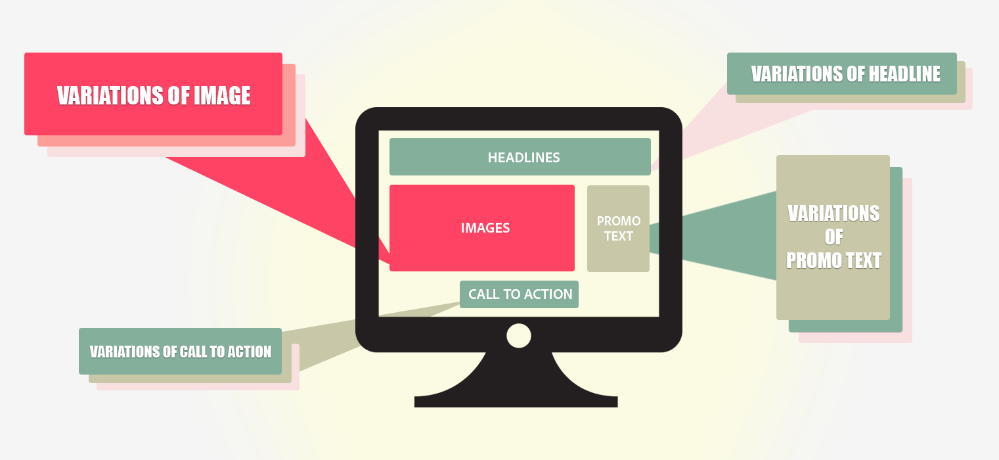

# [!UICONTROL Multivariate Test]概述

[!DNL Adobe Target]中的[!UICONTROL Multivariate Test] (MVT)活动比较页面上各元素中选件的不同组合以确定哪个组合对特定受众的表现最好。 [!UICONTROL Multivariate Test]活动还有助于确定哪个元素对活动取得成功影响最大。

多变量测试可帮助您发现特定元素与页面上的其他元素相比，对转化具有的相对影响。 多变量测试还可以帮助您优化已证明有效的元素组合。

与A/B测试相比，[!UICONTROL Multivariate Test]提供的一项优势是能够显示页面上的哪些元素对转化具有最大影响。 这一优势也被称为“主效应”。 例如，此信息可帮助您确定要将最受关注的内容放在何处。

[!UICONTROL Multivariate Test]活动还可帮助您在页面上找到两个或多个元素之间的复合效果。 例如，与特定横幅或主题图像结合使用时，特定广告可能会产生更多转化。这也被称为“交互效应”。

[!DNL Target] 使用全因子多变量测试来帮助您优化内容。全因子多变量测试以相同概率检查内容的所有可能组合。 例如，如果您有两个页面元素，每个页面元素包含三个选件，则共有九种可能的组合 (3x3)。如果您有三个元素，其中两个包含三个可能的选件，另一个包含两个选件，则共有 18 个选项 (3x3x2)。

在[!DNL Target]中，每个组合都是一个体验。 [!UICONTROL Multivariate Test]比较每个体验，以便您了解哪些组合最成功。 同时，系统会收集和分析数据以了解每个位置和选件对成功量度的影响如何。

由于可生成的组合数量，[!UICONTROL Multivariate Test]比A/B测试需要更多时间和流量。 页面必须获得足够的流量才能为每个体验产生具有统计意义的结果。要获得有用的结果，您必须了解页面接收的流量量，并在适当的时间段内测试最佳组合数量以获得所需的结果。

Target的[流量估算器](/help/main/c-activities/c-multivariate-testing/t-create-multivariate-test/traffic-estimator.md#task_71AA6922AFD447EA8C5E610A78ABA714)可以帮助您设计适用于您的流量的测试。 在使用流量估算器之前，您应已拥有合适的统计数据，该数据可显示您的网站通常会收到的展示次数和转化次数。思考一下您每天的流量级别。活动中的体验越多，活动必须包含的流量越多，或活动必须运行的时间越长。 如果流量量不高，则应该测试一些组合；否则，生成有意义的测试结果所需的时间可能太长而无法使用。

## MVT术语 {#section_DF475CA7F34B4CFDB7BE7363761D64AE}

设置多变量测试时，了解一些基本术语会有帮助。

行业内对术语的用法各有不同。本节定义了 [!DNL Target] 使用的术语。

**组合：**&#x200B;在多个位置测试多个内容选项时创建的内容变体。例如，如果您正在对 3 个位置进行测试，每个位置有 3 个内容选项，则一共有 27 种组合 (3x3x3)。您网站的访客会看到一个组合，也称为体验。

**内容：**&#x200B;构成某个位置当中测试变体的文本或图像。在多变量测试中，会比较多个位置中的多个内容选项。 在 MVT 方法中，有时将内容称为“级”**。

**元素：**&#x200B;包含要在 MVT 中测试的内容变体的 DOM 元素。另请查看“位置”**。

**位置：**&#x200B;页面上的特定内容区域，通常包含在单个 DOM 元素内。在 MVT 方法中，有时将内容称为“因子”**。全因子多变量测试会比较您的位置中所有可能的选件组合。

## 何时使用[!UICONTROL Multivariate Test]与A/B {#section_3D2B966B6671406C861A1843EA41D28C}

多变量测试可与 A/B 测试结合使用以优化您的页面。您可以将它们结合使用的示例包括：

* 使用A/B测试优化页面布局，接着使用MVT测试确定页面上每个元素的最佳内容。

  A/B 测试可以提供关于布局的重要反馈，而 MVT 测试则擅长测试页面设计中元素的内容。在测试多个内容选项之前对布局运行A/B测试可以帮助您确定最佳布局和最具影响力的内容。

* 使用 MVT 测试来确定最重要的元素，然后对该元素进行更集中的 A/B 测试。

  如果不同体验的数量超过5个并跨越两个或更多元素，则最好在运行A/B测试之前先运行MVT测试。 MVT 测试可显示页面中的哪些区域最有可能提高转化。这些是营销人员应关注的元素。例如，MVT 测试可能表明，行为召唤 (call to action) 是实现目标的最重要元素。确定哪些元素和内容对帮助您实现目标最有用后，您可以运行A/B测试以进一步优化结果。 例如，您可以相互测试两个特定图像，或比较行动号召的措辞或颜色。 通过在 MVT 测试后使用一个或多个 A/B 测试，您可以确定达成所需结果的最佳内容。

## 注意事项 {#section_979FE3F398654C1EA1C86E7DBC9A8DAD}

* 当您至少有三个元素要进行测试时，请使用 MVT 测试。如果要测试的元素比这少，则运行一组 A/B 测试。
* 选择您认为对结果影响最大的页面元素。
* 不要在一个测试中包含太多的元素或位置。数字越大，测试持续时间越长。
* 提前对测试设计进行规划。当测试开始运行并开始收集和分析数据时，请勿对其进行编辑。
* 元素之间应相互独立。

  例如，不要在同一测试中对布局和内容这两方面都进行测试。

* 由于体验数量增加，请为QA计划额外的时间。 您也可以使用部分因子测试来减少多变量测试所需的流量。 有关更多信息，请参阅下面的部分因子测试：

## 部分因子测试

[!DNL Target] 提供全因子多变量测试作为内置活动选项。在统计数据中，
“实验设计”提供了多种方法或设计来确定哪些因素会影响结果。 其中一种方法是用于部分因子测试的[田口方法](https://en.wikipedia.org/wiki/Taguchi_methods)。 田口方法使营销人员能够制定一套假设，减少必须测试的体验排列数量，从而降低多变量测试的流量需求。 可以使用此[脱机电子表格](/help/main/assets/MVT-Taguchi-Partial-Factorial-Design-02102017.xlsx)在[!DNL Target]中应用此功能和测试方法。

如果您的团队使用其他“实验设计”方法，则可以将此计算电子表格用作自定义实验设计的参考实施。

在您使用该离线计算电子表格时，请考虑以下提示：

* 选取要更改的元素以及每个元素的版本号（3x2、4x3等）。
* 保持编号一致。例如，如果按钮是元素 1，选项是蓝色、绿色和黄色，则蓝色按钮为 1-1，绿色按钮为 1-2，黄色按钮为 1-3。
* 该离线电子表格提供了所需的相应数量的体验（3x2 是 4 个、4x3 是 9 个，等等）。
* 使用[可视化体验编辑器 (VEC)](/help/main/c-experiences/experiences.md) 在 A/B 工作流中构建体验。您可以使用自定义代码、编辑 HTML、WYSIWYG 或任意组合。
* 活动结束后（基于样本量计算器），通过电子表格运行结果以获取其他详细信息。

有关更多注意事项和最佳实践，请参阅[多变量测试最佳实践](/help/main/c-activities/c-multivariate-testing/best-practices.md#reference_53635817FFB741EF8C4E56CC70688EDD)。

## 培训视频

以下视频包含有关本文中所讨论概念的详细信息。

### 活动类型（9 分 3 秒）

此概述视频介绍[!DNL Target]中可用的活动类型。 对多变量测试的讨论开始于 4:20。

* 介绍 [!DNL Adobe Target] 中包含的活动类型
* 选择相应的活动类型以实现目标
* 介绍适用于所有活动类型的三步引导式工作流

>[!VIDEO](https://video.tv.adobe.com/v/17386)

### 正在创建多变量测试(9:25) 

此视频介绍如何使用Target三步引导式工作流来了解、规划和创建多变量测试。

* 定义和设计多变量测试
* 创建多变量测试

>[!VIDEO](https://video.tv.adobe.com/v/17395)
