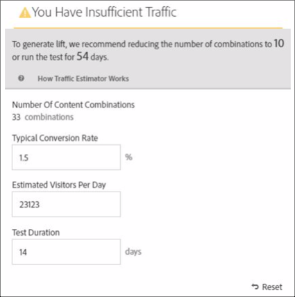

# 创建多变量测试

通过[!DNL Adobe Target]中的[!UICONTROL Visual Experience Composer] (VEC)，可以轻松创建[!UICONTROL Multivariate Test]并在[!DNL Target]中修改页面的各个部分。

使用[!DNL Target]点击式编辑器，您可以选择任意位置并添加多个选件。

[!UICONTROL Multivariate Test] (MVT)生成页面优先报表。 换言之，多变量测试会在某个特定的 URL 上运行，而测试中包含为该页面设计的所有体验。

1. 单击&#x200B;**[!UICONTROL Create Activity]** > **[!UICONTROL Multivariate Test]**。

   

   >[!NOTE]
   >
   >有关 [!DNL Target] 中可用的各种活动类型及其差异的更多信息，请参阅[活动](/help/main/c-activities/activities.md#concept_D317A95A1AB54674BA7AB65C7985BA03)。请参阅 [Target 活动类型](/help/main/c-activities/target-activities-guide.md)，以帮助您确定最符合自己需求的活动类型。

1. （视情况而定）选择投放类型： [!UICONTROL Web]、[!UICONTROL Mobile]、[!UICONTROL Email]或[!UICONTROL Other/API]。

1. （视情况而定）如果您是[Target Premium](/help/main/c-intro/intro.md#premium)客户，请[选择工作区](/help/main/administrating-target/c-user-management/property-channel/property-channel.md)。

1. [为要测试的页面指定URL](/help/main/c-activities/c-multivariate-testing/t-create-multivariate-test/url.md#concept_C12E4A85FF3B4E518E3110F6CF1AF9C0)，然后单击&#x200B;**[!UICONTROL Next]**。

   >[!NOTE]
   >
   >请使用完整的URL，即在开头包含HTTP或HTTPS。

   如果显示了一条消息，要求您为浏览器启用混合内容，请按消息中的说明进行操作。为浏览器启用混合内容后，重新从步骤 1 开始操作。

   将打开[!UICONTROL Visual Experience Composer]。

1. 键入活动的名称。

   

   活动名称不能以下列任何字符开头：

   | 字符 | 描述 |
   |--- |--- |
   | `=` | 等号 |
   | `+` | 加号 |
   | `-` | 减号 |
   | `@` | @ 符号 |

   活动名称不能包含以下任何字符序列：

   | 字符序列 | 描述 |
   |--- |--- |
   | ；= | 分号，等于 |
   | ；+ | 分号，加号 |
   | ；- | 分号，减号 |
   | ；@ | 分号， At sign |
   | ，= | 逗号，等于 |
   | ，+ | 逗号，加号 |
   | ，- | 逗号，减 |
   | ，@ | 逗号， At sign |
   | `[`” | 左方括号，双引号 |
   | &quot;`]` | 双引号，右方括号 |

1. [在每个位置中创建产品建议](/help/main/c-activities/c-multivariate-testing/t-create-multivariate-test/add-offers.md#concept_DCE6B45C30F7419B8EC17AFDEE8D8AA6)。

   

   您可以添加以下类型的选件：

   * HTML
   * 图像
   * 文本

1. 单击&#x200B;**[!UICONTROL Preview]**&#x200B;以[预览您的体验](/help/main/c-activities/c-multivariate-testing/t-create-multivariate-test/preview-experiences.md)。

   

   您可以查看每个体验，并排除不希望包含在测试中的任何体验。要排除一个或多个体验，请选中所需的复选框，然后单击&#x200B;**[!UICONTROL Exclude]** 。

   

1. [使用流量估算器](/help/main/c-activities/c-multivariate-testing/t-create-multivariate-test/traffic-estimator.md#task_71AA6922AFD447EA8C5E610A78ABA714)来检验测试计划的可行性。

   

   下图指示活动流量不足。

   

   下图指示活动流量不足。

   

1. 单击&#x200B;**[!UICONTROL Next]**&#x200B;前进到[!UICONTROL Targeting]页。

1. 选择受众，以及您希望参加活动的符合条件的访客所占的百分比。

   

   例如，您可以将准入资格限制为 50% 的访客或 45% 的“加州”受众。

   >[!NOTE]
   >
   >除了选择现有受众之外，您还可以合并多个受众来创建临时组合受众，而不是创建新受众。有关更多信息，请参阅[合并多个受众](/help/main/c-target/combining-multiple-audiences.md#concept_A7386F1EA4394BD2AB72399C225981E5)。

1. [查看测试摘要](/help/main/c-activities/c-multivariate-testing/t-create-multivariate-test/test-summary.md#reference_971AB225963A4DC18EEB5B0E20F0A4A7)并进行任何所需的更改，然后单击&#x200B;**[!UICONTROL Next]**。

1. [指定测试的目标和设置](/help/main/c-activities/c-multivariate-testing/t-create-multivariate-test/goals-and-settings.md#reference_B25389FD6F3A4989801E740364B089CC)。

1. 单击&#x200B;**[!UICONTROL Save and Close]**&#x200B;以创建该活动。

## 培训视频：创建多变量测试(9:25) 

本视频演示了如何使用[!DNL Target]三步引导式工作流规划和创建多变量测试。

* 定义和设计多变量测试
* 创建多变量测试

>[!VIDEO](https://video.tv.adobe.com/v/30337?captions=chi_hans)
