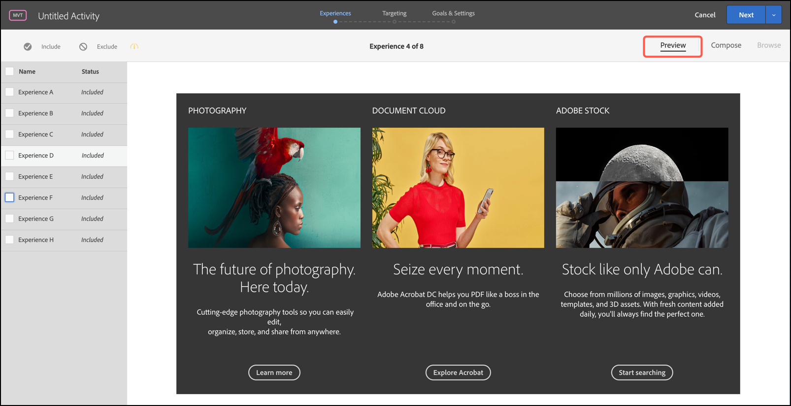

# 预览[!UICONTROL Multivariate Test]的体验

由于[!UICONTROL Multivariate Test]中的[!DNL Adobe Target]比较页面上的多个体验，因此预览每个体验中的页面将会很有帮助。

1. 在[!UICONTROL Visual Experience Composer] (VEC)中，单击&#x200B;**[!UICONTROL Preview]**。

   此时将显示一个包含所有体验的列表。

   

1. 单击列表中的某个体验，以查看该体验。

1. 要从多变量测试中排除一个或多个体验，请选择所需体验，然后单击&#x200B;**[!UICONTROL Exclude]**。

   

   您可能会排除显示冲突变体的体验，或在美学上未实现平衡的体验。

   >[!NOTE]
   >
   >在创建多变量测试时，您可以从测试中排除10%以上的体验，但前提是您确认了随后必须使用离线报表进行分析的警告。

   默认情况下，多变量测试中包含所有体验。要包含已排除的体验，请选择该排除的体验，然后单击&#x200B;**[!UICONTROL Include]**。

1. 单击&#x200B;**[!UICONTROL Exit Preview Mode]**&#x200B;返回到[!UICONTROL Visual Experience Composer]以便进行更改，或单击&#x200B;**[!UICONTROL Continue]**&#x200B;转到测试摘要。
