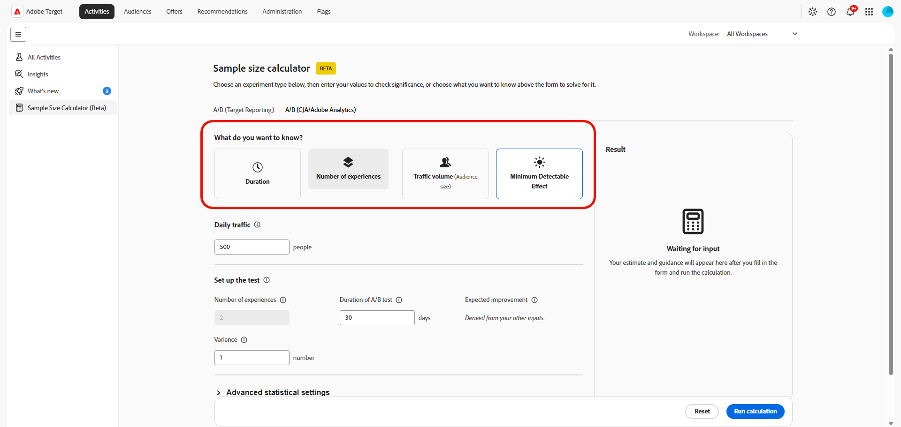

# 样本量计算器

>[!CONTEXTUALHELP]
>id="target_sample_size_ab_daily_traffic"
>title="每日流量"
>abstract="每天进入试验的用户数量。 如果您不知道此值，请选择上方的“流量”，计算器将根据其他输入值自动计算该值。"

>[!CONTEXTUALHELP]
>id="target_sample_size_confidence_level"
>title="置信度"
>abstract="在将结果判定为具有统计显著性之前，您需要多大程度地确信该结果并非由随机因素造成。 95% 的置信度意味着出现假阳性结果的概率不超过 5%。 值越高，假阳性越少，但所需的数据量也越大。"

>[!CONTEXTUALHELP]
>id="target_sample_size_statistical_power"
>title="统计功效"
>abstract="在确实存在真实效应的情况下检测到该效应的概率。 80% 的统计功效意味着检测到真实效应的概率为 80%。 统计功效越高，假阴性越少，但需要更多流量或更长的运行时间。"

>[!CONTEXTUALHELP]
>id="target_sample_size_setup_cja"
>title="设置测试"
>abstract="这些字段用于定义试验、预期结果以及结果的置信度阈值。 系统会自动计算与您上方所选值对应的字段；请在其余字段中填写您的预期值。"

>[!AVAILABILITY]
>
>使用此Beta样本量计算器，即表示您确认Beta是“按原样”提供的，不提供任何形式的保证。 Adobe没有义务维护、更正、更新、更改、修改或以其他方式支持Beta。 建议您谨慎使用，切勿依赖此类Beta和/或随附材料的正确功能或性能。 Beta被视为Adobe的机密信息。  您向Beta提供的任何“反馈”（有关Beta的信息，包括但不限于您在使用Adobe时遇到的问题或缺陷、建议、改进和推荐）均会分配给Adobe，其中包括针对该反馈的所有权利、标题和兴趣。

**[!UICONTROL 样本量计算器]**&#x200B;允许您在启动试验之前估算计划试验所需的输入。 计算器可帮助您确定需要多少流量、测试应该运行多久、要包含多少体验，或者根据您提供的值可以可靠地检测哪些最小影响。

要访问&#x200B;**[!UICONTROL 样本量计算器]**，请转到&#x200B;**[!UICONTROL 活动]**&#x200B;菜单。

## A/B（Target 报告）

>[!CONTEXTUALHELP]
>id="target_sample_size_bonferroni"
>title="Bonferroni 校正"
>abstract="调整置信度，以考虑同时将多个产品建议与控制组进行比较的情况。 仅当产品建议数量大于两个时，此项才会产生影响。 这与 Adobe 公共 Target Calculator 工具所采用的校正方法相同。"

>[!CONTEXTUALHELP]
>id="target_sample_size_metric_type"
>title="量度类型"
>abstract="您要衡量的量度类型。 对于点击或转化等二元结果，请使用“百分比”，因为每个用户只有完成或未完成操作两种情况。 对于收入或页面查看次数等量度，请使用“数值”，因为不同用户的值可能存在很大差异。"

>[!CONTEXTUALHELP]
>id="target_sample_size_number_offers"
>title="产品建议数"
>abstract="试验中的体验数量，包括控制体验。 当产品建议数量超过两个时，系统会自动应用 Bonferroni 校正（如果已启用），以确保所有比较的总体置信度保持准确。"

>[!CONTEXTUALHELP]
>id="target_sample_size_lift"
>title="提升度"
>abstract="您希望检测到的相对于基准值的提升幅度。 请输入相对于基准值的百分比。 例如，如果基准转化率为 11.8%，提升 5% 的目标转化率即为 12.39%。"

>[!CONTEXTUALHELP]
>id="target_sample_size_baseline_conversion_rate"
>title="基准线转化率"
>abstract="试验开始前的当前转化率，即控制组的平均值。 此值为必填项。 对于百分比量度，请输入百分比数值，例如输入 5 表示 5%。 对于计数量度，请直接输入原始数值（可含小数）。"

估计规划和运行A/B测试所需的输入。 这些值可帮助您确定需要多少流量、测试应该运行多久以及可以实际检测的影响大小。

1. 访问&#x200B;**[!UICONTROL A/B （目标报表）]**&#x200B;选项卡以计算A/B测试的规划输入。

1. 启用&#x200B;**[!UICONTROL 应用更正]**&#x200B;选项以调整置信度，考虑将多个选件同时与控件进行比较。

1. 选择您的&#x200B;**[!UICONTROL 量度类型]**：

   * 转化率：将此值用于点击或购买等二进制结果，其中每位访客都会完成或不完成操作。
   * 每位访客带来的收入：将此用于收入类型的量度，在该量度中，访客之间的值可能相差很大。

     

1. 指定&#x200B;**[!UICONTROL 每日流量]**，即每天进入试验的用户数。

1. 在&#x200B;**[!UICONTROL 设置测试]**&#x200B;下，输入其余值：

   * **[!UICONTROL 选件数]**：试验中的体验数，包括控件。 两个以上的选件在启用时应用Bonferroni校正，以保持总体置信度。

   * **[!UICONTROL 提升]**：相对于要检测的基线的改进。 以基线的百分比输入，例如，11.8%的基线转化率目标12.39%的提升5%。

     

1. 在试验开始之前，为当前体验指定&#x200B;**[!UICONTROL 基线转化率]**。

1. 您可以展开&#x200B;**[!UICONTROL 高级统计设置]**，以便在统计输入可用于所选计算时提供其他统计输入。

   * **[!UICONTROL 置信度级别]**：结果不是由于偶然性产生的可能性。 95%的水平有5%的误报率。

   * **[!UICONTROL 统计功效]**：检测实际效果的可能性。 80%的电源可减少误报，但需要更多的流量或时间。

1. 选择&#x200B;**[!UICONTROL 运行计算]**&#x200B;以生成估算值。 选择&#x200B;**[!UICONTROL 重置]**&#x200B;以清除当前输入并重新启动。

在您完成必填字段并运行计算后，**[!UICONTROL 结果]**&#x200B;面板将显示估计值。 如果必填字段不完整，面板会提示您输入缺少的值。

该计算器提供了用于规划试验的估计值。 在决定活动运行的时长时，请将此结果与您的试验设计、预期流量、基线性能和统计要求结合使用。

## A/B (CJA/Adobe Analytics)

>[!CONTEXTUALHELP]
>id="target_sample_size_number_experiences"
>title="体验数量"
>abstract="试验中的变体数量，包括对照组。 A/B 测试包含 2 个试验组。 5 个变体加上 1 个对照组，共计 6 个试验组。 试验组越多，所需流量也越大，且需按比例增加，以维持统计功效。"

>[!CONTEXTUALHELP]
>id="target_sample_size_duration"
>title="A/B 测试持续时间"
>abstract="试验将运行的天数。 持续时间越长，试验收集数据的时间就越充足，从而能够可靠地检测出更小的效应。 持续时间较短时，需要更大的效应或更多的每日流量，才能得出可靠的结果。"

>[!CONTEXTUALHELP]
>id="target_sample_size_expected_improvement"
>title="预期提升幅度"
>abstract="值得检测的最小提升幅度，即足以促使您采取行动的最小量度变化幅度。 此处指以百分点表示的提升幅度，而非相对于基准值的百分比变化。 例如，如果基准值为 5%，且提升 1 个百分点就有实际意义，请输入 1。"

>[!CONTEXTUALHELP]
>id="target_sample_size_variance"
>title="变量"
>abstract="量度值的离散程度，而不是平均值。 点进率等量度（大多数值为 0 或 1）的方差通常较低，而每位用户收入等量度的方差可能要高得多。 如果您不确定，请保留默认值 1。"

估算依赖于Adobe Analytics或Customer Journey Analytics数据的A/B活动的规划输入。 它可帮助您在启动活动之前定义试验大小、预期提升和测试持续时间。

1. 访问&#x200B;**[!UICONTROL A/B (CJA/Adobe Analytics)]**&#x200B;选项卡以计算A/B测试的规划输入。

1. 在&#x200B;**[!UICONTROL 您希望了解什么？]**&#x200B;下，选择您希望计算器确定的值：

   * **[!UICONTROL 持续时间]**：您有一个试验，想知道运行该试验需要多长时间，以及是否值得运行。
   * **[!UICONTROL 体验数量]**：您有一个位置可以运行试验，并想要确定您的流量可以支持多少个处理。
   * **[!UICONTROL 流量]**：您想进行一项试验，希望了解需要有多少访客才能达到统计显着性。
   * **[!UICONTROL 最低可检测效果]**：您想要运行一个试验，但想知道需要提升多少才能达到统计显着性。 这有助于您评估试验是否值得运行或计划。

   根据您选择的值，表单中的字段会发生变化。 计算器使用其它输入来确定所选的结果。

   

1. 指定&#x200B;**[!UICONTROL 每日流量]**，即每天进入试验的用户数。

1. 在&#x200B;**[!UICONTROL 设置测试]**&#x200B;下，输入其余值：

   * **[!UICONTROL 体验数]**：包括控件在内的变体的数量。 更多变体需要更多流量。

   * **[!UICONTROL A/B测试的持续时间]**：试验运行的天数。 较长的测试可以检测到较小的影响。

   * **[!UICONTROL 预期改进]**：您预期试验将产生的改进。

   * **[!UICONTROL 变量]**：度量值的分布方式。 点进率通常具有低差异，每位用户的收入可能更高。 如果您不确定，请保留默认值 1。

     在[Analytics文档](https://experienceleague.adobe.com/zh-hans/docs/analytics/components/calculated-metrics/calcmetrics-reference/cm-functions#variance)中了解如何计算&#x200B;**[!UICONTROL 差异]**

     

1. 您可以展开&#x200B;**[!UICONTROL 高级统计设置]**，以便在统计输入可用于所选计算时提供其他统计输入。

   * **[!UICONTROL 置信度级别]**：结果不是由于偶然性产生的可能性。 95%的水平有5%的误报率。 较低的置信水平意味着所需的流量更少，但这也会增加误报的风险。

   * **[!UICONTROL 统计功效]**：检测实际效果的可能性。 80%的电源可减少误报，但需要更多的流量或时间。

1. 选择&#x200B;**[!UICONTROL 运行计算]**&#x200B;以生成估算值。 选择&#x200B;**[!UICONTROL 重置]**&#x200B;以清除当前输入并重新启动。

在您完成必填字段并运行计算后，**[!UICONTROL 结果]**&#x200B;面板将显示估计值。 如果必填字段不完整，面板会提示您输入缺少的值。

该计算器提供了用于规划试验的估计值。 在决定活动运行的时长时，请将此结果与您的试验设计、预期流量、基线性能和统计要求结合使用。
