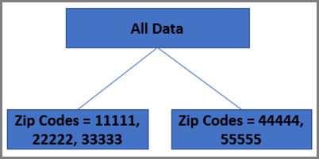

# 随机林算法

在(AP)和[!DNL Auto-Target]活动中使用的主要个性化算法是随机林。 集成方法（如随机森林）使用多种学习算法以获得比任何组成学习算法都更好的预测性能。 [!UICONTROL Automated Personalization]和[!UICONTROL Auto-Target]中的随机林算法是一种分类或回归方法，它通过训练时构造大量决策树来运行。

提到统计数据时，您可能会想到使用单个回归分析模型来预测结果。最新的数据科学研究显示，与基于单个模型进行预测相比较，“组合方法”（基于同一数据集创建多个模型，然后对这些模型进行智能合并）可产生更好的结果。

随机林算法是在[!UICONTROL Automated Personalization]和[!UICONTROL Auto-Target]活动中使用的关键基本个性化算法。 随机森林将数百棵决策树合并在一起，得出比一棵树单独做出更好的预测。

## 什么是决策树？ {#section_7F5865D8064447F4856FED426243FDAC}

决策树的目标是划分系统可从中学习的所有可用访问数据，然后对该数据进行分组，其中每个分组内的访问与目标量度尽可能相似。 但是，对于不同的目标量度（例如，转化率），群组之间的访问会尽可能地不同。 决策树查看它在训练集中具有的不同变量，以确定如何以互斥共同穷尽(MECE)方式将数据拆分为这些组（或“叶”），以实现此目标的最大化。

在一个简单的示例中，假设两个输入变量：

* 性别（具有两个可能的值：男性或女性）
* 邮政编码(小数据集中有五个潜在值：11111、22222、33333、44444或55555)

如果目标量度是转化，则树将首先确定两个变量中的哪个变量解释了访问数据转化率中的最大变化量。

假设邮政编码最具预测性。这样此变量就构成了决策树的第一个“分支”。接着，决策树会确定如何拆分访问数据，如每个拆分中的记录转化率尽可能相似，各拆分之间的转化率尽可能不同。在本例中，假设11111、22222、33333是一个拆分，44444和55555是第二个拆分。

此操作将生成决策树的第一层：

决策树提出了这样一个问题：“最能预测的变量是什么？” 在本例中，只有两个变量，因此这里的答案显然是性别。 树现在将完成一个类似的练习，在每个分支&#x200B;*内拆分数据*。 我们首先考虑 11111、22222 和 33333 分支。在这些邮政编码中，如果男性与女性之间的转化存在差异，则形成两个叶子（男性和女性），此分支完成。在其他分支44444和55555中，假设男女转化率之间没有统计学差异。 在这种情况下，第一个分支变为最后一个拆分。

此示例将生成以下树：

## 随机林如何使用决策树？ {#section_536C105EF9F540C096D60450CAC6F627}

决策树可堪称是强大的统计工具。但是，它们也存在一些缺陷。最为关键的是，它们可能会“过度拟合”数据，因此单个树不能很好地预测在构建初始决策树时未用到的将来数据。这一难题在统计学习中被称为[偏差-方差权衡](https://en.wikipedia.org/wiki/Bias%E2%80%93variance_tradeoff)。随机森林有助于克服这一过度契合的挑战。 在最高层次上，随机林就是决策树的一个集合，这些决策树基于同一个数据集构建但又略有不同，它们一起“投票”来产生一个比单个树更好的模型。这些树是通过随机选择具有替换（称为bagging）的访问记录子集和随机选择属性子集来构建的，因此林由稍有不同的决策树组成。 这种方法可为随机林中创建的决策树引入一些小的差异。通过加入这些数量可控的差异，可帮助提高算法的预测准确性。

## [!DNL Target]个性化算法如何使用随机林？ {#section_32FB53CAD8DF40FB9C0F1217FBDBB691}

### 如何构建模型

下图总结了如何为[!UICONTROL Auto-Target]和[!UICONTROL Automated Personalization]活动构建模型：

{width="650" zoomable="yes"}

1. Target在随机提供体验或选件的同时收集访客数据
1. 在[!DNL Target]点击关键数量的数据后，[!DNL Target]执行功能工程
1. [!DNL Target]为每个体验或选件构建随机林模型
1. [!DNL Target]检查模型是否满足阈值质量分数
1. [!DNL Target]将模型推送到生产环境以个性化未来的流量

[!DNL Target]使用它自动收集的数据以及您提供的自定义数据构建其个性化算法。 这些模型可预测要向访客显示的最佳体验或选件。通常，每个体验（如果为[!UICONTROL Auto-Target]活动）或每个选件（如果为[!UICONTROL Automated Personalization]活动）会生成一个模型。 然后，[!DNL Target]显示产生最高预测成功量度的体验或选件（例如，转化率）。 这些模型在用于进行预测之前，必须针对随机提供的访问进行训练。因此，在活动最初开始时，甚至会向个性化组内的访客随机显示不同的体验或选件，这种情况会一直持续到个性化算法准备就绪为止。

必须验证每个模型，以确保其在将应用于活动之前能够很好地预测访客的行为。 根据模型的“曲线下面积”(AUC)验证模型。 由于需要进行验证，因此模型开始提供个性化体验的确切时间取决于数据的详细信息。 实际上，出于流量规划目的，在每个模型生效之前，模型所使用的转化次数通常远高于最小转化次数。

当模型开始对体验或选件生效时，体验/选件名称左侧的时钟图标会变为绿色复选框。当至少有两个体验或选件可使用有效模型时，某些访问会开始个性化。

### 特征转换

在数据遍历个性化算法之前，需要进行特性转换，可将此过程视为准备训练记录中收集的数据以供个性化模型使用。

特性转换取决于属性的类型。主要有两种类型的属性（数据科学家有时称之为“特性”）：

* **类别：**&#x200B;类别特性无法计数，但可以划分为不同的组。类别特性包括国家/地区、性别或邮政编码。
* **数字：**&#x200B;数字特性可以测量或计数，如年龄、收入等。

对于类别特性，会保留所有可能的特性集，可使用概率转换来减小数据量。对于数值特征，重新缩放可确保这些特征在整体上具有可比性。

### 采用多臂老虎机来平衡学习与个性化

在[!DNL Target]构建个性化模型以个性化您的流量后，您将对未来访问您的活动的访客做出明确的权衡。 您应该根据当前模型对所有流量进行个性化设置，还是应该通过随机提供新访客的选件继续向其学习？ 您需要确保个性化算法在个性化大部分流量的同时，不断学习访客的新趋势。

多臂老虎机是[!DNL Target]帮助您实现此目标的方式。 多臂老虎机确保模型始终“花费”一小部分流量以在活动学习的整个生命周期中继续学习，并防止过度利用之前学习到的趋势。

在数据科学世界中，多臂盗贼问题是探索与开发困境的经典例子。在该问题中，给出一组单臂盗贼的集合，每个盗贼的奖励概率未知。 关键思想是制定一种策略，得出按下哪个摇臂可获得最高成功概率，从而获得最大化的奖赏总额。在构建在线模型后，使用多臂老虎机进行在线评分。 此过程有助于在探索期间进行在线学习。 当前的多臂算法是epsilon(ε)贪婪算法。 在此算法中，使用概率 1 - ε 来选择最佳摇臂。使用概率 ε 随机选择任何其他摇臂。
