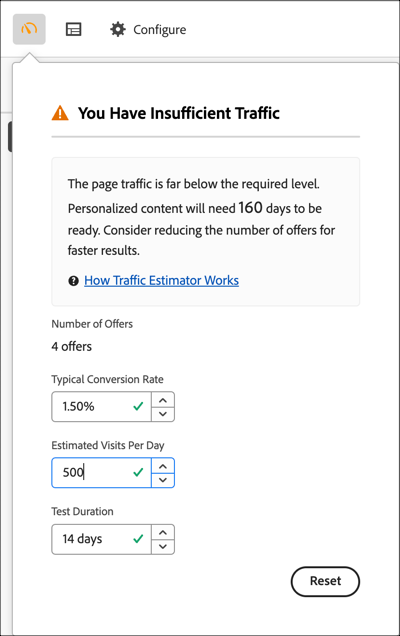

# 估算成功所需流量

[!DNL Adobe Target] [!UICONTROL Traffic Estimator]提供的反馈可让您知道您是否具有足够的流量以使[!UICONTROL Automated Personalization] (AP)活动成功。

由于[!UICONTROL Automated Personalization]活动使用多个选件组合，因此了解需要多少流量才能获得有意义的结果非常重要。 [!UICONTROL Traffic Estimator]使用有关您的页面的统计信息和正在测试的体验数量来估计流量和成功活动所需的测试持续时间。

[!UICONTROL Traffic Estimator]通过比较页面的预计页面展示次数和典型转化率，确定是否有足够的流量来生成个性化模型。 对于成功的活动，在理想的情况下，正确的样本量可确保个性化内容在活动持续时间的一半时间或 14 天内（以较短者为准）准备就绪。此过程留有充足的时间来获取个性化内容并了解要交付的内容。

请记住，[!DNL Target]会随机提供体验，直到生成个性化算法为止。 每个优惠旁边的复选标记图标显示该优惠的模型何时准备就绪，[!DNL Target]何时能够开始提供个性化内容。 由于提升仅在模型准备就绪后才属于预期提升度，因此，通过视觉指示可设置正确的预期。 使用[!UICONTROL Visual Experience Composer] (VEC)中的[!UICONTROL Traffic Estimator]获取模型准备就绪的指南。

## 使用流量估算器

1. 从[!UICONTROL Automated Personalization]活动中[!UICONTROL Visual Experience Composer]的[!UICONTROL Experiences]页面，单击[!UICONTROL Experiences]页面左上角的&#x200B;**[!UICONTROL Traffic]**&#x200B;图标（ ）。

   将打开[!UICONTROL Traffic Estimator]。

   

   您可以再次单击该图标以隐藏[!UICONTROL Traffic Estimator]。

1. 指定典型转化率（或此活动的预期转化率）、预计每日活动展示次数和测试持续时间。

   | 量度 | 描述 |
   | --- | --- |
   | **[!UICONTROL Number of Offers]** | 此量度是在执行任何排除之后，根据作为活动的一部分创建的体验数量自动计算的。 |
   | **[!UICONTROL Typical Conversion Rate]** | 此量度以百分比表示，根据估算或Analytics系统中的以往数据得出。 |
   | **[!UICONTROL Estimated Visits Per Day]** | 此量度是基于定位标准的每日访问次数，这些访问来自能够查看活动的访客。 此量度可以基于您的分析数据。 此数字必须是访问次数，而不是独特访客。 |
   | **[!UICONTROL Test Duration]** | 您希望该活动运行的天数。 |

   [!UICONTROL Traffic Estimator]使用这些量度来确定要运行成功的测试所需的调整。

   在[!UICONTROL Traffic Estimator]顶部附近，计算您输入的值并显示结果。

   

   当您更改这些数字时，估算的结果也会相应改变。例如，如果您要测试多个组合，而您的转化率和展示次数太低，则[!UICONTROL Traffic Estimator]会显示测试成功必须运行多久。 或者，如果您的流量较低，则[!UICONTROL Traffic Estimator]可以建议较低的选件组合数量，以便您可以在所需的天数内运行测试。

   如果流量不足，请考虑以下事项：

   * 考虑使用[[!UICONTROL Auto-Target]](/help/main/c-activities/auto-target/auto-target-to-optimize.md)活动而不是[!UICONTROL Automated Personalization]创建体验，以便在一个体验变量中进行多次选件更改。
   * 减少[!UICONTROL Automated Personalization]活动中的选件组合数量。
   * 延长活动持续时间。

   调整这些数字，直到[!UICONTROL Traffic Estimator]指示您具有足够的流量，然后相应地设计测试。

   

   如果流量足够，[!UICONTROL Traffic]图标会显示绿色复选标记。 如果流量不足，该图标会显示一个红色警告标签。

## 关于流量估算的常见问题解答

在使用[!UICONTROL Traffic Estimator]时请考虑以下常见问题：

### 即使我的AP活动具有足够的流量，为何仍无法构建个性化模型？

在某些情况下，您的流量足够大，可以生成个性化模型，但该流量可能会通知[!DNL Target]个性化模型与随机模型之间没有有意义的差异。 尽管模型是在[!DNL Target]中构建并经过测试，但并未部署，因为该模型并不比随机模型好多少。

此模型没有优于随机模型的一个可能原因可能是选件之间的差异不足。 如果是这样的话，您可以尝试在消息相似的情况下使选件在视觉上更加不同，也可以尝试更改消息本身。
