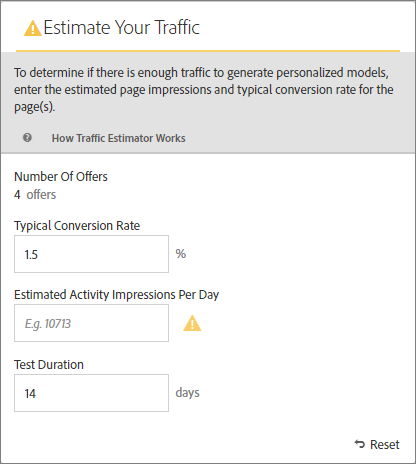

#  估算成功所需流量

的 [!DNL Adobe Target] [!UICONTROL 流量估算器] 提供反馈，让您知道自己是否有足够的流量 [!UICONTROL Automated Personalization] 活动成功。

因为 [!UICONTROL Automated Personalization] 活动使用多个选件组合，因此务必要了解需要多少流量才能提供有意义的结果。 的 [!UICONTROL 流量估算器] 使用有关您的页面和所测试体验数量的统计信息来估算流量量和测试持续时间，以便使活动成功。

的 [!UICONTROL 流量估算器] 通过比较估计的页面展示次数和页面的典型转化率，确定是否有足够的流量来生成个性化模型。 对于成功的活动，在理想的情况下，正确的样本量可确保个性化内容在活动持续时间的一半时间或 14 天内（以较短者为准）准备就绪。此过程允许有充足的时间获取个性化内容并了解要交付的内容。

记住 [!DNL Target] 在构建个性化算法之前，会随机提供体验。 当每个选件的模型准备就绪且 [!DNL Target] 能够开始提供个性化内容。 由于只有在个性化模型准备就绪后才会出现提升，因此显示的指示标记可帮助您设置正确的预期。使用 [!UICONTROL 流量估算器] 在 [!UICONTROL 可视化体验编辑器] (VEC)，以了解模型何时准备就绪的准则。

## 使用流量估算器

1. 从 [!UICONTROL 可视化体验编辑器]，单击 **[!UICONTROL 流量]**.

   

   的 [!UICONTROL 流量估算器] 打开。 您可以单击 **[!UICONTROL 流量]** 再次隐藏 [!UICONTROL 流量估算器].

   

1. 指定典型转化率（或此活动的预期转化率）、预计每日活动展示次数和测试持续时间。

   | 量度 | 描述 |
   | --- | --- |
   | **[!UICONTROL 选件数量]** | 此量度会根据在任何排除后作为活动的一部分创建的体验的数量自动计算。 |
   | **[!UICONTROL 典型转化率]** | 此量度以百分比表示，根据您的估算或分析系统中的以往数据得出。 |
   | **[!UICONTROL 预计每日访问次数]** | 此量度是指根据定位标准，能够查看活动的访客每天的访问次数。 此量度可以基于您的分析数据。 此数量必须为访问次数，而不是独特访客。 |
   | **[!UICONTROL 测试持续时间]** | 您希望该活动运行的天数。 |

   的 [!UICONTROL 流量估算器] 使用这些量度来确定运行成功测试需要哪些调整。

   在 [!UICONTROL 流量估算器]，则会计算输入的值并显示结果。

   

   当您更改这些数字时，估算的结果也会相应改变。例如，如果您正在测试许多组合，并且转化率和展示次数过低，则 [!UICONTROL 流量估算器] 显示测试必须运行多长时间才能成功。 或者，如果流量较低，则 [!UICONTROL 流量估算器] 可能建议选件组合数量减少，以便您可以按所需的天数运行测试。

   如果流量不足，请考虑以下事项：

   * 请考虑使用 [自动定位](/help/main/c-activities/auto-target/auto-target-to-optimize.md) 活动，而不是 [!UICONTROL Automated Personalization] 用于在一个体验变量中创建具有多个选件更改的体验。
   * 减少 [!UICONTROL Automated Personalization] 活动。
   * 延长活动持续时间。

   调整数字，直到 [!UICONTROL 流量估算器] 表示您拥有足够的流量，然后相应地设计测试。

   

   如果流量足够，则 [!UICONTROL 流量] 图标会显示绿色复选。 如果流量不足，该图标会显示一个红色警告标签。

## 有关流量估算器的常见问题解答

使用时，请考虑以下常见问题解答 [!UICONTROL 流量估算器]:

### 为什么即使我的AP活动具有足够的流量，仍未构建个性化模型？

在某些情况下，您的流量足够大，足以构建个性化模型，但该流量可能会通知 [!DNL Target] 个性化模型与随机模型之间没有显着区别。 尽管已内置模型 [!DNL Target] 经过测试后，该模型并未部署，因为该模型并不比随机模型更好。

模型没有比随机选件更好的一个原因可能是选件之间不够不同。 如果是，您可以尝试在消息相似的情况下使选件更加直观地不同，也可以尝试更改消息本身。
