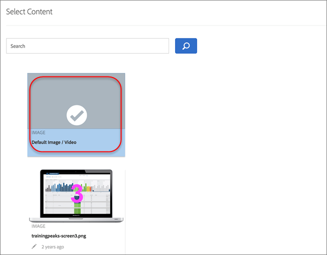

# 管理排除项

通过掌握排除项来控制您的[!UICONTROL Automated Personalization] (AP)策略。 无论您是防止重复的选件、优化体验组合，还是删除默认内容，排除项都可以让您根据目标和受众期望，提供更清晰、更相关的体验。

## 允许或禁止重复的选件 {#concept_4EF78013F80E48EFA024AE0274C9F037}

在AP活动中的不同位置使用选件库中的选件时，请防止重复这些选件。

例如，在您的一个活动中，一个页面上可能有 6 个位置和 12 个选件。活动中的多个位置可能存在相同的选件。通过此功能，您可以防止在同一活动内的不同位置同时显示重复的选件。

1. 在[创建或编辑AP活动](/help/main/c-activities/t-automated-personalization/create-ap-activity.md)时，单击&#x200B;**[!UICONTROL Configure]**&#x200B;图标（ ）>单击&#x200B;**[!UICONTROL Allow Duplicate Offers]**&#x200B;以根据您的需求打开和关闭此功能。

## 排除特定体验 {#task_C17D36EF58AF4908B17A3D84CA6DE85A}

如果要从AP活动中排除某些选件组合，请排除特定体验。

可能有某些组合无法协同工作，或者您可能正在限制测试的体验数量，以降低活动的流量要求。

1. 在[创建或编辑AP活动](/help/main/c-activities/t-automated-personalization/create-ap-activity.md)时，单击&#x200B;**管理内容**&#x200B;图标（）。

   [!UICONTROL Experiences]列表显示了所有内容和位置选项经过排列组合而生成的每个体验。

1. 根据需要排除相应的体验。

   您可以通过单击&#x200B;[!UICONTROL **更多操作**]&#x200B;图标（）然后单击&#x200B;[!UICONTROL **排除**]&#x200B;来排除特定体验。

   或者，您也可以批量排除体验，方法是选中相关体验的复选框，然后单击&#x200B;**[!UICONTROL Exclude]**。 选中一个或多个体验后，[!UICONTROL Exclude]图标即会显示。

   

   体验现已从活动中排除，其[!UICONTROL Status]显示为[!UICONTROL Excluded]。

## 排除默认内容 {#task_DCB4528989DF4C05A3A4729E5891D18F}

有时，您可能不希望将默认内容包含在AP活动中。 您可以使用此方法在一个位置中只有一个选件（与默认内容不同）作为活动的一部分。

排除默认内容是一种非常有用的方法，可用于更改页面上其余内容的外观，以使其符合您在 AP 活动中所测试的产品建议。例如，假设您想要匹配所测试选件的调色板，则可以更改页面的背景颜色并排除默认的背景颜色。

**使用[!UICONTROL Visual Experience Composer] (VEC)排除默认内容：**

1. 在[创建或编辑AP活动](/help/main/c-activities/t-automated-personalization/create-ap-activity.md)时，选择要替换的内容，然后单击以访问&#x200B;**[!UICONTROL Change Text/HTML]**、**[!UICONTROL Change Image Offer]**&#x200B;或&#x200B;**[!UICONTROL Change Background Color]**。 可用选项因内容类型而异。

   
1. 创建新内容。

1. 单击&#x200B;**[!UICONTROL More Actions]** （  ）图标，然后单击&#x200B;**排除默认选件/包含默认值**/切换以排除或包含默认选件。

   <!-- Depending on the content or offer type, the [!UICONTROL Include] checkbox is in a slightly different place. 

   For Text/HTML content: 

   

   For Image/Video content: 

   

   For background color: 

   -->

<!-- 1. Click **[!UICONTROL Save]**.

   You can see the experiences created from the offers you specified under [!UICONTROL Manage Content]. You notice that no experiences are created in [!UICONTROL Manage Content] using the default offer you excluded. 

   

**To exclude default content using the [!UICONTROL Form-Based Experience Composer]:** 

1. While creating or editing an AP activity, click **[!UICONTROL Change Text/HTML]** or **[!UICONTROL Change Image Offer]** under **[!UICONTROL Content]**. 
1. In the dialog box, create your new content and uncheck **[!UICONTROL Include]** to the right of the default content (or uncheck the Default Image/Video in the [!UICONTROL Select Content] screen). 

   Depending on the content or offer type, the [!UICONTROL Include] checkbox is in a slightly different place. 

   For Text/HTML content: 

   

   For Image/Video content: 

   

1. Click **[!UICONTROL Save]**. 

   You can see the experiences created from the offers you specified under [!UICONTROL Manage Content]. You notice that no experiences are created in [!UICONTROL Manage Content] using the default offer you excluded. 

   -->
