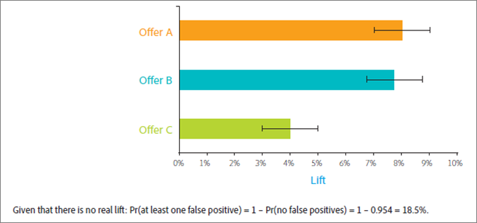

# 十个常见的 A/B 测试隐患以及避免方法

[!DNL Adobe Target] 中的 A/B 测试是大多数数字营销优化方案的基础，可帮助营销人员为其访客和客户提供经过优化、有针对性的体验。本文概述了公司在执行A/B测试时容易遇到的十个最显着的隐患。 此外，还介绍避免这些隐患的方法，以使贵公司可通过其测试工作获得更高的投资回报率 (ROI)，并对其报告的 A/B 测试结果更有信心。

## 隐患 1：忽视显著性水平的影响 {#section_55F5577A13C6470BA1417C2B735C6B1D}

您的测试是否存在这种可能：它报告了两个选件之间的转化率有着显著差异，但实际上这种差异并不存在？这就是测试的“显著性水平”的作用所在。**&#x200B;这种误导性的发现通常被称为误报，而在统计学领域中，被称为I型错误（如果您错误地拒绝了true的空假设）。

当您指定 A/B 测试的显著性水平时，您就是在以下两种情况的容差之间进行权衡：第一，认同一种体验比另一种体验好，但事实并非如此（I 类错误或“误报”）；第二，认为两个体验之间不存在具有统计意义的差异，但实际这种差异是存在真正的（II 类错误或“漏报”）。在运行测试之前确定“置信水平”**。

此 *置信区间*（在测试完成后确定）受三个关键因素影响：

* 测试的样本大小
* 显着性水平
* 总体标准偏差

由于营销人员是在设计测试之前选择显著性水平，而总体标准偏差不会受到影响，因此唯一的“可控”因素就是样本量。您满意的置信区间所需的样本量，以及达到该样本量所需经历的时间，是营销人员在测试的设计过程中必须做出的关键决定。

另一个直接相关的术语“置信水平”，**&#x200B;它更多地是从正面考虑。置信度水平不是说明您得到误报的可能性（显着性水平是如此），而是表示您的测试没有犯该错误的可能性。

置信水平和显著性水平直接相关，因为：

100% - 置信水平 = 显著性水平

在 A/B 测试中，营销人员经常使用 95% 的置信水平。显然，根据上述等式，显著性水平将为 5%。在测试中使用 95% 的置信水平意味着您有 5% 的机会得到误报，即：虽然选件之间实际上并没有差异，但您仍检测到具有统计意义的提升。

如下图所示，您运行的测试越多，其中至少一个测试就越有可能导致误报。 例如，如果您使用95%的置信水平运行10个测试，您检测到一个或多个误报的可能性大约为40%(假定没有真正的提升：Pr（至少一个误报）= 1 - Pr（无误报）= 1 - 0.95^10 = 40%)。

在营销组织中，95%通常构成假阳性与假阴性的合理权衡。

但是，以下两种情况需要密切关注显著性水平及其对测试结果的影响：测试后分段以及测试多个选件。

* **测试后分段：**&#x200B;营销人员经常会在 A/B 测试结束后，根据访客区段对测试结果进行切割分析。常见区段包括：浏览器类型、设备类型、地理区域、一天中的不同时段以及新访客和回访访客。这种操作被称为测试后分段，可对访客区段进行非常详细的分析和解读。反过来，营销人员可以利用这些见解来创建更有针对性、更相关且差异化的内容。

  如果转化率没有实际差异，则每测试一个区段时，误报的概率等于显著性水平。此外，如前所述，您运行的测试越多，在这些测试中您至少遇到一次误报的可能性就越大。 实质上，每个测试后区段都代表一次单独的测试。显着性水平为5%，平均而言，每次查看20个测试后区段时，您会落入一个误报状态。 上图显示了这种可能性是如何增加的。

  您运行的测试越多，在这些测试中至少出现一个假阳性的可能性就越大。 实质上，每个测试后区段都代表一次单独的测试，而这会增加误报的可能性。如果区段相互关联，则这种增加会更明显。

  是否应进行测试后分段？ 答案是否定的，测试后分段非常重要。要避免测试后分段出现累积误报的问题，在确定测试后区段后，应考虑在新的测试中对该区段进行测试。或者，您也可以应用下文所讨论的邦弗朗尼校正 (Bonferroni correction)。

* **测试多个选件：**&#x200B;营销人员经常对两个以上的选件（或体验）同步进行对比测试。这就是为什么您有时会看到 A/B 测试解决方案被称为 A/B/n 测试，其中 n 是同步测试的选件数量。

  需要注意的是，如上文所述，*每一个*&#x200B;测试选件都具有一个等于显著性水平的误报率。同样，如果同一个测试环境中有多个选件彼此对照，那么实际上您正在有效运行多个测试。例如，如果您在 A/B/C/D/E 测试中比较五个选件，则可以有效地形成四组对比：控制选件与 B 的对比、控制选件与 C 的对比、控制选件与 D 的对比、控制选件与 E 的对比。那么当置信水平为 95% 时，出现误报的可能性概率实际是 18.5%，而不是 5%。

  要将整体置信水平保持在 95% 并避免出现此问题，请应用邦弗朗尼校正。使用此校正方法，您只需将显着性水平除以比较数量，即可得出您必须达到95%置信水平显着性水平。

  在将邦弗朗尼校正应用于上述示例时，您将使用 5%/4 = 1.25% 的显著性水平，这等同于单次测试 98.75% (100% - 1.25% = 98.75%) 的置信水平。在上述示例运行四个测试的情况下，这项调整会将有效置信水平维持在 95%。

## 隐患 2：不存在统计学意义上显著的差异即宣布多个选件测试的入选者 {#section_FA83977C71DB4F69B3D438AF850EF3B6}

在对多个选件进行测试时，营销人员通常会将具有最高提升度的选件确定为测试获胜选件（即“入选者”），即使入选者和第二名之间不存在具有统计意义的显著差异。当替代选件之间的差异小于替代选件与控制选件之间的差异时，会出现这种情况。下图说明了此概念，黑色误差线表示 95% 的提升度置信区间。每个选件相对于控制选件的真实提升度有 95% 的可能包含在置信区间内，即误差线所示的范围内。

选件A和B在测试期间具有最高的观察提升度，并且在未来的测试中，选件C不太可能超过这些选件，因为C的置信区间与A或B的置信区间不重叠。但是，尽管选件A在测试期间具有观察到的提升度最高，但由于置信区间重叠，选件B在将来的测试中可能表现更好。

由此得出的结论是，选件 A 和 B 都应该被视为测试的入选者。

运行足够长时间的测试以识别替代选件的真实相对性能通常是不可行的，而且替代选件之间的性能差异有时会太小而不足以对转化率产生实质性影响。在这种情况下，您可以将结果解释为平局，然后使用其他考虑因素来确定要执行的选件，例如从策略层面考虑，或者是否与页面的其他元素相得益彰。您必须对多个入选者开放，才能进行多项测试，这样有时会为网站开发提供更多的可能性。

如果您确实希望确定具有最高转化率的选件，则需要将所有选件与其他所有选件进行比较。 在上例中，您具有 n = 5 个选件，因此您必须进行 n(n-1)/2 次比较，即 5&#42;(5-1)/2 = 10 次比较。此时，根据邦弗朗尼校正，测试的显著性水平应为 5%/10 = 0.5%，相当于 99.5% 的置信水平。但是，如此高的置信水平可能会要求您运行测试一段不合理的长时间。

## 隐患 3：忽视统计功效的影响 {#section_0D517079B7D547CCAA75F80981CBE12A}

统计幂是测试检测到选件之间转化率实际差异的概率。 由于转化事件的随机性（或统计学家喜欢将其称为“随机”），测试可能不会显示具有统计意义的显着差异，即使最终两个选件的转化率存在实际差异也是如此。 可以认为这就是运气不好或纯属偶然。我们将这种未能检测到转化率真实差异的情况称为漏报或 II 类错误。

以下两个关键因素决定了测试的功效：第一个是样本量，即测试中包含的访客数量。第二个是您希望测试检测的转换率差异的大小。 也许这是直观的，但如果您只想检测大的转化率差异，那么测试实际检测到如此大的差异的概率就更高。 那么，您想要检测到的差异越小，需要的样本量就越大，也因此，获得更大的样本量所需的时间就越长。

现今，营销人员进行了大量的低功效测试。换句话说，他们使用的样本量过小。这意味着即使转化率实际存在实质性差异，他们也很难检测到正确报告的正样例。事实上，如果您不断地进行低功效的测试，则误报数量会与正确报告的正样例数量相当，甚至大大超过。这通常会导致对网站执行无变化更改（浪费时间），或者是执行实际上会降低转化率的更改。

要避免进行低功效测试，请考虑使用典型的高功效测试标准，包括将置信水平设为 95%，统计功效设为 80%。这种测试提供了95%的避免误报的概率，以及80%的避免误报的概率。

## 隐患 4：使用单侧检验 {#section_8BB136D1DD6341FA9772F4C31E9AA37C}

当显著性水平一定时，如要在多个选件中确定入选者，那么单侧检验所需观察到的选件之间的转化率差异更小。这种类型的测试似乎很有吸引力，因为与采用双尾测试相比，获胜者可以更早、更频繁地被呼叫。 但俗话说，“没有免费的午餐”，单侧检验是有代价的。

例如，在一个单侧检验中，您测试的是选件 B 是否比选件 A 更好。测试的方向必须在测试开始之前确定，或者使用统计学的说法，要进行“先验”。换句话说，您必须在开始测试&#x200B;*之前*，决定是测试 B 优于 A 还是 A 优于 B。但是，如果您是先查看了 A/B 测试的结果并看到 B 优于 A，*然后*&#x200B;决定进行一个单侧检验来看这种差异是否具有统计意义，那么您就违反了统计测试背后的假设。违反测试的假设意味着您的置信区间不可靠，并且测试的误报率比您预期的要高。

您可以将单侧检验看做是一种已经由裁判做出决定、只是对该选件进行试验的测试。在单尾测试中，您已决定胜出选项是什么，并且希望证明它，而不是向每个体验提供证明自己是胜者的平等机会。 单侧检验只应在这种极少发生的情况下使用：您只关注某个选件是否优于其他选件，而不是其他选件优于某个选件。要避免出现单侧检验问题，请使用始终运用双侧检验的 A/B 测试解决方案，例如 [!DNL Adobe Target]。

## 隐患 5：监控测试 {#section_EA42F8D5967B439284D863C46706A1BA}

营销人员会时刻监控 A/B 测试，直到确定测试结果为止。毕竟，为什么要在已获得统计意义后进行测试？

遗憾地是，这并不是那样简单。我们希望监控测试不会带来不利影响，但事实证明，监控结果对测试的有效统计意义会产生不利影响。这会大大增加误报的可能性，并使置信区间不可信。

这可能会让人感到困惑。听上去似乎是，仅仅是在测试过程中看一下结果，就可能导致它们失去其统计意义。但事实并非完全如此。让我们通过一个示例来解释原因。

假设您模拟两个选件的 10,000 个转化事件，其中两个选件的转化率均为 10%。由于转化率相同，因此当您对这两个选件相互进行测试时，应该检测到转化率提升度没有差异。如果使用 95% 的置信区间，当收集所有 10,000 个观测值之后，测试结果为预期的 5% 误报率。因此，如果我们运行100个这些测试，则平均会得到5个误报（实际上，本示例中的所有误报都是误报，因为两个选件的转化率之间没有差异）。 但是，如果在测试期间对测试进行十次评估（每1,000次观察），则假阳性率会跃升至16%。 对测试进行监控使出现误报的可能性增加了三倍以上！这是怎么回事？

要了解发生这种情况的原因，您必须考虑在检测到显着结果时以及未检测到该结果时执行的不同操作。 当检测到具有统计意义的结果时，您会停止测试并宣布入选者。但是，如果该结果不具有统计意义，则会继续测试。这种情况极易偏向于积极的结果，这样就扭曲了测试的有效显著性水平。

要避免出现此问题，应在启动测试之前确定测试运行的足够时长。 虽然在测试期间查看测试结果可以确保您正确实施测试，但在达到所需的访客数量之前，请不要做出结论或停止测试。 换言之，不要作弊！

## 隐患 6：过早停止测试 {#section_DF01A97275E44CA5859D825E0DE2F49F}

如果某个选件在测试的最初几天表现优于或逊于其他选件，则很容易停止测试。 但是，当观察数量较低时，很有可能只是偶然观察到正或负的提升，因为转化率只是少数访客的平均值。随着测试收集的数据点越来越多，转化率会逐渐靠近真正的长期值。

下图显示了五个具有相同长期转化率的选件。选件 B 在前 2000 名访客时的转化率较差，并且在预计转化率回到真正的长期转化率之前花费了较长时间。

这种现象称为“向均数回归”，当在测试最初几天表现良好的选件最终未能保持这一级别的表现时，可能会导致失望。 此外，当良好选件因为在测试初期偶然表现不佳而未实施时，它可能会导致收入损失。

与监控测试陷阱类似，避免这些问题的最好方法是在运行测试之前确定足够的访客数量，然后一直运行测试直到选件已经向达到此数量的所有访客展示。

## 隐患 7：在测试期间更改流量分配 {#allocation}

我们建议您不要在测试期间更改流量分配百分比，因为这样可能会歪曲测试结果，直到数据正常化为止。

例如，假设您有一个A/B测试，其中将80%的流量分配给体验A（对照组），将20%的流量分配给体验B。在测试期间，您将每个体验的分配百分比更改为50%。 几天之后，将分配给体验 B 的流量改为 100%。

在此场景中，如何将用户分配到体验？

如果手动将体验 B 的流量拆分改为 100%，则最初分配给体验 A 的访客（对照组）留在其最初分配的体验（体验 A）中。流量分配的更改仅影响新加入者。

如果要更改百分比或极大地影响流向每个体验的访客数，我们建议您创建新活动或复制活动，然后编辑流量分配百分比。

如果在测试期间更改不同体验的百分比，则耗时数日数据才能正常化，尤其是如果许多购买者为回头客的情况。

另一个例子，如果您的A/B测试的流量分配拆分为50/50，然后您将拆分更改为80/20，在进行该更改后的前几天，结果可能会有偏差。 如果转化的平均时间较长，意味着某人需要耗时数小时甚至数日才能做出购买决定，则这些推迟的转化可能会影响您的报表。在数字从 50% 提高到 80% 并且平均转化时间为 2 天的这第一个体验中，仅占总人数 50% 的访客在测试的第一天发生转化，虽然今天有总人数的 80% 进入该体验。这样看起来转化率暴跌，但在这些 80% 的访客耗时两天发生转化之后，数据将再次正常化。

## 隐患 8：不考虑新奇效应 {#section_90F0D24C40294A8F801B1A6D6DEF9003}

如果我们运行测试的时间不充分，可能还会发生其他意想不到的情况。此时的问题就不是统计问题；而只是访客对变化做出的反应。如果您更改了网站中某个早已被广泛接受的部分，则旧访客可能会因为他们以往熟悉的工作流发生了改变而排斥使用新选件。这会暂时导致卓越的新选件性能不佳，直到回访访客习惯于此选件 — 考虑到卓越选件带来的长期收益，此价格非常低廉。

要确定新选件是否由于新奇效应或由于其真正的优秀而性能缺佳，您可以将访客分为新访客和回访访客，并比较转化率。 如果只是新奇效应，则新选件会赢得新访客的青睐。 最终，随着回访访客适应新的更改，选件也将随这些新更改一起入选。

新奇效应也会逆向发挥作用。通常，访客会对更改做出积极的反应，因为它引入了新内容。过了一段时间后，随着新内容变得陈旧或不再令访客感到兴奋，其转化率会下降。尽管这种效应难以识别，但仔细监控转化率的变化是检测到这一点的关键。

## 隐患 9：没有将考虑期的差异考虑在内 {#section_B166731B5BEE4E578816E351ECDEA992}

考虑期是指从 A/B 测试解决方案向访客展示选件到该访客实现转化之间的时间段。这很重要，因为选件会极大地影响考虑期，例如，包含截止日期的选件，如“有时间限制的选件”。 请在本周日之前购买。”

这类选件可以促使访客更快地转化，并且如果在选件到期后立即停止测试，这类选件将会获益，因为替代选件可能会有更长的截止日期或没有截止日期，因此需要更长的考虑期。替代选件将会在测试结束后的时段内进行转化，但如果您在截止日期结束时停止测试，则后来进一步的转化不会计入测试转化率。

下图显示了两个不同访客在周日下午在同一时间看到的两个选件。选件 A 的考虑期较短，该访客在当天晚些时候便已转化。但是，选件 B 的考虑期较长，查看选件 B 的访客对该选件考虑了一段时间，并最终在周一上午形成转化。如果您在周日晚上停止测试，与选件 A 关联的转化会计入选件 A 的转化量度，而与选件 B 关联的转化则不会计入选件 B 的转化量度。这使选件 B 处于明显的劣势。

要避免此陷阱，可在停止要测试的新条目后，再给予查看过测试选件的访客一些时间，使他们能够形成转化。这样做即可让您对这些选件进行公平比较。

## 隐患 10：所使用的指标未体现业务目标 {#section_F0CD6DC7993B4A6F9BEEBB31CD1D9BEE}

营销人员可能会倾向于使用上层漏斗中的高流量低方差转化量度，例如点进率 (CTR)，以更快地达到足够数量的测试转化。但是，请仔细考虑点进率是否能够真正代表您想获得的业务目标。点进率较高的选件很容易导致收入减少。例如，当优惠吸引的访客的购买倾向较低时，或者当优惠本身只是导致收入较低时，就会发生这种情况。

以下面的滑雪选件为例。它产生的CTR高于骑车优惠，但由于访客在遵循骑车优惠时平均花费的钱更多，因此将骑车优惠放在给定访客面前时的预期收入更高。 因此，以CTR作为量度的A/B测试会选择收入未最大化且可能是基本业务目标的A/B测试。

要避免此问题，请仔细监控您的业务量度以确定选件在业务方面的影响，或者更好的做法是，尽可能使用更接近您业务目标的量度。

## 总结：通过识别并绕过隐患而成功开展 A/B 测试 {#section_54D33248163A481EBD4421A786FE2B15}

在了解了常见的 A/B 测试陷阱后，我们希望您能够识别您可能会在何时以及何处遇到这些问题。同时，我们也希望通过上面的介绍，让您更好地理解到 A/B 测试所涉及的一些统计学概念和概率概念，一般人会认为似乎只有数学专业的人才会接触这些概念。

以下步骤可帮助您避免落入这些陷阱，并将重点聚焦在如何通过 A/B 测试取得更好的结果：

* 根据相关业务目标，仔细考虑要测试的正确量度。
* 在测试开始前决定置信水平，并在测试结束后评估结果时坚持以该阈值为参考。
* 在测试开始前计算样本量（访客数量）。
* 等待达到计算的样本量之后再停止测试。
* 在执行测试后分段或评估多个替代方案（例如，使用Bonferroni校正）时调整置信度级别。
