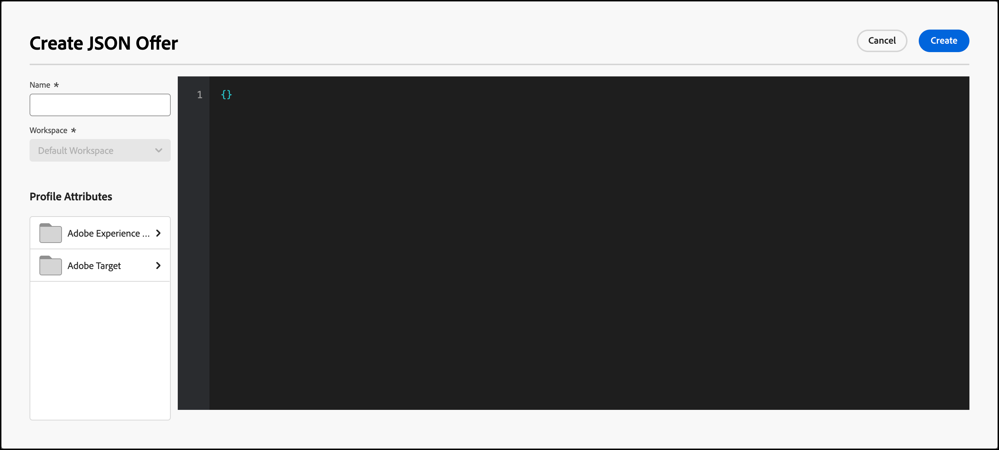

# 创建 JSON 选件

在[!DNL Adobe Target]的[!UICONTROL Offer Library]中创建JSON选件以在[!UICONTROL Form-Based Experience Composer]中使用。

JSON选件可用于基于表单的活动，以启用以下用例：需要通过[!DNL Target]决策来以JSON格式发送选件，以便在SPA框架或服务器端集成中使用。

## JSON注意事项

使用 JSON 选件时，请考虑以下信息：

* JSON选件当前仅可用于[!UICONTROL A/B Test]、[!UICONTROL Automated Personalization] (AP)和[!UICONTROL Experience Targeting] (XT)活动。
* JSON选件只能在[基于表单的活动](/help/main/c-experiences/form-experience-composer.md)中使用。
* 当您使用[服务器端API和Mobile Node.js、Java、.NET和Python SDK](https://experienceleague.adobe.com/docs/target-dev/developer/server-side/server-side-overview.html){target=_blank}时，可以直接检索JSON选件。
* 在浏览器中，只能通过at.js 1.2.3（或更高版本）并使用[getOffer()](https://experienceleague.adobe.com/docs/target-dev/developer/client-side/at-js-implementation/functions-overview/adobe-target-getoffer.html){target=_blank}来检索JSON选件，方法是使用`setJson`操作过滤操作。
* JSON 选件可作为原生 JSON 对象而不是字符串来交付。这些对象的用户不必再将对象作为字符串处理后再将其转换为 JSON 对象。
* 与其他选件（例如 HTML 选件）不同，JSON 选件不会自动应用，因为 JSON 选件不是可视化选件。开发人员必须编写代码以使用[getOffer()](https://experienceleague.adobe.com/docs/target-dev/developer/client-side/at-js-implementation/functions-overview/adobe-target-getoffer.html){target=_blank}明确获取选件。

## 创建JSON选件 {#section_BB9C72D59DEA4EFB97A906AE7569AD7A}

1. 单击&#x200B;**[!UICONTROL Offers]** > **[!UICONTROL Code Offers]**。

   

1. 单击&#x200B;**[!UICONTROL Create Offer]** > **[!UICONTROL JSON Offer]**。

   

1. 键入选件名称。
1. （视情况而定）如果您拥有[[!DNL Target] 高级帐户](/help/main/c-intro/intro.md#premium)，请选择所需的[工作区](/help/main/administrating-target/c-user-management/property-channel/property-channel.md#workspace)。
1. （视情况而定）选择所需的配置文件属性。
1. 在&#x200B;**[!UICONTROL Code]**&#x200B;框中键入或粘贴您的JSON代码。
1. 单击 **[!UICONTROL Create]**。

## JSON示例 {#section_A54F7BB2B55D4B7ABCD5002E0C72D8C9}

仅在使用基于表单的体验编辑器[创建的活动中支持JSON选件。 ](/help/main/c-experiences/form-experience-composer.md)目前，能够使用JSON选件的唯一方法是通过直接API/SDK调用。

示例如下：

```json
adobe.target.getOffer({ 
  mbox: "some-mbox", 
  success: function(actions) { 
    console.log('Success', actions); 
  }, 
  error: function(status, error) { 
    console.log('Error', status, error); 
  } 
});
```

传递到 success 回调的操作是一个对象数组。假设您有单个JSON选件，该选件具有以下内容：

```json
{ 
  "demo": {"a": 1, "b": 2} 
}
```

操作数组的结构如下：

```json
[ 
 { 
   action: "setJson", 
   content: [{ 
     "demo": {"a": 1, "b": 2} 
   }] 
 }  
]
```

要提取JSON选件，您需要遍历各个操作，并使用`setJson`操作找到该操作，然后遍历内容数组。

## 用例 {#section_85B07907B51A43239C8E3498EF58B1E5}

假设将以下 JSON 选件交付到您的网页：

```json
{ 
    "_id": "5a65d24d8fafc966921e9169", 
    "index": 0, 
    "guid": "7c006504-c6f7-468d-a46f-f72531ea454c", 
    "isActive": true, 
    "balance": "$2,075.06", 
    "picture": "https://placehold.it/32x32", 
    "tags": [ 
      "esse", 
      "commodo", 
      "excepteur"
    ], 
    "friends": [ 
      { 
        "id": 0, 
        "name": "Carla Lyons" 
      }, 
      { 
        "id": 1, 
        "name": "Ollie Mooney" 
      } 
    ], 
    "greeting": "Hello, Stephenson Fernandez! You have 4 unread messages.", 
    "favoriteFruit": "strawberry" 
} 
  
```

以下代码显示了如何访问“greeting”属性：

```json
adobe.target.getOffer({   
  "mbox": "name_of_mbox", 
  "params": {}, 
  "success": function(offer) {           
        console.log(offer[0].content[0].greeting); 
  },   
  "error": function(status, error) {           
      console.log('Error', status, error); 
  } 
});
```

## 使用实时CDP配置文件属性的JSON选件示例

Real-time CDP配置文件属性可与[!DNL Target]共享，以用于HTML和JSON选件。

有关详细信息，请参阅[与 [!DNL Target]](/help/main/c-integrating-target-with-mac/integrating-with-rtcdp.md#rtcdp-profile-attributes)共享Real-time CDP配置文件属性。

## 按JSON选件类型过滤选件 {#section_52533555BCE6420C8A95EB4EB8907BDE}

您可以按JSON选件类型筛选[!UICONTROL Offers]库，方法是单击&#x200B;**[!UICONTROL Show filters]**&#x200B;图标，然后选中&#x200B;**[!UICONTROL JSON]**&#x200B;复选框。


