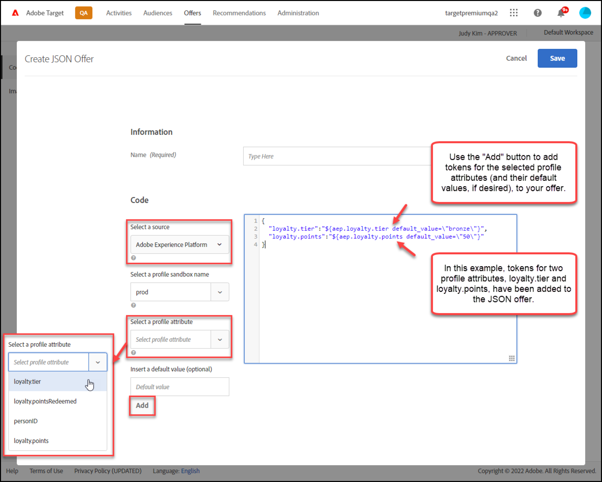

# 创建 JSON 选件

在中创建JSON选件 [!UICONTROL 选件库] in [!DNL Adobe Target] ，在中使用 [!UICONTROL 基于表单的体验编辑器].

JSON选件可用于基于表单的活动，在这些活动中，可启用 [!DNL Target]要发送JSON格式的选件以供在SPA框架或服务器端集成中使用，需要使用的决策。

## JSON注意事项

使用 JSON 选件时，请考虑以下信息：

* JSON选件当前仅适用于 [!UICONTROL A/B测试] 和 [!UICONTROL 体验定位] (XT)活动。
* JSON选件可用于 [基于表单的活动](/help/main/c-experiences/form-experience-composer.md) 仅。
* 使用服务器端 API、Mobile SDK 或 NodeJS SDK 时，可以直接检索 JSON 选件。
* 在浏览器中，只能通过 at.js 1.2.3（或更高版本）并使用 [getOffer()](https://developer.adobe.com/target/implement/client-side/atjs/atjs-functions/adobe-target-getoffer/){target=_blank}，方法是使用 `setJson` 操作。
* JSON 选件可作为原生 JSON 对象而不是字符串来交付。这些对象的用户不必再将对象作为字符串处理后再将其转换为 JSON 对象。
* 与其他选件（例如 HTML 选件）不同，JSON 选件不会自动应用，因为 JSON 选件不是可视化选件。开发人员必须编写相应代码，以便使用 [getOffer()](https://developer.adobe.com/target/implement/client-side/atjs/atjs-functions/adobe-target-getoffer/){target=_blank}。

## 创建JSON选件 {#section_BB9C72D59DEA4EFB97A906AE7569AD7A}

1. 单击 **[!UICONTROL 选件]** > **[!UICONTROL 代码选件]**.

   

1. 单击&#x200B;**[!UICONTROL 创建]** > **[!UICONTROL JSON 选件]**。

   

1. 键入选件名称。
1. 在&#x200B;**[!UICONTROL 代码]**&#x200B;框中键入或粘贴您的 JSON 代码。
1. 单击&#x200B;**[!UICONTROL 保存]**。

## JSON示例 {#section_A54F7BB2B55D4B7ABCD5002E0C72D8C9}

JSON选件仅在使用 [基于表单的体验编辑器](/help/main/c-experiences/form-experience-composer.md). 目前，唯有通过直接 API 调用才能使用 JSON 选件。

示例如下：

```json
adobe.target.getOffer({ 
  mbox: "some-mbox", 
  success: function(actions) { 
    console.log('Success', actions); 
  }, 
  error: function(status, error) { 
    console.log('Error', status, error); 
  } 
});
```

传递到 success 回调的操作是一个对象数组。假设我们只有一个 JSON 选件，且该选件具有以下内容：

```json
{ 
  "demo": {"a": 1, "b": 2} 
}
```

操作数组将具有以下结构：

```json
[ 
 { 
   action: "setJson", 
   content: [{ 
     "demo": {"a": 1, "b": 2} 
   }] 
 }  
]
```

要提取JSON选件，您需要遍历各个操作，并使用 `setJson` 操作，然后遍历内容数组。

## 用例 {#section_85B07907B51A43239C8E3498EF58B1E5}

假设将以下 JSON 选件交付到您的网页：

```json
{ 
    "_id": "5a65d24d8fafc966921e9169", 
    "index": 0, 
    "guid": "7c006504-c6f7-468d-a46f-f72531ea454c", 
    "isActive": true, 
    "balance": "$2,075.06", 
    "picture": "https://placehold.it/32x32", 
    "tags": [ 
      "esse", 
      "commodo", 
      "excepteur", 
    ], 
    "friends": [ 
      { 
        "id": 0, 
        "name": "Carla Lyons" 
      }, 
      { 
        "id": 1, 
        "name": "Ollie Mooney" 
      }, 
    ], 
    "greeting": "Hello, Stephenson Fernandez! You have 4 unread messages.", 
    "favoriteFruit": "strawberry" 
} 
  
```

以下代码显示了如何访问“greeting”属性：

```json
adobe.target.getOffer({   
  "mbox": "name_of_mbox", 
  "params": {}, 
  "success": function(offer) {           
        console.log(offer[0].content[0].greeting); 
  },   
  "error": function(status, error) {           
      console.log('Error', status, error); 
  } 
});
```

## JSON选件示例（使用实时CDP配置文件属性）

可以与Target共享实时CDP配置文件属性，以用于HTML选件和JSON选件。 （请注意，此功能目前处于测试阶段。）

示例用例：作为在线营销人员，Grace希望AEP/统一配置文件与Target共享属性值，以便提供实时个性化。 通过使用实时CDP配置文件属性，Grace可以使用令牌替换在Target选件中显示AEP属性的值。 例如，她可以使用 `${aep.profile.favoriteColor}`，或者使用令牌的忠诚度等级和忠诚度点值 `${aep.loyalty.tier}` 和 `${aep.loyalty.points}`.



在上面显示的示例中，请注意，分配默认值是可选的。

## 按JSON选件类型筛选选件 {#section_52533555BCE6420C8A95EB4EB8907BDE}

您可以过滤 [!UICONTROL 选件] 库(通过单击 **[!UICONTROL 类型]** 下拉列表中，然后选择 **[!UICONTROL JSON]** 复选框。


