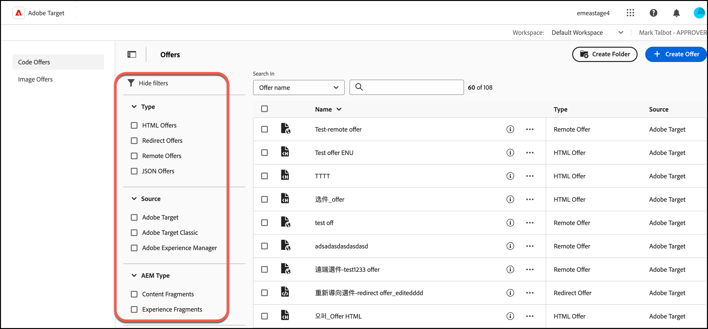

# 选件

在[!DNL Adobe Target]中使用[!UICONTROL Offers]库来管理代码和图像选件内容。

>[!NOTE]
>
>本文包含有关[!DNL Target]用户界面的更新的信息，该界面当前是Beta程序的一部分。 [!DNL Adobe Target]团队经常为选定的客户启用新功能以进行测试和提供反馈。 在测试期结束后，将在未来[!DNL Target Standard/Premium]版本中为所有客户启用这些功能，并在发行说明中宣布。

单击[!DNL Target] UI顶部的&#x200B;**[!UICONTROL Offers]**&#x200B;选项卡以显示[!UICONTROL Offers]库。

Adobe Target中的

[!UICONTROL Offers]库包含已通过[!DNL Target Standard/Premium]、[!DNL Target Classic]、[!DNL Adobe Experience Manager] (AEM)、[!DNL Adobe Mobile Services] (AMS)和API设置的选件。 在 [!DNL Target Classic] 或其他解决方案中创建的选件可以在 [!DNL Target Standard/Premium] 中进行编辑。

选件库提供了所有代码和图像选件的概述，并允许您执行各种操作：

| 元素 | 描述 |
|--- |--- |
| 左侧导航边栏 | 在列表[!UICONTROL Code Offers]或[!UICONTROL Image Offers]之间切换。 |
| [!UICONTROL Show filters]图标
 | 单击&#x200B;**[!UICONTROL Show filters]**&#x200B;图标可按[!UICONTROL Type]、[!UICONTROL Source]和[!UICONTROL AEM Type]筛选选件
有关详细信息，请参阅下面的[将筛选器应用到选件列表](#filters)。 |
| 搜索字段 | 使用&#x200B;**[!UICONTROL Search in]**&#x200B;字段快速查找选件或减少[!UICONTROL Offers]库中显示的选件数。 您可以按[!UICONTROL Offer Name]、[!UICONTROL AEM Paths]或[!UICONTROL AEM Tags]进行搜索。 |
| [!UICONTROL Create Folder] | 单击“创建文件夹”可在[!UICONTROL Offer]库中创建文件夹以保存代码选件、图像选件以及其他文件夹以创建子文件夹结构。 有关详细信息，请参阅[创建选件文件夹](/help/main/c-experiences/c-manage-content/create-content-folder.md)。 |
| [!UICONTROL [!UICONTROL Create Offer]] | 创建选件。 有关创建各种选件类型的详细信息，请参阅： <ul><li>HTML 选件</li><li>[JSON选件](/help/main/c-experiences/c-manage-content/create-json-offer.md)</li><li>[重定向选件](/help/main/c-experiences/c-manage-content/offer-redirect.md)</li><li>[远程选件](/help/main/c-experiences/c-manage-content/about-remote-offers.md)</li></ul> |
| “批量操作”复选框 | 对所有活动或选定活动执行批量操作。
有关可用操作的列表（取决于您的权限和选件状态），请参阅下面的[执行快速操作](#quick-actions)。 |
| [!UICONTROL Name] | 每个选件的名称。
单击每个选件名称旁边的&#x200B;**[!UICONTROL Quick Info]**&#x200B;图标可在弹出卡片中查看有关该选件的更多信息，包括选件ID、类型、上次修改选件的日期以及修改者等。
单击每个选件名称旁边的&#x200B;**[!UICONTROL More actions]**&#x200B;图标（水平省略号）以打开一个菜单，该菜单允许您对活动执行快速操作。 以下操作可用（取决于您的权限和选件状态）： [!UICONTROL Edit]、[!UICONTROL Copy]、[!UICONTROL Delete]和[!UICONTROL Move]。 有关每个操作的详细信息，请参阅下面的[执行快速操作](#quick-actions)。
单击表标题可按名称的字母升序或降序对列表进行排序。 |
| [!UICONTROL Type] | 选件类型：HTML的选件、[重定向选件](/help/main/c-experiences/c-manage-content/offer-redirect.md)、[远程选件](/help/main/c-experiences/c-manage-content/about-remote-offers.md)和[JSON选件](/help/main/c-experiences/c-manage-content/create-json-offer.md)。 |
| [!UICONTROL Source] | 显示创建选件的位置： [!DNL Adobe Target]、[!DNL Adobe Target Classic]和[!DNL Adobe Experience Manager]。 |

## 将过滤器应用到选件库 {#filters}

单击&#x200B;**[!UICONTROL Show filters]**&#x200B;图标（“选件”页面上的）可按[!UICONTROL Type]、[!UICONTROL Source]和[!UICONTROL AEM Type]筛选选件。

**[!UICONTROL Show filters]**&#x200B;图标允许您按以下类别筛选选件：

* **类型**：HTML的选件，[JSON选件](/help/main/c-experiences/c-manage-content/create-json-offer.md)，[重定向选件](/help/main/c-experiences/c-manage-content/offer-redirect.md)，[远程选件](/help/main/c-experiences/c-manage-content/about-remote-offers.md)。

* **Source**： [!DNL Adobe Target]、[!DNL Adobe Target Classic]和[!DNL Adobe Experience Manager]。

* **AEM类型**：[内容片段](/help/main/c-integrating-target-with-mac/aem/content-fragments-aem.md)和[体验片段](/help/main/c-integrating-target-with-mac/aem/experience-fragments-aem.md)。 有关不同片段类型的更多信息，请参阅[AEM体验片段和内容片段概述](/help/main/c-integrating-target-with-mac/aem/aem-experience-and-content-fragments.md)。

## 执行快速操作 {#quick-actions}

通过单击相应的图标，可以执行以下快速操作：

### 快速信息

单击每个选件名称旁边的&#x200B;**[!UICONTROL Quick Info]**&#x200B;图标可在弹出卡片中查看有关该选件的更多信息，包括选件ID、类型、上次修改选件的日期以及修改者等。 可用的选项取决于选件类型：HTML的选件、[JSON选件](/help/main/c-experiences/c-manage-content/create-json-offer.md)、[重定向选件](/help/main/c-experiences/c-manage-content/offer-redirect.md)、[远程选件](/help/main/c-experiences/c-manage-content/about-remote-offers.md)。

### 更多操作

代码选件和图像选件的可用操作略有不同。 以下部分包含更多信息：

#### [!UICONTROL Code Offer]选项

单击每个选件名称旁边的&#x200B;**[!UICONTROL More actions]**&#x200B;图标（水平省略号）以打开一个菜单，该菜单允许您对活动执行快速操作。 以下操作可用（取决于您的权限和选件状态）： [!UICONTROL Edit]、[!UICONTROL Copy]、[!UICONTROL Delete]和[!UICONTROL Move]。

Target选件库中的

* 编辑
* 复制
* 删除
* 移动（例如，要将一个或多个项目移动到文件夹中，请单击所需项目的&#x200B;**[!UICONTROL Move]**&#x200B;图标，单击所需文件夹，然后单击&#x200B;**[!UICONTROL Drop]**。）

根据您的权限，您可能不会看到所有选项的图标。 例如，具有[!UICONTROL Observer]权限的用户无权使用[!UICONTROL Copy]选项。

有关可对选件和文件夹执行的任务的详细信息，请参阅[处理资源库中的内容](/help/main/c-experiences/c-manage-content/assets-working.md)。

#### [!UICONTROL Image Offer]选项

将鼠标悬停在[!UICONTROL Image Offers]选项卡上所需的图像选件或文件夹上，然后单击所需的图标，以执行其他任务。

选项包括：

* 选择
* 下载
* 查看属性
* 编辑
* 注释
* 复制

有关可对选件和文件夹执行的任务的详细信息，请参阅[处理资源库中的内容](/help/main/c-experiences/c-manage-content/assets-working.md)。

>[!NOTE]
>
>图像选件不是[企业用户权限](/help/main/administrating-target/c-user-management/property-channel/property-channel.md)模型的一部分。

## 查看选件定义 {#section_6B059DD121434E6292CAB393507D010E}

无需打开选件，即可在[!UICONTROL Offers]库中的弹出卡片上查看选件定义详细信息。

例如，将鼠标悬停在[!UICONTROL Content]列表上的某个选件上，然后单击信息图标，可访问HTML选件的以下选件定义卡片：

其中提供了以下信息：

* 名称
* 来源
* 类型
* 选件 ID
* 选件路径
* 上次修改时间

单击[!UICONTROL Offer Usage]选项卡可查看引用每个选件的定义弹出卡片中的代码选件的活动。 此功能不适用于图像选件。利用此功能，您可以避免在编辑选件时对其他活动造成影响。信息包括[!UICONTROL Live Activities]和[!UICONTROL Inactive Activities]。

下面是一个重定向选件的定义卡片：

其中提供了以下信息：

* 名称
* 来源
* 类型
* 选件 ID
* 选件路径
* 上次修改时间
* 重定向 URL
* 包含所有URL参数（打开或关闭）
* 传递mbox会话ID（打开或关闭）

下面是一个远程选件的定义卡片：

其中提供了以下信息：

* 名称
* 来源
* 类型
* 选件 ID
* 选件路径
* 上次修改时间
* 重定向 URL 类型
* 绝对或相对 URL

## 培训视频：内容存储库

以下视频包含有关管理选件的信息。

* [Experience Cloud 资产库](https://experienceleague.adobe.com/docs/core-services/interface/assets/creative-cloud.html)与 Target 内容库之间的关联
* 自定义 HTML 选件
* 可视化体验编辑器中的自定义 HTML 选件

>[!VIDEO](https://video.tv.adobe.com/v/17387)
