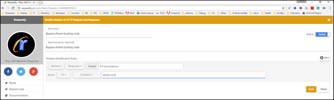

# 排除与[!UICONTROL 可视化体验编辑器]相关的问题

有时，在某些情况下，[!DNL Adobe Target] [!UICONTROL 可视化体验编辑器] (VEC)会发生显示问题。

## 当我在[!UICONTROL 可视化体验编辑器]中打开我的网站时，[!DNL Target]库未加载。 （仅 VEC） {#section_8A7D3F4AD2CC4C3B823EE9432B97E06F}

+++详细信息
在[!UICONTROL 可视化体验编辑器]中打开网站时，[!DNL Target]添加了两个参数（`mboxEdit=1`和`mboxDisable=1`）。

如果您的网站（特别是单页应用程序）裁切参数，或者在从一个页面导航到另一个页面（不重新加载页面）时将参数实际删除，[!DNL Target]功能会中断并且[!DNL Target]库不会加载。

为避免出现此问题，请确保不要裁切掉或删除这两个参数。

+++

## 我的页面无法在 EEC 中打开，或者加载速度缓慢。 活动或体验在 VEC 中的加载速度缓慢。 （仅 VEC） {#section_71E7601BE9894E3DA3A7FBBB72B6B0C1}

+++详细信息
若干问题可能会影响[!UICONTROL Target]体验编辑器中的页面性能。 一些常见的问题包括：

* 您的页面上没有 mbox。
* 您的网站使用了代理阻止，该功能不允许在任一体验编辑器中打开页面。
* 您的网站不允许在 iFrame 中自行打开。

如果[!UICONTROL 增强型体验编辑器]中出现问题，请尝试关闭[!UICONTROL 增强型体验编辑器]，然后改用[!UICONTROL 可视化体验编辑器]。

要禁用[!UICONTROL 增强型体验编辑器]，请转到&#x200B;**[!UICONTROL 管理]** > **[!UICONTROL 可视化体验编辑器]**，并关闭&#x200B;**[!UICONTROL 启用增强型体验编辑器]**&#x200B;选项。

某些用户会在控制台中看到以下错误消息：

如果[!UICONTROL 可视化体验编辑器]和[!UICONTROL 增强型体验编辑器]都无法工作，请使用浏览器扩展，如[!DNL Requestly] （[!DNL Chrome]或[!DNL Firefox]）或修改响应标头(Firefox)，以覆盖网站的X-Frames标头选项并允许将它们加载到iFrames中，从而启用VEC。 如果您无法使用浏览器扩展，请使用[基于表单的体验编辑器](/help/main/c-experiences/form-experience-composer.md)。

>[!NOTE]
>
>除了以下信息外，您还可以为[!DNL Google Chrome]使用[[!DNL Adobe Target] [!UICONTROL 可视化编辑帮助程序]扩展](/help/main/c-experiences/c-visual-experience-composer/r-troubleshoot-composer/visual-editing-helper-extension.md)。

>[!NOTE]
>
>以下插件仅应在 VEC 编辑上下文中使用。
>
>对于[!DNL Requestly]扩展，无论何时需要删除标头，都应执行以下操作之一：
>
>* 为要在 VEC 中打开的 URL 添加 URL 规则，以便仅删除这些 URL 的标头。
>
>* 在 VEC 中进行编辑时启用该规则，而在不使用 VEC 时禁用该规则。
>
>对于[!UICONTROL Modify Response Header]扩展([!DNL Firefox])，由于您无法添加URL规则，因此必须执行以下操作：
>
>* 在 VEC 中进行编辑时启用该规则，而在不使用 VEC 时禁用该规则。

**要在[!DNL Chrome]或[!DNL Firefox]上使用[!DNL Requestly]扩展：**

1. 关闭[!UICONTROL 增强型体验编辑器]。
1. 在[!DNL Chrome]或[!DNL Firefox]上安装[!DNL Requestly]浏览器扩展。
1. 打开该扩展程序，并执行以下操作以对其进行配置：
1. 选择&#x200B;**[!UICONTROL 修改标头]**。
1. 输入以下内容：

   * 规则名称
   * 修改规则

      * 将&#x200B;**[!UICONTROL 添加]**&#x200B;切换为&#x200B;**[!UICONTROL 删除]**。
      * 将&#x200B;**[!UICONTROL 请求]**&#x200B;切换为&#x200B;**[!UICONTROL 响应]**。
      * 输入“X-Frame-Options”作为标头名称。
      * 重复执行上述步骤，输入“x-frame-options”作为标头名称。

        >[!NOTE]
        >
        >通过[!DNL Requestly]处理的标头区分大小写。

      * 将&#x200B;**[!UICONTROL 等于]**&#x200B;更改为&#x200B;**[!UICONTROL 包含]**&#x200B;以作为源 URL 的条件，并输入您尝试在 VEC 中加载的活动的 URL。

     

1. 单击&#x200B;**[!UICONTROL 保存]**。

   

   现在，您应该能够使用[!UICONTROL 可视化体验编辑器]快速加载页面。

**要在[!UICONTROL Firefox]上使用[!DNL Modify Response Headers]扩展：**

1. 在[!DNL Firefox]上安装[!UICONTROL Modify响应标头]并重新启动浏览器。
1. 从[!DNL Firefox]扩展中，选择Modify Response Headers扩展。
1. 单击&#x200B;**[!UICONTROL 首选项]**。
1. 从[!UICONTROL 操作]下拉列表中选择&#x200B;**[!UICONTROL 筛选器]**。
1. 在[!UICONTROL 标头名称]字段中，输入： **[!UICONTROL X-Frame-Options]**。
1. 重复执行步骤 4 和 5，添加一个使用 **[!UICONTROL x-frame-options]** 的筛选器。
1. 单击&#x200B;**[!UICONTROL 添加]**。
1. 单击&#x200B;**[!UICONTROL 启动]**。

设置扩展后，打开[!DNL Target]。 您的页面现在应在[!UICONTROL 可视化体验编辑器]中加载，即使[!UICONTROL 增强型体验编辑器]被禁用也是如此。

+++

## VEC 中不显示我的页面（仅 VEC） {#does-not-load}

+++详细信息
* 最新版本的扩展确保与VEC的最佳兼容性： [[!DNL Adobe Experience Cloud] [!UICONTROL 可视化编辑帮助程序扩展]](/help/main/c-experiences/c-visual-experience-composer/r-troubleshoot-composer/visual-editing-helper-extension.md)。

  要验证您是否使用的是最新版本，请转到[!UICONTROL 扩展] > [!UICONTROL 管理扩展]，然后单击[!UICONTROL 详细信息]。

* [!UICONTROL 可视化体验编辑器]需要创作库才能对网页执行修改。 这些库嵌入在at.js库中，并在每次使用VEC时由扩展从[!DNL Adobe]服务器下载。

  无论at.js或[!DNL Adobe Experience Platform Web SDK]是否已包含在页面中，该扩展都会下载at.js库。

  确保没有向[!UICONTROL 管理] > [!UICONTROL 实现]部分中配置的at.js标头添加无效的更改。

* 确保网页未阻止在嵌入到iFrame中时加载的必需请求。 这包括使用frame-ancestors CSP指令或嵌入到客户网站中的自定义JS代码、meta HTML标记或x-frame-options标头。

* 确保网页的Javascript不会干扰创作库。 请勿使用或包含使用以下保留名称的文件：

   * `target-vec-helper.js`
   * `target-vec.js`
   * `target.js`
   * `admin.css`
   * `sizzle.js`
   * `mixContentCheck.html`

     此外，意外覆盖这些文件内定义的变量或事件可能会导致VEC出现问题。

* 浏览器阻止安全网站上的不安全页面。

  请单击浏览器地址栏中 URL 左侧的图标，然后再单击&#x200B;**[!UICONTROL 在此页面上禁用保护]**

* 您输入了无效的 URL。
* 如果您的网站无法在VEC中加载或行为异常，则可能的修复方法是：在尝试在[!DNL Target]中加载网站之前，在浏览器中接受您网站上的Cookie。

+++

## 当我使用[!UICONTROL 浏览]模式时，VEC显示为已损坏。 （仅 VEC） {#section_FA2A18E8FD6A4274B2E395DBAA2FB407}

+++详细信息
使用[!UICONTROL 浏览]模式时，如果您访问的URL未实现[!DNL Target]库（[at.js](https://experienceleague.adobe.com/docs/target-dev/developer/client-side/at-js-implementation/overview.html?lang=zh-Hans){target=_blank}或[Adobe Experience Platform Web SDK](https://experienceleague.adobe.com/docs/target-dev/developer/client-side/aep-web-sdk.html?lang=zh-Hans){target=_blank}）或包含frame-buster标头，则VEC显示为已损坏。 由于浏览器安全问题，[!DNL Target]无法正确访问您导航到的URL，或者如果页面加载，VEC URL不会一致更新。

出现此问题的原因是VEC在`<iframe>`中加载了网页。 由于相同源策略，浏览器的当前安全机制阻止[!DNL Target] UI访问给定帧的元素。 浏览器阻止脚本尝试访问具有不同来源且包含`location.href`等信息的帧。

您必须使用新的[Visual Editing Helper扩展](/help/main/c-experiences/c-visual-experience-composer/r-troubleshoot-composer/visual-editing-helper-extension.md)将[!DNL Target]库插入到页面中，才能以最佳方式浏览页面。

+++

## 由[!UICONTROL 可视化体验编辑器]中的CSS冲突导致的问题

+++详细信息
验证在编辑器中加载网页时是否有任何可能影响可见性的CSS文件。 例如，在页面正文中使用`overflow: hidden`属性可能会导致滚动问题或触发点击事件，这些事件可能会干扰创作菜单。

+++
