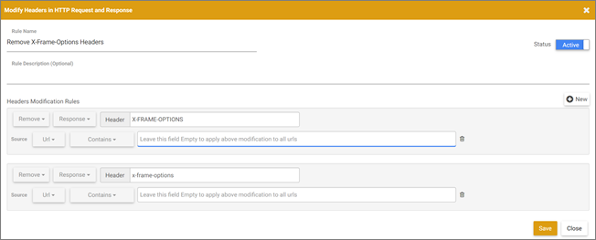

# 对与相关的问题进行故障诊断 [!UICONTROL Visual Experience Composer]

有时会出现显示问题 [!DNL Adobe Target] [!UICONTROL Visual Experience Composer] (VEC)时，不会将反向链接计算在内。

## 当我在 [!UICONTROL Visual Experience Composer]， [!DNL Target] 库不加载。 （仅 VEC） {#section_8A7D3F4AD2CC4C3B823EE9432B97E06F}

[!DNL Target] 添加两个参数(`mboxEdit=1` 和 `mboxDisable=1`)同时在中打开网站 [!UICONTROL Visual Experience Composer].

如果您的网站（特别是单页应用程序）裁切参数，或者在从一个页面导航到另一个页面（不重新加载页面）时将参数实际删除， [!DNL Target] 功能中断和 [!DNL Target] 库不加载。

为避免出现此问题，请确保不要裁切掉或删除这两个参数。

## 我的页面无法在 EEC 中打开，或者加载速度缓慢。活动或体验在 VEC 中的加载速度缓慢。（仅 VEC） {#section_71E7601BE9894E3DA3A7FBBB72B6B0C1}

有一些问题可能会影响 [!UICONTROL Target] 体验编辑器。 一些常见的问题包括：

* 您的页面上没有 mbox。
* 您的网站使用了代理阻止，该功能不允许在任一体验编辑器中打开页面。
* 您的网站不允许在 iFrame 中自行打开。

如果中出现问题 [!UICONTROL Enhanced Experience Composer]，请尝试关闭 [!UICONTROL Enhanced Experience Composer] 并使用 [!UICONTROL Visual Experience Composer] 而是。

要禁用 [!UICONTROL Enhanced Experience Composer]，转到 **[!UICONTROL Administration]** > **[!UICONTROL Visual Experience Composer]** 然后关闭 **[!UICONTROL Enable Enhanced Experience Composer]** 选项。

某些用户会在控制台中看到以下错误消息：

如果 [!UICONTROL Visual Experience Composer] 也不是 [!UICONTROL Enhanced Experience Composer] 工作，使用浏览器扩展，如 [!DNL Requestly] ([!DNL Chrome] 或 [!DNL Firefox])或修改响应标头(Firefox)，这些标头可以覆盖网站的X-Frames标头选项，并允许在iFrames中加载这些标头，从而启用VEC。 如果您无法使用浏览器扩展，请使用 [基于表单的体验编辑器](/help/main/c-experiences/form-experience-composer.md).

>[!NOTE]
>
>除了以下信息外，您还可以使用 [[!DNL Adobe Target] [!UICONTROL Visual Editing Helper] 扩展](/help/main/c-experiences/c-visual-experience-composer/r-troubleshoot-composer/visual-editing-helper-extension.md) 对象 [!DNL Google Chrome].

>[!NOTE]
>
>以下插件仅应在 VEC 编辑上下文中使用。
>
>对于 [!DNL Requestly] 扩展中，每当需要删除标头时，您都应该执行以下任一操作：
>
>* 为要在 VEC 中打开的 URL 添加 URL 规则，以便仅删除这些 URL 的标头。
>
>* 在 VEC 中进行编辑时启用该规则，而在不使用 VEC 时禁用该规则。
>
>对于 [!UICONTROL Modify Response Header] 扩展名([!DNL Firefox])，因为无法添加URL规则，您必须执行以下操作：
>
>* 在 VEC 中进行编辑时启用该规则，而在不使用 VEC 时禁用该规则。

**要使用 [!DNL Requestly] 扩展名 [!DNL Chrome] 或 [!DNL Firefox]：**

1. 关闭 [!UICONTROL Enhanced Experienced Composer].
1. 安装 [!DNL Requestly] 浏览器扩展位于 [!DNL Chrome] 或 [!DNL Firefox].
1. 打开该扩展程序，并执行以下操作以对其进行配置：
1. 选择 **[!UICONTROL Modify headers]**.
1. 输入以下内容：

   * 规则名称
   * 修改规则

      * 切换 **[!UICONTROL Add]** 到 **[!UICONTROL Remove]**.
      * 切换 **[!UICONTROL Request]** 到 **[!UICONTROL Response]**.
      * 输入“X-Frame-Options”作为标头名称。
      * 重复执行上述步骤，输入“x-frame-options”作为标头名称。

        >[!NOTE]
        >
        >通过以下方式处理的标头 [!DNL Requestly] 区分大小写。

      * 更改 **[!UICONTROL Equals]** 到 **[!UICONTROL Contains]** 作为源URL的条件，并输入您尝试在VEC中加载的活动的URL。

     

1. 单击 **[!UICONTROL Save]**。

   

   现在，您应该能够使用快速加载页面 [!UICONTROL Visual Experience Composer].

**要使用 [!DNL Modify Response Headers] 扩展名 [!UICONTROL Firefox]：**

1. 安装 [!UICONTROL Modify Response Headers] 日期 [!DNL Firefox] 然后重新启动浏览器。
1. 来自您的 [!DNL Firefox] 扩展中，选择Modify Response Headers扩展。
1. 单击 **[!UICONTROL Preferences]**。
1. 选择 **[!UICONTROL Filter]** 从 [!UICONTROL Action] 下拉菜单。
1. 在 [!UICONTROL Header Name] 字段中，输入： **[!UICONTROL X-Frame-Options]**.
1. 重复步骤4和5以添加过滤器 **[!UICONTROL x-frame-options]**.
1. 单击 **[!UICONTROL Add]**。
1. 单击 **[!UICONTROL Start]**。

设置扩展后，打开 [!DNL Target]. 现在，您的页面应加载到 [!UICONTROL Visual Experience Composer]，即使 [!UICONTROL Enhanced Experience Composer] 已禁用。

## VEC 中不显示我的页面（仅 VEC） {#does-not-load}

* 最新版本的扩展确保了与VEC的最佳兼容性： [[!DNL Adobe Experience Cloud] [!UICONTROL Visual Editing Helper extension]](/help/main/c-experiences/c-visual-experience-composer/r-troubleshoot-composer/visual-editing-helper-extension.md).

  要验证您是否使用的是最新版本，请转到 [!UICONTROL Extensions] > [!UICONTROL Manage Extensions] 然后单击 [!UICONTROL Details].

* 此 [!UICONTROL Visual Experience Composer] 需要创作库才能在网页上执行修改。 这些库嵌入在at.js库中，并由中的扩展下载 [!DNL Adobe] 每次使用VEC时的服务器。

  无论at.js还是 [!DNL Adobe Experience Platform Web SDK] 已包含在页面中。

  确保没有将无效的更改添加到在中配置的at.js标头 [!UICONTROL Administration] > [!UICONTROL Implementation] 部分。

* 确保网页未阻止在嵌入到iFrame中时加载的必需请求。 这包括使用frame-ancestors CSP指令或嵌入到客户网站中的自定义JS代码、metaHTML标记或x-frame-options标头。

* 确保网页的Javascript不会干扰创作库。 请勿使用或包含使用以下保留名称的文件：

   * `target-vec-helper.js`
   * `target-vec.js`
   * `target.js`
   * `admin.css`
   * `sizzle.js`
   * `mixContentCheck.html`

     此外，意外覆盖这些文件内定义的变量或事件可能会导致VEC出现问题。

* 浏览器阻止安全网站上的不安全页面。

  单击浏览器地址栏中URL左侧的图标，然后单击 **[!UICONTROL Disable protection on this page]**

* 您输入了无效的 URL。
* 如果您的网站无法在VEC中加载，或行为异常，潜在的修复方法是，在尝试加载网站之前，在浏览器中接受网站上的Cookie [!DNL Target].

## 使用浏览模式时，VEC 显示已损坏。（仅 VEC） {#section_FA2A18E8FD6A4274B2E395DBAA2FB407}

在使用浏览模式时，如果您访问的URL没有 [!DNL Target] 已实现的库([at.js](https://experienceleague.adobe.com/docs/target-dev/developer/client-side/at-js-implementation/overview.html){target=_blank} or [Adobe Experience Platform Web SDK](https://experienceleague.adobe.com/docs/target-dev/developer/client-side/aep-web-sdk.html){target=_blank})或包含frame-buster标头，则VEC显示为断开。 出于对浏览器安全的考虑， [!DNL Target] 无法正确访问您导航到的URL，或者如果页面加载，则VEC URL不会一致更新。

出现此问题的原因是VEC将网页加载到 `<iframe>`. 当前浏览器的安全机制阻止 [!DNL Target] UI访问给定框架的元素，因为策略相同。 浏览器会阻止脚本尝试访问具有不同来源且包含如下信息的帧： `location.href`.

您必须使用新的 [可视化编辑帮助程序扩展](/help/main/c-experiences/c-visual-experience-composer/r-troubleshoot-composer/visual-editing-helper-extension.md) （推荐）或 [旧扩展](/help/main/c-experiences/c-visual-experience-composer/r-troubleshoot-composer/vec-helper-browser-extension.md) 以插入 [!DNL Target] 库添加到页面中，以便优化浏览。

## 中的CSS冲突导致的问题 [!UICONTROL Visual Experience Composer]

验证在编辑器中加载网页时是否有任何可能影响可见性的CSS文件。 例如，使用 `overflow: hidden` 属性可能会导致滚动问题或触发点击事件，这些事件可能会干扰创作菜单。
