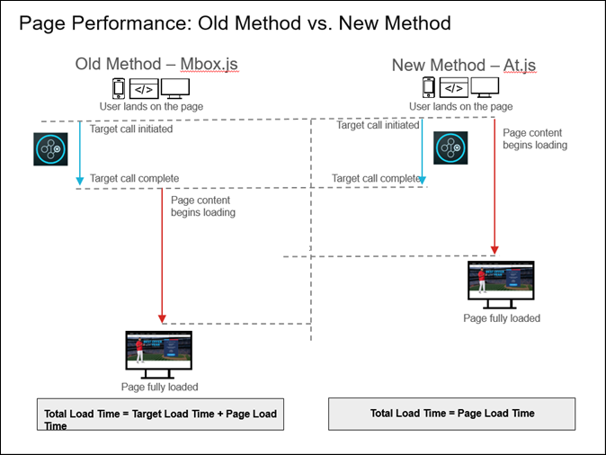

# at.js 常见问题解答

有关 [!DNL Adobe Target] at.js JavaScript库。

## 与 mbox.js 相比，使用 at.js 具有什么好处？ {#section_FE30D01A577C46ACB0F787B85F5E0F6B}

的 [!DNL at.js] 库替换 [!DNL mbox.js]. 的 [!DNL mbox.js] 不再支持库。 但是，对于大多数人来说，[!DNL at.js] 比 [!DNL mbox.js] 更具有优势。

使用 [!DNL at.js] 具有许多好处，包括缩短 Web 实施的页面加载时间，增强安全性，以及为单页应用程序提供更好的实施选项，等等。

下图说明了使用 mbox.js 与使用 at.js 时的页面加载性能。



如上图所示，使用mbox.js时，页面内容只有在 [!DNL Target] 调用完成。 使用 at.js 时，在 [!DNL Target] 调用启动后即会开始加载页面内容，而不会等到调用完成才开始加载。

## at.js 和 mbox.js 对页面加载时间有何影响？ {#page-load}

很多客户和顾问都想了解 [!DNL at.js] 和 [!DNL mbox.js] 对页面加载时间的影响，特别是对于新用户与旧用户的情况。但遗憾的是，由于每位客户的实施不尽相同，因此很难评测 [!DNL at.js] 或 [!DNL mbox.js] 对页面加载时间的影响并给出具体的数字。

但是，如果页面上存在访客API， [!DNL Target] 能更好地了解 [!DNL at.js] 和 [!DNL mbox.js] 影响页面加载时间。

>[!NOTE]
>
>仅当您使用了全局 mbox 时，访客 API 和 [!DNL at.js] 或 [!DNL mbox.js] 才会对页面加载时间造成影响（由于采用了主体隐藏技术）。区域 mbox 不受访客 API 集成的影响。

下表介绍了为新访客和旧访客执行的一系列操作：

### 新访客

1. 加载、解析并执行访客 API。
1. 加载、解析并执行 at.js/mbox.js。
1. 如果已启用全局 mbox 自动创建，则 Target JavaScript 库会执行以下操作：

   * 对访客对象实例化。
   * 的 [!DNL Target] 库尝试检索 [!DNL Experience Cloud Visitor ID] 数据。
   * 由于此访客是新访客，因此访客API会触发对demdex.net的跨域请求。
   * 之后 [!DNL Experience Cloud Visitor ID] 检索数据，请求 [!DNL Target] 被触发。

### 旧访客

1. 加载、解析并执行访客 API。
1. 加载、解析并执行 at.js/mbox.js。
1. 如果启用了全局mbox自动创建，则 [!DNL Target] JavaScript库：

   * 对访客对象实例化。
   * 的 [!DNL Target] 库尝试检索 [!DNL Experience Cloud Visitor ID] 数据。
   * 访客 API 从 Cookie 中检索数据。
   * 之后 [!DNL Experience Cloud Visitor ID] 检索数据，请求 [!DNL Target] 被触发。

>[!NOTE]
>
>对于新访客，如果存在访客API， [!DNL Target] 必须多次翻过电线才能确保 [!DNL Target] 请求包含 [!DNL Experience Cloud Visitor ID] 数据。 对于回访访客， [!DNL Target] 过了铁丝网 [!DNL Target] 以检索个性化内容。

## 为何从以前版本的 at.js 升级到版本 1.0.0 后，响应时间似乎变长了？ {#section_DFBA5854FFD142B49AD87BFAA09896B0}

[!DNL at.js] 版本 1.0.0 及更高版本可并行触发所有请求。以前的版本会按顺序执行请求，这意味着请求会被放入队列中，并且 [!DNL Target] 会等待第一个请求完成，然后再转到下一个请求。

以前版本的 [!DNL at.js] 执行请求的方式容易受到“队头阻塞”的影响。在 [!DNL at.js] 1.0.0 及更高版本中， 转为使用并行请求执行模式。[!DNL Target]

例如，如果您查看 [!DNL at.js] 0.9.1 的网络选项卡瀑布图，您会看到上一个 请求完成后才会启动下一个 Target 请求。[!DNL Target]这个顺序与 [!DNL at.js] 1.0.0及更高版本，其中所有请求基本上同时启动。

从响应时间的角度来看，从数学上来说，这个序列可以概括为如下

<ul class="simplelist"> 
 <li> at.js 0.9.1:所有响应时间 [!DNL Target] requests =请求响应时间总和 </li> 
 <li> at.js 1.0.0及更高版本：所有响应时间 [!DNL Target] 请求=请求响应时间的最大值 </li> 
</ul>

的 [!DNL at.js] 库版本1.0.0可更快地完成请求。 另外，[!DNL at.js] 请求是异步执行的，因此 不会阻止页面渲染。[!DNL Target]即使请求需要几秒钟才能完成，您仍会看到渲染的页面，在此之前，页面的某些部分会一直显示为空白 [!DNL Target] 从 [!DNL Target] 边缘。

## 我能否加载 [!DNL Target] 库是异步的？ {#section_AB9A0CA30C5440C693413F1455841470}

at.js 1.0.0版本允许加载 [!DNL Target] 库是异步的。

要异步加载 at.js，请执行以下操作：

* 推荐的方法是通过 [!DNL Adobe Experience Platform].
* 您还可以通过向加载 at.js 的脚本标记中添加 async 属性来异步加载 at.js。使用如下内容：

   ```
   <script src="<URL to at.js>" async></script>
   ```

* 您还可以使用以下代码异步加载 at.js：

   ```
   var script = document.createElement('script'); 
   script.async = true; 
   script.src = "<URL to at.js>"; 
   document.head.appendChild(script);
   ```

异步加载 at.js 有利于避免阻止浏览器渲染；但是，此技术可能会导致网页闪烁。

您可以避免闪烁，方法是使用预先隐藏的代码片段隐藏页面（或指定的部分），然后在加载at.js和全局请求后显示该页面。 在加载 at.js 之前，必须先添加该代码片段。

如果您要通过异步部署at.js [!DNL Adobe Experience Platform] 实施中，请确保在实施之前，将预隐藏的代码片段直接包含在您的页面上 [!DNL Target] 使用 [!DNL Adobe Experience Platform] 嵌入代码。

如果要通过同步 DTM 实施部署 at.js，则可通过页面顶部触发的“页面加载”规则添加预先隐藏的代码片段。

有关更多信息，请参阅 [at.js如何管理闪烁](https://developer.adobe.com/target/implement/client-side/atjs/how-atjs-works/manage-flicker-with-atjs/){target=_blank}。

## at.js是否与 [!DNL Adobe Experience Manager] 集成(Experience Manager)? {#section_6177AE10542344239753764C6165FDDC}

现在，带有 FP-11577 的 [!DNL Adobe Experience Manager] 6.2（或更高版本）支持通过其 [!DNL at.js]Adobe Target 云服务[!UICONTROL 集成来实施 ]。

## 使用 at.js 时，我如何才能阻止页面加载闪烁？ {#section_4D78AAAE73C24E578C974743A3C65919}

Target 提供了多种方法来阻止页面加载闪烁。有关更多信息，请参阅 [使用at.js阻止闪烁](https://developer.adobe.com/target/implement/client-side/atjs/how-atjs-works/manage-flicker-with-atjs/){target=_blank}。

## at.js 的文件大小是多少？ {#section_6A25C9A14C66441785A7635FEF5C4475}

at.js 文件在下载后大约为 109 KB。但是，由于大多数服务器会自动压缩文件以缩小文件大小，因此在服务器上压缩（使用 GZIP 或其他方法）后，at.js 的大小约为 34 KB，并且该文件会在用户访问您的网站时加载。安装 at.js 的服务器上的压缩设置决定了其实际压缩大小。

## 为何 at.js 比 mbox.js 大？ {#section_AA1C43897E46448FA3E26EEC10ED7E51}

at.js 实施使用单个库 ([!DNL at.js])，而 mbox.js 实施则实际使用两个库（[!DNL mbox.js] 和 [!DNL target.js]）。因此，更公平的比较方式是将 at.js 与 mbox.js *和* `target.js` 进行比较。若比较两个版本的 gzip 压缩文件大小，at.js 版本 1.2 的大小为 34 KB，而 mbox.js 版本 63 的大小则为 26.2 KB。

at.js 更大，因为与 mbox.js 相比，它执行更多的 DOM 解析。该解析是必需的，因为 at.js 会在 JSON 响应中获取“原始”数据，并且必须了解这些数据的含义。使用的mbox.js `document.write()` 所有的解析都由浏览器完成。

尽管文件较大，但我们的测试表明，与使用 mbox.js 相比，使用 at.js 可加快页面加载速度。此外，at.js的安全性也更高，因为它不会动态加载其他文件或使用 `document.write`.

## at.js 中是否有 jQuery？如果我的网站上已有 jQuery，我是否可以删除 at.js 中的这一部分？ {#section_E4604E46E7B34460B8DD6A78D9B476F9}

at.js当前使用jQuery部分，因此您会在at.js顶部看到MIT许可通知。 jQuery 不会显示，且不会影响您的页面上已有的 jQuery 库，页面上已有的 jQuery 版本可能不同。不支持删除 at.js 内的 jQuery 代码。

## at.js 是否支持 Safari 和将跨域设置为“仅限 x”？ {#section_114EC271A6E045E1B2183B66F1B71285}

否，如果将跨域设置为“仅限x”，并且Safari禁用了第三方Cookie，则两者均可 [!DNL mbox.js] 和at.js会设置一个禁用的Cookie，且不会为该特定客户端的域执行mbox请求。

要支持 Safari 访客，X-Domain 最好为“已禁用”（仅设置第一方 Cookie）或“已启用”（仅在 Safari 上设置第一方 Cookie，而在其他浏览器上设置第一方和第三方 Cookie）。

## 我能否使用 [!DNL Target] 单页应用程序中的可视化体验编辑器(VEC)? {#section_459C1BEABD4B4A1AADA6CF4EC7A70DFB}

能，如果您使用at.js 2.x，则可以将VEC用于SPA。有关更多信息，请参阅 [单页(SPA)可视化体验编辑器](/help/main/c-experiences/spa-visual-experience-composer.md).

## 我能否使用 [!DNL Adobe Experience Cloud] 使用at.js实施进行调试器？ {#section_FF3CF4C5FD2F4DB1BF1A6B39DA161637}

是. 您也可以使用 mboxTrace 来进行调试或使用浏览器的开发人员工具来检查网络请求，并按“mbox”进行筛选以隔离出 mbox 调用。

## 我能否在使用 at.js 的 mbox 名称中使用特殊字符？ {#section_8E31D2E8A27642098934D7DACFB2A600}

能，与使用 mbox.js 的 mbox 名称一样。

## 为何 mbox 没有在我的网页上触发？ {#section_4BA5DA424B734324AAB51E4588FA50F5}

[!DNL Target] 客户有时会将基于云的实例与 [!DNL Target] 结合使用来进行测试或简单的概念验证。这些域以及其他许多域均是[公共后缀列表](https://publicsuffix.org/list/public_suffix_list.dat)的一部分。

除非您自定义 `cookieDomain` 设置。 有关更多信息，请参阅 [结合使用基于云的实例和Target](https://developer.adobe.com/target/implement/client-side/target-debugging-atjs/targeting-using-cloud-based-instances/){target=_blank}。

## 使用 at.js 时，IP 地址能否用作 Cookie 域？ {#section_8BEEC91A3410459D9E442840A3C88AF7}

是，如果您使用 [at.js版本1.2或更高版本](https://developer.adobe.com/target/implement/client-side/atjs/target-atjs-versions/){target=_blank}。 [!DNL Adobe] 但是，强烈建议您保持最新版本。

>[!NOTE]
>
>如果您使用的是 at.js 版本 1.2 或更高版本，则无需查看以下示例。

取决于您的使用方式 [targetGlobalSettings](https://developer.adobe.com/target/implement/client-side/atjs/atjs-functions/targetglobalsettings/){target=_blank}，您可能需要在下载at.js后对代码进行其他修改。 例如，如果您需要对不同网站上的 [!DNL Target] 实施进行稍微不同的设置，而又无法使用自定义 JavaScript 动态定义这些设置，则需在下载该文件之后以及将该文件上传到相应网站之前手动自定义这些设置。

以下示例允许您使用 `targetGlobalSettings()` at.js 函数插入一个代码片段来支持 IP 地址：

此示例适用于单个 IP 地址：

```
if (window.location.hostname === '123.456.78.9') { 
    window.targetGlobalSettings = window.targetGlobalSettings || {}; 
    window.targetGlobalSettings.cookieDomain = window.location.hostname; 
}
```

此示例适用于 IP 地址范围：

```
if (/^123\.456\.78\..*/g.test(window.location.hostname)) { 
    window.targetGlobalSettings = window.targetGlobalSettings || {}; 
    window.targetGlobalSettings.cookieDomain = window.location.hostname; 
}
```

## 为何我会看到诸如“操作缺少选择器”之类的警告消息？ {#section_C36BED5B16634361A1BA46FCB731489D}

这些消息与 [!DNL at.js] 功能。 [!DNL at.js] 库会尝试报告无法在 DOM 中找到的任何内容。

如果看到此类警告消息，则根本原因可能如下所示：

* 页面是动态构建的，at.js找不到该元素。
* 页面生成速度缓慢（由于网络速度缓慢），at.js在DOM中找不到选择器。
* 激活的页面结构[!UICONTROL 运行的y已更改。 如果您在 ]可视化体验编辑器(VEC)时，您应会收到一条警告消息。 更新活动，以便找到所有必需的元素。
* 基础页面是 [!UICONTROL 单页应用程序] (SPA)或页面包含显示在 [!DNL at.js] “选择器轮询机制”找不到这些元素。 增加 `selectorsPollingTimeout` 可能会有所帮助。有关更多信息，请参阅 [targetGlobalSettings()](https://developer.adobe.com/target/implement/client-side/atjs/atjs-functions/targetglobalsettings/){target=_blank}。
* 任何点击跟踪量度都会尝试将其自身添加到每个页面，而不考虑已设置量度的 URL。尽管不会产生不利影响，但此情况会显示许多此类消息。

   为获得最佳结果，请下载并使用最新版本的 [!DNL at.js]。有关更多信息，请参阅 [at.js版本详细信息](https://developer.adobe.com/target/implement/client-side/atjs/target-atjs-versions/){target=_blank}和 [下载at.js](https://developer.adobe.com/target/implement/client-side/atjs/how-to-deployatjs/implement-target-without-a-tag-manager/){target=_blank}。

## tt.omtrdc.net是什么域 [!DNL Target] 服务器调用转到？ {#section_999C29940E8B4CAD8A957A6B1D440317}

[!DNL tt.omtrdc.net] 是 Adobe 的边缘网络的域名，用于接收 Target 的所有服务器调用。

## 为什么at.js不始终使用HttpOnly和Secure Cookie标记？ {#section_74527E3B41B54B0A83F217C3E664ED1F}

HttpOnly 只能通过服务器端代码进行设置。[!DNL Target] Cookie（例如 mbox）通过 JavaScript 代码创建和保存，因此 无法使用 HttpOnly Cookie 标记。[!DNL Target][!DNL Target] 在启用跨域时，会对从服务器端设置的第三方Cookie使用设置HttpOnly 。

只有在通过 HTTPS 加载页面时，才能通过 JavaScript 设置 Secure 标记。如果页面最初通过 HTTP 加载，则 JavaScript 无法设置此标记。此外，如果使用安全标记，则Cookie仅在HTTPS页面上可用。 对于通过HTTPS加载的页面， [!DNL Target] 设置Secure和SameSite=None属性。

确保 [!DNL Target] 能够正确跟踪用户，并且由于Cookie是在客户端生成的， [!DNL Target] 除上述情况外，不会使用这些标记。

## at.js 多久触发一次网络请求？ {#section_57C5235DF7694AF093A845D73EABADFD}

[!DNL Target] 可在服务器端执行其所有决策。这意味着每次重新加载页面或调用 at.js 公共 API 时，at.js 都会触发网络请求。

## 在最佳情况下，当执行隐藏、替换和显示内容这类页面加载操作时，用户是否不会受到明显影响？ {#section_CB3C566AD61F417FAC0EC5AC706723EB}

at.js会尝试避免在较长的时间内预先隐藏HTML主体或其他DOM元素，但这取决于网络条件和活动设置。 at.js提供 [设置](https://developer.adobe.com/target/implement/client-side/atjs/atjs-functions/targetglobalsettings/){target=_blank}您可以使用自定义主体隐藏CSS样式，这样您就可以预先隐藏页面的某些部分，而不清空整个HTML主体。 预期的情况是这些部分包含必须进行“个性化”的 DOM 元素。

## 在用户符合活动条件的一般场景中，事件的序列是怎样的？ {#section_56E6F448E901403FB77DF02F44C44452}

由于 at.js 请求是异步 `XMLHttpRequest`，因此我们会执行以下步骤：

1. 页面加载。
1. at.js 预先隐藏 HTML 主体。有一个设置可用来预先隐藏特定容器而不是 HTML 主体。
1. at.js 请求触发。
1. 在 [!DNL Target] 收到响应， [!DNL Target] 提取CSS选择器。
1. 使用CSS选择器， [!DNL Target] 创建STYLE标记以预隐藏将要自定义的DOM元素。
1. 删除 HTML 主体预先隐藏 STYLE。
1. [!DNL Target] 对 DOM 元素启动轮询。
1. 如果找到DOM元素， [!DNL Target] 应用DOM更改，并删除预隐藏STYLE的元素。
1. 如果找不到DOM元素，则全局超时会取消隐藏这些元素，以避免页面损坏。

## 当at.js最终取消隐藏活动正在更改的元素时，系统将以何种频率充分加载和显示页面内容？ {#section_01AFF476EFD046298A2E17FE3ED85075}

考虑到上述情况，当at.js最终取消隐藏活动正在更改的元素时，系统将以何种频率充分加载和显示页面内容？ 换言之，除了活动内容之外，页面会完全可见，而活动内容会在其他内容稍后显示。

at.js 不会阻止页面呈现。用户可能会注意到页面上的某些空白区域表示了由自定义的元素 [!DNL Target]. 如果要应用的内容未包含大量远程资产（例如 SCRIPT 或 IMG），则所有内容都应会快速呈现。

## 已完全缓存的页面对上述情景有何影响？活动内容是否很可能会在页面的其他内容加载相当一段时间后才会显示？ {#section_CE76335A3E0B41CB8253DEE5E060FCDA}

如果页面缓存在靠近用户位置，但不靠近 [!DNL Target] edge，则用户可能会看到一些延迟。 [!DNL Target] 边缘在全球分布得很好，因此大多数情况下这不是问题。

## 是否可以先显示主页图像，然后在短暂延迟后将其换掉？ {#section_C25B07B25B854AAE8DEE1623D0FA62A3}

请考虑以下情况：

的 [!DNL Target] 超时为5秒。 用户加载的页面具有自定义主页图像的活动。at.js 发送请求以确定是否有可应用的活动，但没有收到初始响应。假设用户看到了主页图像的常规内容，因为未收到来自的任何响应 [!DNL Target] 是否存在关联的活动。 四秒钟后， [!DNL Target] 会返回包含活动内容的响应。

此时，是否可以显示替代版本？那么四秒后，是否可以换掉主页图像？同时，用户是否可以查看此图像切换过程？

最初，主页图像 DOM 元素处于隐藏状态。在 [!DNL Target] 收到，则at.js会应用DOM更改，例如替换IMG并显示自定义的主页图像。

## at.js 需要何种 HTML doctype？

at.js 需要 HTML 5 doctype。

此语法为：

`<!DOCTYPE html>`

HTML 5 doctype 可确保页面以标准模式加载。在 Quirks 模式下加载时，at.js 所依赖的一些 JS API 将被禁用。[!DNL Target] 会在 Quirks 模式下禁用 at.js。
