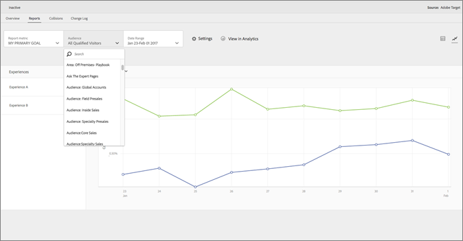

# [!DNL Adobe Analytics] 作为 [!DNL Adobe Target] 的报表源 (A4T)

[!DNL Adobe Analytics for Target] (A4T) 是一种跨解决方案的集成，通过它，可根据 [!DNL Analytics] 转化指标和受众区段创建活动。A4T 集成让您可以使用 [!DNL Analytics] 报表检查结果。如果将 [!DNL Analytics] 用作活动的报表源，则该活动的所有报表和区段都基于 [!DNL Analytics] 数据收集。

## 概述 {#section_92B66069210C40DBA937790E8CC596CF}

[!DNL Analytics] 与 [!DNL Target] 之间形成的 [!DNL Analytics for Target] 集成为优化项目提供强大而又节省时间的分析工具。

在 [!DNL Target] 中使用 [!DNL Analytics] 数据的三个主要优势包括：

* 营销人员可随时动态地将 [!DNL Analytics] 成功指标或报表区段应用于 [!DNL Target] 活动报表。在运行活动之前什么都不需要指定。
* 单一数据源可消除在两个不同的系统中收集数据时出现的差异。
* 您现有的 [!DNL Analytics] 实施收集所有必需的数据。无需专为收集报表数据而在页面上实施 mbox。

如果将 [!DNL Analytics] 用作活动的报表源，则该活动的所有报表和区段都基于 [!DNL Analytics]。

可在 [!DNL Target] 以及 [!DNL Analytics] 中的 [!UICONTROL Target 活动]报表中找到所有 [!DNL Analytics] 指标（包括计算指标），但有一个指标例外。不支持[!UICONTROL 提升和置信度]的计算指标。同样，可将 [!DNL Analytics] 中可用的任何区段应用于这两个解决方案。可在活动开始之后，甚至可在活动完成之后，将指标或受众应用于 [!DNL Target] 中的报表。

其中含有每个指标，包括 [!DNL Analytics] 中内置的任何自定义或计算指标。

分类期过后，数据会在从网站收集大约一小时后显示在这些报表中。报表中的所有量度、区段和值都来自您在设置活动时选择的报表包。

在考虑使用 A4T 时，请牢记以下几点：

* 要使用 [!DNL Analytics] 作为 [!DNL Target] 的报表源，您和您的公司必须均可以访问 [!DNL Analytics] 和 [!DNL Target]。[请联系您的帐户代表](/help/main/cmp-resources-and-contact-information.md#concept_34A1CA16F2244D42930BB77846A5ABBB)，以便使用这些解决方案。
* 为每个活动设置报表源。[!DNL Target] 持续收集要在报表中使用的数据，如果更愿意根据 [!DNL Target] 收集的数据开展活动，则还有 [!DNL Target] 数据可用。
* 使用一个报表源或另一个。无法同时从两个报表源为单个活动收集数据。
* 在使用 A4T 时，所有对活动可用的成功指标均为 [!DNL Analytics] 指标。但是，如果正在使用 at.js，则目标指标可基于 mbox 调用。例如，可将 Target 现成的点击跟踪功能与 A4T 配合使用，而不必实施 [!DNL Analytics] 点击跟踪代码。
* 在 [!DNL Target] UI 中查看 A4T 活动的报表时，查看的是 [!DNL Analytics] 数据。例如，如果在 [!DNL Target] 中使用[!UICONTROL 访客]指标，则使用的是 [!DNL Analytics] [!UICONTROL 访客]指标，而非 [!DNL Target] [!UICONTROL 访客]指标，后者现在称为[!UICONTROL 新加入者]。这一区别对于基本流量指标（[!UICONTROL 访客数]、[!UICONTROL 访问次数]、[!UICONTROL 页面查看次数]）和转化指标尤为重要。
* 任何现有 [!DNL Target] 活动继续使用 [!DNL Target] 数据收集，不受启用 A4T 的影响。
* 在使用 A4T 时，只允许有一个基于 mbox 的指标。
* 从 [!DNL Target] 到 [!DNL Analytics] 的服务器到服务器调用将活动和体验信息发送到 [!DNL Analytics]。此集成不会为 [!DNL Target] 或 [!DNL Analytics] 产生额外的服务器调用。

  在部分情况中，从 [!DNL Target] 到 [!DNL Analytics] 的分类失败，活动在 [!DNL Analytics] 中不显示数据。请参阅[为 Analytics 与 Target 集成 (A4T) 排除故障](/help/main/c-integrating-target-with-mac/a4t/c-a4t-troubleshooting/a4t-troubleshooting.md)。您还可以[联系客户关怀](/help/main/cmp-resources-and-contact-information.md#concept_34A1CA16F2244D42930BB77846A5ABBB)以获取更多帮助。

## 实施 A4T

有关使用 at.js 和 [!DNL Adobe Experience Platform Web SDK] 实施 A4T 的信息，请参阅 [Analytics for [!DNL Target] 实施](/help/main/c-integrating-target-with-mac/a4t/a4timplementation.md)。

## 支持的活动类型 {#section_F487896214BF4803AF78C552EF1669AA}

以下部分包含在使用 [!DNL Adobe Experience Platform Web SDK] 或 at.js 时支持的活动类型的信息：

| 活动类型 | 是否兼容 A4T？ | 注释（如果适用） |
|--- |--- |--- |
| [使用手动流量拆分的 A/B 活动](/help/main/c-activities/t-test-ab/test-ab.md) | 是 |  |
| [使用自动分配的 A/B 活动](/help/main/c-activities/automated-traffic-allocation/automated-traffic-allocation.md) | 是 | 请参阅[自动分配和自动定位活动支持 A4T](/help/main/c-integrating-target-with-mac/a4t/a4t-at-aa.md) |
| [使用自动定位的 A/B 活动](/help/main/c-activities/auto-target/auto-target-to-optimize.md) | 是 (at.js)
否 (Platform Web SDK) | 目前仅对 at.js 支持为自动定位活动支持 A4T。 |
| [体验定位 (XT)](/help/main/c-activities/t-experience-target/experience-target.md) | 是 |  |
| [多变量测试 (MVT)](/help/main/c-activities/c-multivariate-testing/multivariate-testing.md) | 是 | 需要基于 mbox 的目标指标以获取[!UICONTROL 元素贡献]报表。[!UICONTROL 元素贡献]报表当前不支持 [!DNL Analytics] 指标。 |
| [Automated Personalization (AP) 活动](/help/main/c-activities/t-automated-personalization/automated-personalization.md) | 否 |  |
| [Recommendations 活动](/help/main/c-recommendations/recommendations.md) | 是 |  |
| [使用重定向选件的任意活动](/help/main/c-integrating-target-with-mac/a4t/r-a4t-faq/a4t-faq-redirect-offers.md) | 是 |

由于所有活动类型尚不支持 A4T，因此建议您保留或实施重要的转化 mbox，例如 `orderConfirmPage` mbox。

## A4T 报表示例 {#section_F0A43A1CB2F04E8282B909E4D7034361}

要在 [!DNL Target] 中查看 A4T 报表，请单击&#x200B;**[!UICONTROL 活动]**，在使用 [!DNL Analytics] 作为其报表源的活动列表中单击所需活动，然后单击&#x200B;**[!UICONTROL 报表]**&#x200B;选项卡。

>[!NOTE]
>
>您可以使用位于[!UICONTROL 活动]页面顶部的[!UICONTROL 报表源]下拉列表来仅显示使用 A4T 的活动。

您可单击位于报表右上角的相应图标，在报表的[!UICONTROL 表视图]和[!UICONTROL 图形视图]之间切换。

下图显示了 A4T 报表的“[!UICONTROL 图形视图]”，其中的“[!UICONTROL 报表量度]”下拉列表显示了可用的 [!DNL Analytics] 目标量度：

下图显示了 A4T 报表的“[!UICONTROL 图形视图]”，其中的“[!UICONTROL 受众”下拉列表显示了可用的 ][!DNL Analytics] 受众：

下图显示了 A4T 报表的“[!UICONTROL 表格视图]”：

要在 [!DNL Analytics] 而不是 [!DNL Target] 中查看报表，请单击报表顶部的&#x200B;**[!UICONTROL 在 Analytics 中查看]**。

## Analytics 与 Target：分析最佳实践教程 {#section_3438E6E77A464424B717A4FD333B84B2}

打开由 [!DNL Adobe Experience League] 提供的[Analytics 与 Target：分析最佳实践](https://spark.adobe.com/page/Lo3Spm4oBOvwF/)教程。

## 培训视频：

以下视频包含有关本主题中讨论的概念的更多信息。

### Analytics for Adobe Target (A4T) (4:32)

此视频说明了如何使用 [!DNL Analytics] 作为 [!DNL Target] 中的报表源，推动您的优化项目的分析。

* 介绍什么是 A4T 以及为何要使用它
* 介绍 A4T 的工作原理
* 了解使用 A4T 之前需要满足的先决条件

>[!VIDEO](https://video.tv.adobe.com/v/17384)

### Analytics/Adobe Target 集成 (A4T) (40:33) 

此视频是“[办公时间](/help/main/cmp-resources-and-contact-information.md#concept_58EA30379D3B48C4848BA2A8C464A5B7)”的录像，“办公时间”是 Adobe 客户关怀团队发起的一项计划。

* 如何设置集成并验证集成可正常工作
* 集成的工作原理
* 了解要在 Analytics 中使用的理想报表
* 关于 A4T 的常见问题解答

[Analytics/Target 集成 (A4T) 办公时间](https://helpx.adobe.com/cn/customer-care-office-hours/target/analytics-target-A4T-integration.html)

>[!MORELIKETHIS]
>
>* [Analytics for [!DNL Target] 实施](/help/main/c-integrating-target-with-mac/a4t/a4timplementation.md)：包含适用于 at.js 和平台 Web SDK 的实施信息。
>* [重定向选件 - A4T 常见问题解答](/help/main/c-integrating-target-with-mac/a4t/r-a4t-faq/a4t-faq-redirect-offers.md)
>* [什么是 Adobe Experience Platform Web SDK](https://experienceleague.adobe.com/docs/experience-platform/edge/home.html)：包含有关 Platform Web SDK 的概述信息。
>* [Target 概述](https://experienceleague.adobe.com/docs/experience-platform/edge/personalization/adobe-target/target-overview.html)：包含特定于 [!DNL Target] 和 [!DNL Platform Web SDK] 的信息。
